:walkthrough: Lab Introduction
:user-password: openshift
:namespace: {user-username}

// URLs
:codeready-url: http://codeready-che.{openshift-app-host}/

ifdef::env-github[]
endif::[]

[id='lab-intro']
= Lab Introduction

Start from here to familiarise yourself with the goals of this workshop and the scenario it is based on.

_Apache Camel_ has taken a major evolution step with the release of version 3. It now reaches a wider audience and delivers significant automation on _Kubernetes_ environments to provide cloud native integration.

{empty} +

[time=1]
[id="workshop-progression"]
== Workshop progression

This workshop has been designed to start with the non-_Camel_ user in mind (the _Kubernetes_ user). All the initial data flows are delivered by the _Kubernetes_ user to showcase the no-code building blocks of _Camel_.

As the student progresses with the labs, the scenario builds up in a more sophisticated architecture. Gradually, each new use case requires increased level of control, an area where the experienced _Camel_ developer is better suited.

Every step you complete in the lab delivers value to the end platform under development. The further you go, the more fascinating power you uncover. It all starts, however, with the simplicity and easiness of no-code building blocks allowing anyone to define data flows from A to B.  

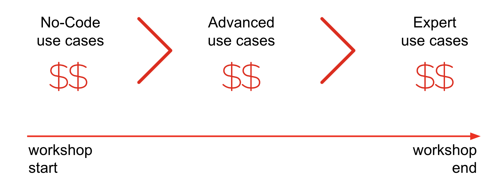

[time=1]
[id="workshop-user-profiles"]
== User profiles

The workshop has been designed to attend two different user profiles:

* *The Kubernetes user* (no previous Camel experience) +
The way this user consumes _Camel_ is by selecting _Kamelets_ (no-code building blocks) from a catalogue, and creating _Kamelet Bindings_ (concatenated _Kamelets_) in YAML definitions. The user creates local YAML files and then pushes them to _OpenShift_. The _Camel K_ operator automates the process of building, creating images and deploying the integrations.

* *The Camel developer* +
The traditional _Camel_ developer would typically, first, use his local environment for the inner loop development cycle. This strategy allows speeding up the process of prototyping and validating the code. Once the basics covered, it would follow the same deployment flow as the Kubernetes user.

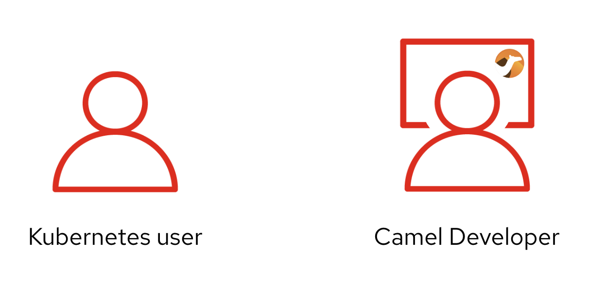

[time=1]
[id="workshop-goals"]
== Workshop goals

The list below summarises, among others, the main goals the workshop sets for you:

* *Be the Kubernetes user* +
Experience how to define and deploy integration flows connecting multiple _Kamelets_ (no-code building blocks) into _Kamelet Bindings_. +
{empty} +

* *Be the Camel developer* + 
Experience first hand powerful _Camel_ tooling that accelerates the development process, and how the _Camel DSL_ (Domain Specific Language) can help you to implement advanced use cases. +
{empty} +

* *Extend/Amplify connectivity* +
Learn how both personas (_Kubernetes/Camel_ users) can coordinate to maximise reusability by taking advantage of _Camel's_ open framework. +
{empty} +

* *Understand different levels of control* + 
Familiarise yourself with simple/medium/advanced integrations use cases and how _Camel_ helps to accelerate their delivery. +
{empty} +

* *Evolve an architecture towards maturity* +
Understand the justification behind certain design/architecture principles. Experience hands-on how evolving a platform in the right direction delivers a future proof architecture. +
{empty} +

* *Play with an exciting collaboration use case* + 
Get to know the architecture of a collaboration platform, an increasingly needed capability, strategic for any industry/organisation, to connect internally and externally with colleagues and customers. +
{empty} +

=== Use of Camel

In terms of _Camel_ constructs, the workshop covers the following building blocks, corresponding to `Entry` and `Integrator` levels (as per the diagram below):  

- _Kamelet_ bindings
- _Kamelets_
- _Camel_ routes

{blank}

If you've never played with _Camel_ before, by the end of the workshop you're expected to be familiar with the constructs above listed.

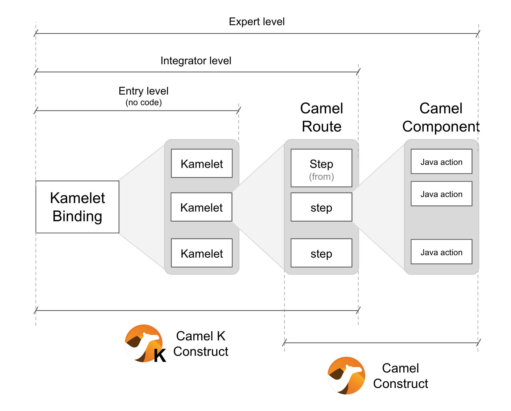

{empty} +

[time=1]
[id="scenario-intro"]
== Scenario introduction

As the internet evolves and technologies and trends emerge, so does the way people and organisations connect. Not only is digitalization transforming and automating processes, but also social changes and events are making an impact that is shaping how we interact.

Email and SMSs started to replace direct phone conversations, and soon instant messaging platforms gained popularity over them. Today we have a big landscape of messaging platforms and often we feel divided on which one to use to communicate with family and friends.

On the professional side, organisations mandate one common communication platform for all associates, but often, more than one survives, splitting work discussions between them.

It becomes even more inconvenient when a sales department, for example, needs to communicate with customers. Telephone / email are old fashioned channels that are no longer effective. Sales agents try to stay in close contact with their customers via instant messaging platforms, and of course, each customer uses a different one.

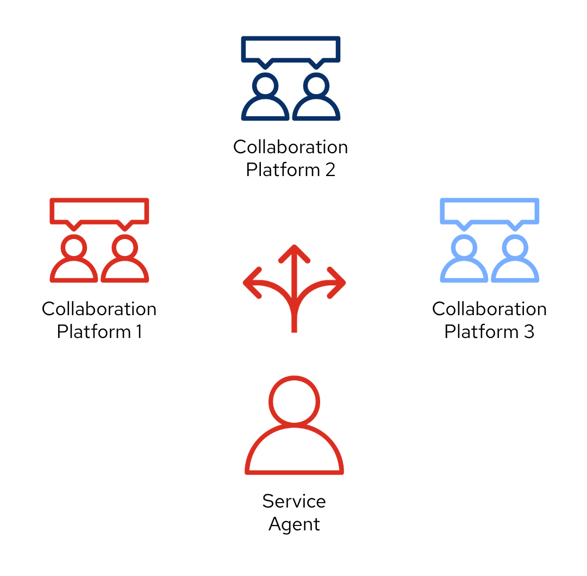

In the picture above, the _Service Agent_ needs to manage multiple and diverse platform accounts in order to stay in contact with different customers.

The workshop proposes to build a platform that addresses this problem. It would integrate all platforms as one, and plug in additional services associated with those interactions. Additionally, the platform would provide new collaboration possibilities and new capabilities to help complying with government regulations, like data privacy and security.

The picture below illustrates a system that integrates all platforms and allows communication exchanges between different members from unrelated entities

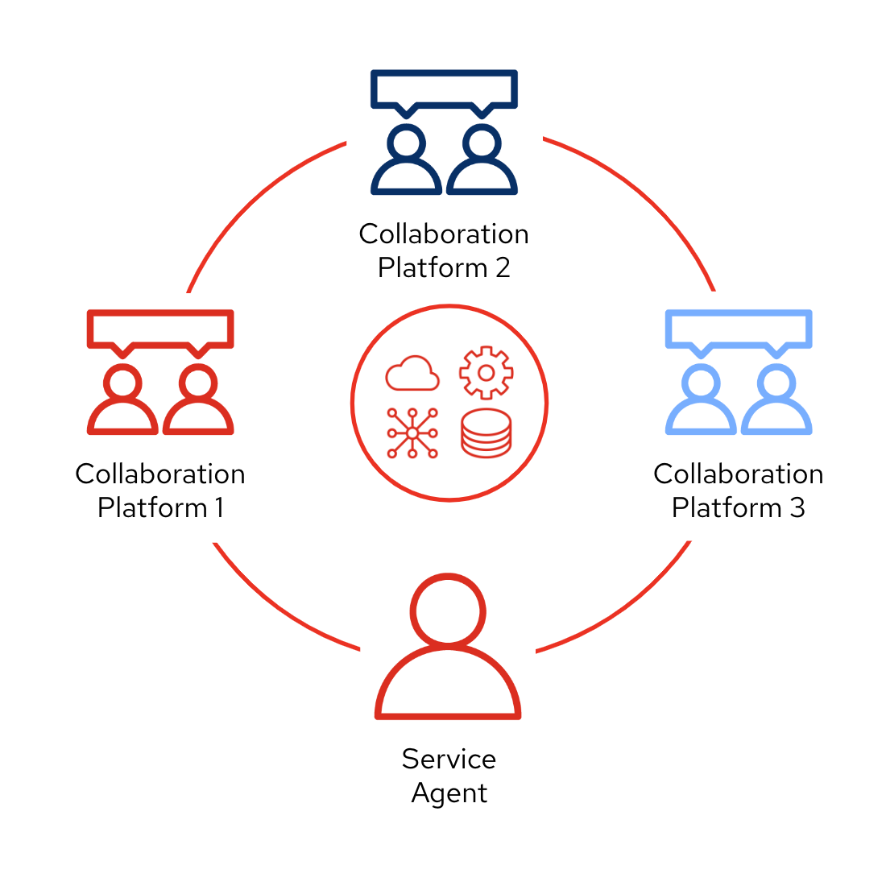

Under such solution, The _Service Agent_ would be abstracted from all external platforms and would simply be another member of the unified platform. 

{empty} +

[time=2]
[id='dev-environment']
== Development environment

The following instructions introduce you to your development environment, and the cluster where you'll deploy your applications throughout this workshop.

=== Overview

Built on the open Eclipse Che project, Red Hat OpenShift Dev Spaces uses Kubernetes and containers to provide any member of the development or IT team with a consistent, secure, and zero-configuration development environment. The experience is as fast and familiar as an integrated development environment on your laptop.

OpenShift Dev Spaces is included with your OpenShift subscription and is available in the Operator Hub. It provides development teams a faster and more reliable foundation on which to work, and it gives operations centralized control and peace of mind.

// [type=walkthroughResource,serviceName=codeready]
// .Red Hat OpenShift Dev Spaces
// ****
// * link:{codeready-url}[Console, window="_blank", , id="resources-codeready-url"]
// ****
// [type=walkthroughResource]
// .Red Hat OpenShift Developer Console
// ****
// * link:{openshift-host}/topology/ns/{namespace}[Topology View, window="_blank"]
// ****
// [type=walkthroughResource]
// .Credentials
// ****
// * *username:* `{user-username}`
// * *password:* `{user-password}`
// ****

[type=taskResource]
.Red Hat OpenShift Dev Spaces
****
* link:{codeready-url}[Console, window="_blank", , id="resources-codeready-url"]
****
[type=taskResource]
.Red Hat OpenShift Developer Console
****
* link:{openshift-host}/topology/ns/{namespace}[Topology View, window="_blank"]
****
[type=taskResource]
.Credentials
****
* *username:* `{user-username}`
* *password:* `{user-password}`
****

// :sectnums:
{empty} +

=== Accessing a Development Environment

The development environment you use throughout the workshop is a web-hosted IDE known as link:https://developers.redhat.com/products/codeready-workspaces/overview[Red Hat OpenShift Dev Spaces, window="_blank"].

{empty} +

=== Login to OpenShift Dev Spaces

To access your development environment:

. Click the link:{codeready-url}[Console, window="_blank"] link under the *Red Hat OpenShift Dev Spaces* in the *Resources* panel on the right.
. Log in using your username (`{user-username}`) and password (`{user-password}`)
+
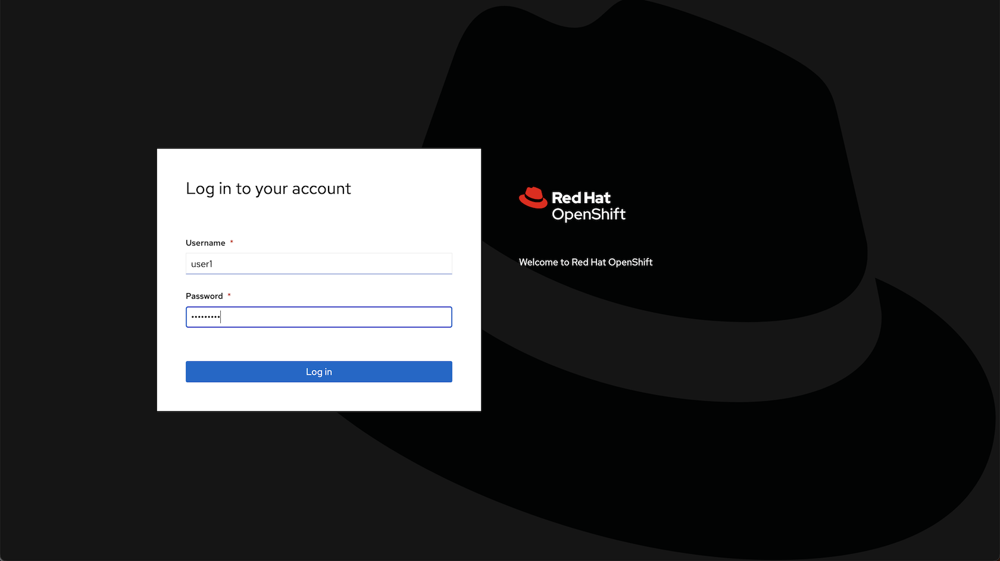
+
{empty} +
+
Once you are logged in, you'll see the CodeReady dashboard. This lists available workspaces.
+
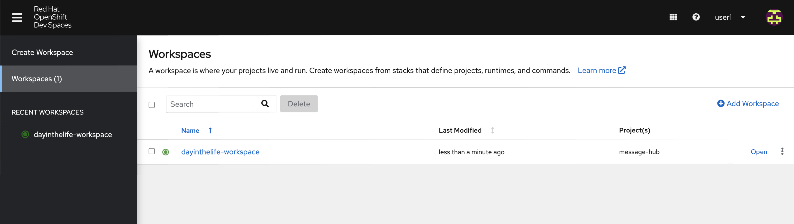

{empty} +

=== Accessing your CodeReady Workspace

This workshop provides a single, pre-configured workspace with plugins, source code, and even container images that have various Command-Line Interface (CLI) tools installed.

{empty} +

. Click the *Open* link for the workspace named `camel3-workshop-{user-username}`.
+
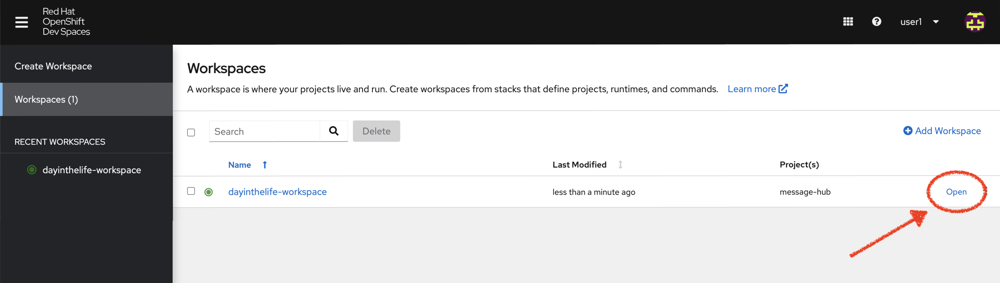
+
{blank}
+
This will start an instance of the workspace. Please wait a few moments while it downloads the required container images and configuration setup.
+
{empty} +

. When the IDE appears:
+
--
* ensure you click `Yes, I trust` when the following message shows on the bottom right corner:
+
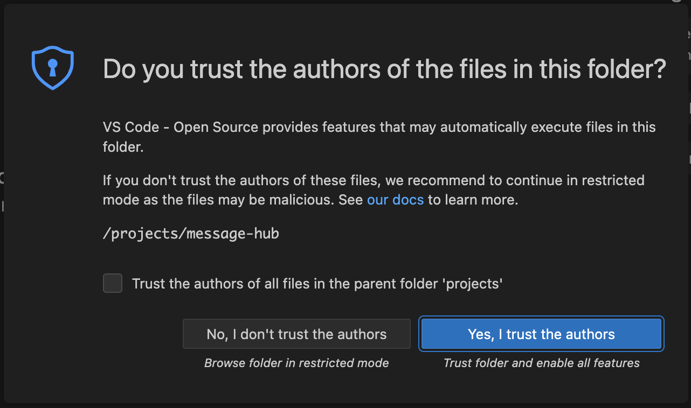
+
{blank}
+
* Ensure you close the following options:
+
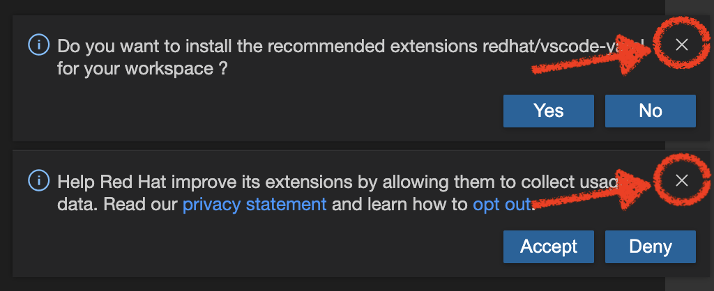
--
+
{empty} +

. Close the welcome and README tab and the other open dialogs by clicking the *x*, then click on the Explorer (file) icon on the left side bar. The Explorer shows you the *MessageHub* folder with the required projects and lab files.
+
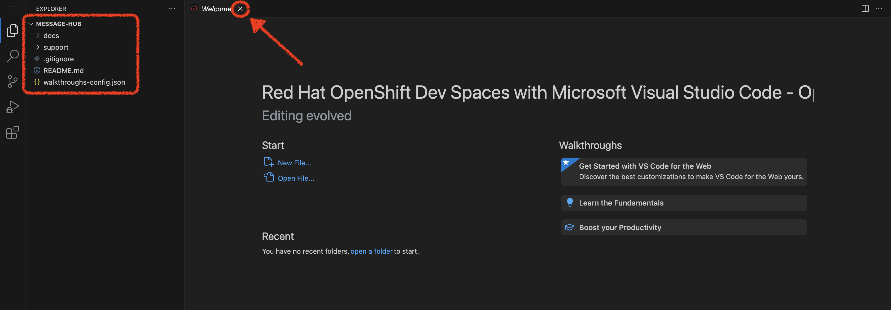
+
[NOTE]
====
This IDE is based on *CodeReady*, which is in turn is based on Microsoft VSCode. It will look familiar if you have already used it.

You can close the _Problems_ and _Output_ views to clear space.
====

=== Accessing a Terminal

During the workshop you will use the OpenShift CLI along with other developer-focused Command Line Interface (CLI) tools.
These CLI tools are available directly inside your Workspace via tools containers.

Access the *tools* container(s) like so:

CAUTION: There are *TWO* terminal options available, make sure you select the one indicated in the picture below (*number 2 in red*).

. Click on the _My Workspace_ (cube) icon on the right side panel.
. Click on *User Runtimes* -> *tools* -> *>_ New terminal*.
+
{blank}
+
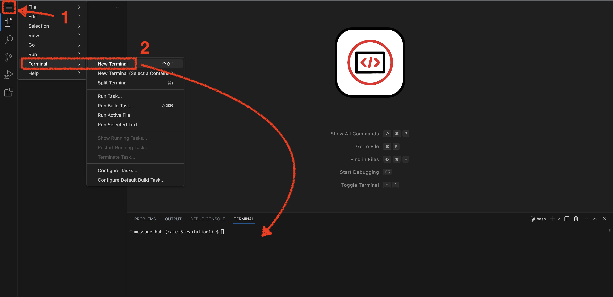

{blank}

A terminal window should be open at the bottom of the screen. This terminal is attached to the running CodeReady container and is also running on OpenShift. This is the place where you will issue most of the commands from this workshop.

{empty} +

=== Login into OpenShift using the CLI

. Open a terminal using the instructions from the previous section.
. In the terminal tab, issue the following command:
+
[source,bash,subs="attributes+"]
----
oc login -u {user-username} -p {user-password} https://$KUBERNETES_SERVICE_HOST:$KUBERNETES_SERVICE_PORT --insecure-skip-tls-verify=true
----
+
{blank}
+
[TIP]
====
* To copy the content of snippets of code, as above, click on the copy button on the right side of snippet box.
* Perform the same copy action for other snippets along the workshop to complete the exercises.
====
. You should see something like the following (the project names may be different):
+
[subs="attributes+"]
----
Login successful.

You have access to the following projects and can switch between them with 'oc project <projectname>':

  * {user-username}
    {user-username}-che
    {user-username}-shared-475f
    {user-username}-workshop-a14c

Using project "user1".
Welcome! See 'oc help' to get started.
----
+
{blank}
+
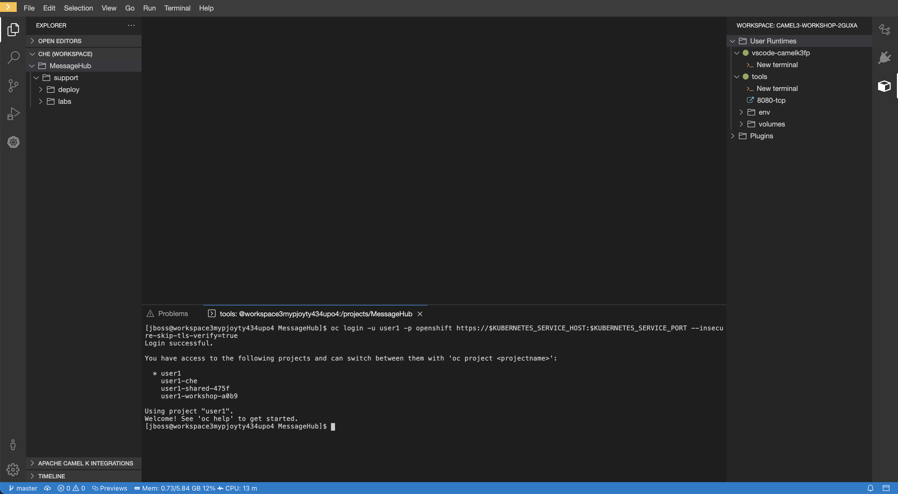
+
{empty} +

. Most of the work will be deploy to your own `{namespace}` project namespace. +
Be sure to have it as a _working_ project by executing the following command:
+
[source,bash,subs="attributes+"]
----
oc project {namespace}
----

{empty} +

[type=verification]
Did your terminal show you are connected to _OpenShift_ and pointing to the project `{namespace}`?

[type=verificationFail]
Make sure you follow the commands above. Try again.

[type=verificationSuccess]
You are now ready to start working !
