:walkthrough: Lab Introduction
:user-password: openshift
:namespace: {user-username}

// URLs
:codeready-url: http://devspaces.{openshift-app-host}/

//:url-docserver: https://docserver-webapp.{openshift-app-host}
//:url-docserver: http://0.0.0.0:8080

//:docserver-status: pass:a[ response.text()) \
//        .then(data => this.parentElement.innerHTML = 'Status: 

') \
//        .catch(error => this.parentElement.innerHTML = 'Status: 

') \
//      ">]

:experimental:

// WORKS
:style-kbd: kbd { \
  color: black; \
  background-color: lightgrey; \
  border: 1px solid black; \
  box-shadow: 0px 1px black; \
  font-size: .85em; \
  line-height: .85em; \
  display: inline-block; \
  font-weight: 600; \
  letter-spacing: .05em; \
  padding: 3px 5px; \
  white-space: nowrap; \
  border-radius:5px; \
} \

:style-summary: summary {cursor: pointer; list-style: none;}
:style-triangle: .triangle {margin-right: .5em;} summary:hover .sumtext {text-decoration: underline;}
:style-details:  .triangle::before {content: "▶";} details[open] .triangle::before {content: "▼";}
:style-open-close: {style-summary}{style-triangle}{style-details} 

//:style-summary: summary {cursor: pointer; list-style: none;}
//:style-triangle: .triangle::before {content: "▶"; margin-right: .5em;}
//:style-details: details[open] .triangle::before {content: "▼";} details[open] p {margin-top: 1em;}
//:style-open-close: {style-summary}{style-triangle}{style-details} 

:style-preview: pre {background-color: #272822; color: white; padding: 5px 15px; font-size: 15px}
:style-indent: .indent2 {padding-left: 2rem;}
:style-all: pass:a[]

:url-docserver: https://docserver-webapp.{openshift-app-host}
//:url-docserver: http://0.0.0.0:8080

:docserver-status: pass:a[ response.text()) \
        .then(data => this.parentElement.innerHTML = 'Status: 

') \
        .catch(error => this.parentElement.innerHTML = 'Status: 

') \
      ">]

:freplace: pass:[function replaceTokens(templateString, values) { \
    const valueArray = values.split(',').map(val => val.trim()); \
    let result = templateString; \
    let replaceIndex = 0; \
    while (result.includes('REPLACE') && replaceIndex < valueArray.length) { \
        result = result.replace('REPLACE', valueArray[replaceIndex]); \
        replaceIndex++; \
    } \
    return result; \
}]

:fdocserver: pass:a[function docserver(target,template,params) { \
    {freplace} \
    fetch('{url-docserver}/roomid?user='+params) \
        .then(response => response.text()) \
        .then(data => {target.firstChild.data=replaceTokens(text, data);}) \
        .catch(error => room = 'Error fetching data: ' + error.message); \
}]

:fcopy: pass:a[function copy(el) { \
  el.previousElementSibling.select(); \
  text = el.previousElementSibling.textContent; \
  console.log(text); \
  navigator.clipboard.writeText(text + '\n') \
        .then(response => console.log('Text with carriage return copied to clipboard!')) \
        .catch(err => console.error('Failed to copy: ', err)); \
}]

:copypaste: pass:a[ \

 \
  <textarea readonly style="field-sizing: content;border: none; background-color: #f0f0f0; width: 100%; resize: none; font-size:14px; font-family: monospace;padding: 5px 15px" rows="4">function example() { \
  console.log("Hello {replace-with-previous}!"); \
  return true; \
}</textarea> \
  <button class="mytooltip" onclick="{fcopy} copy(this);" style="border: none; background-color: white; padding: 5px 15px; border-bottom: 1px solid transparent; transition: border-bottom-color 0.2s;"> \
    <svg fill="currentColor" height="1em" width="1em" viewBox="0 0 448 512" aria-hidden="true" role="img" style="vertical-align: -0.125em;"> \
      <path d="M320 448v40c0 13.255-10.745 24-24 24H24c-13.255 0-24-10.745-24-24V120c0-13.255 10.745-24 24-24h72v296c0 30.879 25.121 56 56 56h168zm0-344V0H152c-13.255 0-24 10.745-24 24v368c0 13.255 10.745 24 24 24h272c13.255 0 24-10.745 24-24V128H344c-13.2 0-24-10.8-24-24zm120.971-31.029L375.029 7.029A24 24 0 0 0 358.059 0H352v96h96v-6.059a24 24 0 0 0-7.029-16.97z"></path> \
    </svg> \
    Copy to clipboard \
  </button> \
   \

 \
 \
]

:snippet: pass:a[ \

 \

 \
 \
]

ifdef::env-github[]
endif::[]

[id='lab-intro']
= Lab Introduction

Start from here to familiarise yourself with the goals of this workshop and the scenario it is based on.

[type=walkthroughResource,serviceName=openshift]
.Invite System
****
[subs=attributes]
++++

{docserver-status}

++++
****

_Apache Camel_ keeps making major evolution steps improving its usability and reaching wider audiences. It also advances in delivering significant automation on _Kubernetes_ environments to provide cloud native integration.

{empty} +

[time=1]
[id="workshop-progression"]
== Workshop progression

This workshop has been designed to start with the non-_Camel_ user in mind (the _Kubernetes_ user). All the initial data flows are delivered by the _Kubernetes_ user to showcase the no-code building blocks of _Camel_.

As the student progresses with the labs, the scenario builds up in a more sophisticated architecture. Gradually, each new use case requires increased level of control, an area where the experienced _Camel_ developer is better suited.

Every step you complete in the lab delivers value to the end platform under development. The further you go, the more fascinating power you uncover. It all starts, however, with the simplicity and easiness of no-code building blocks allowing anyone to define data flows from A to B.  

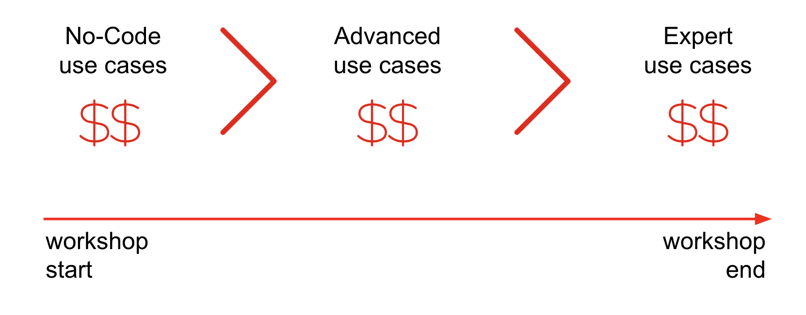

[time=1]
[id="workshop-user-profiles"]
== User profiles

The workshop has been designed to attend two different user profiles:

* *The Kubernetes user* (no previous Camel experience) +
The way this user consumes _Camel_ is by selecting _Kamelets_ (no-code building blocks) from a catalogue, and creating _Kamelet Bindings_ (concatenated _Kamelets_) in YAML definitions. The user creates local YAML files and then pushes them to _OpenShift_. The _Camel K_ operator automates the process of building, creating images and deploying the integrations.

* *The Camel developer* +
The traditional _Camel_ developer would typically, first, use his local environment for the inner loop development cycle. This strategy allows speeding up the process of prototyping and validating the code. Once the basics covered, it would follow the same deployment flow as the Kubernetes user.

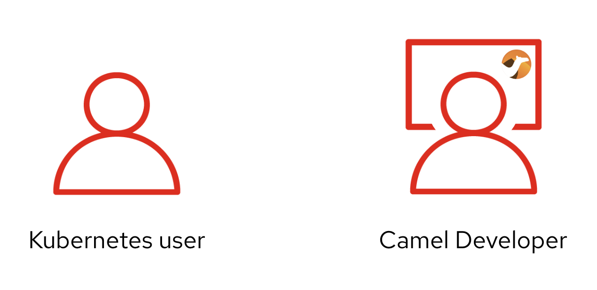

[time=1]
[id="workshop-goals"]
== Workshop goals

The list below summarises, among others, the main goals the workshop sets for you:

* *Be the Kubernetes user* +
Experience how to define and deploy integration flows connecting multiple _Kamelets_ (no-code building blocks) into _Kamelet Bindings_. +
{empty} +

* *Be the Camel developer* + 
Experience first hand powerful _Camel_ tooling that accelerates the development process, and how the _Camel DSL_ (Domain Specific Language) can help you to implement advanced use cases. +
{empty} +

* *Extend/Amplify connectivity* +
Learn how both personas (_Kubernetes/Camel_ users) can coordinate to maximise reusability by taking advantage of _Camel's_ open framework. +
{empty} +

* *Understand different levels of control* + 
Familiarise yourself with simple/medium/advanced integrations use cases and how _Camel_ helps to accelerate their delivery. +
{empty} +

* *Evolve an architecture towards maturity* +
Understand the justification behind certain design/architecture principles. Experience hands-on how evolving a platform in the right direction delivers a future proof architecture. +
{empty} +

* *Play with an exciting collaboration use case* + 
Get to know the architecture of a collaboration platform, an increasingly needed capability, strategic for any industry/organisation, to connect internally and externally with colleagues and customers. +
{empty} +

=== Use of Camel

In terms of _Camel_ constructs, the workshop covers the following building blocks, corresponding to `Entry` and `Integrator` levels (as per the diagram below):  

- _Kamelet_ bindings
- _Kamelets_
- _Camel_ routes

{blank}

If you've never played with _Camel_ before, by the end of the workshop you're expected to be familiar with the constructs above listed.

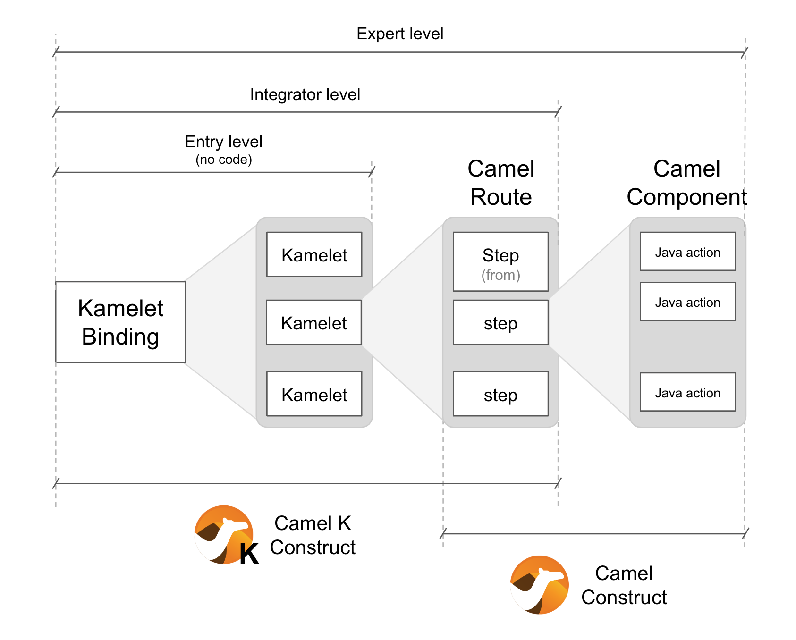

{empty} +

[time=1]
[id="scenario-intro"]
== Scenario introduction

As the internet evolves and technologies and trends emerge, so does the way people and organisations connect. Not only is digitalization transforming and automating processes, but also social changes and events are making an impact that is shaping how we interact.

Email and SMSs started to replace direct phone conversations, and soon instant messaging platforms gained popularity over them. Today we have a big landscape of messaging platforms and often we feel divided on which one to use to communicate with family and friends.

On the professional side, organisations mandate one common communication platform for all associates, but often, more than one survives, splitting work discussions between them.

It becomes even more inconvenient when a sales department, for example, needs to communicate with customers. Telephone / email are old fashioned channels that are no longer effective. Sales agents try to stay in close contact with their customers via instant messaging platforms, and of course, each customer uses a different one.

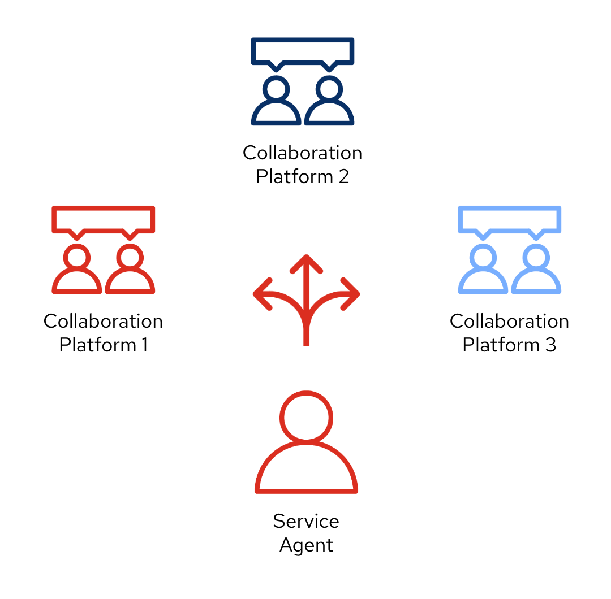

In the picture above, the _Service Agent_ needs to manage multiple and diverse platform accounts in order to stay in contact with different customers.

The workshop proposes to build a platform that addresses this problem. It would integrate all platforms as one, and plug in additional services associated with those interactions. Additionally, the platform would provide new collaboration possibilities and new capabilities to help complying with government regulations, like data privacy and security.

The picture below illustrates a system that integrates all platforms and allows communication exchanges between different members from unrelated entities

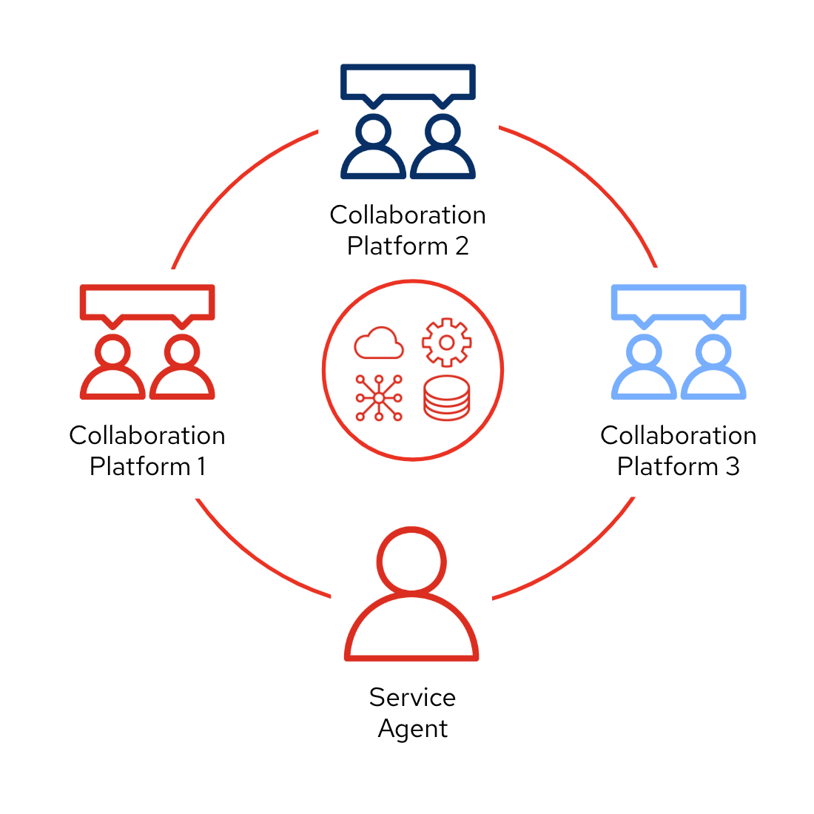

Under such solution, The _Service Agent_ would be abstracted from all external platforms and would simply be another member of the unified platform. 

{empty} +

[time=2]
[id='dev-environment']
== Development environment

The following instructions introduce you to your development environment, and the cluster where you'll deploy your applications throughout this workshop.

=== Overview

Built on the open Eclipse Che project, Red Hat OpenShift Dev Spaces uses Kubernetes and containers to provide any member of the development or IT team with a consistent, secure, and zero-configuration development environment. The experience is as fast and familiar as an integrated development environment on your laptop.

OpenShift Dev Spaces is included with your OpenShift subscription and is available in the Operator Hub. It provides development teams a faster and more reliable foundation on which to work, and it gives operations centralized control and peace of mind.

// [type=walkthroughResource,serviceName=codeready]
// .Red Hat OpenShift Dev Spaces
// ****
// * link:{codeready-url}[Console, window="_blank", , id="resources-codeready-url"]
// ****
// [type=walkthroughResource]
// .Red Hat OpenShift Developer Console
// ****
// * link:{openshift-host}/topology/ns/{namespace}[Topology View, window="_blank"]
// ****
// [type=walkthroughResource]
// .Credentials
// ****
// * *username:* `{user-username}`
// * *password:* `{user-password}`
// ****

[type=taskResource]
.Red Hat OpenShift Dev Spaces
****
* link:{codeready-url}[Console, window="_blank", , id="resources-codeready-url"]
****
[type=taskResource]
.Red Hat OpenShift Developer Console
****
* link:{openshift-host}/topology/ns/{namespace}[Topology View, window="_blank"]
****
[type=taskResource]
.Credentials
****
* *username:* `{user-username}`
* *password:* `{user-password}`
****

// :sectnums:
{empty} +

=== Accessing a Development Environment

The development environment you use throughout the workshop is a web-hosted IDE known as link:https://developers.redhat.com/products/codeready-workspaces/overview[Red Hat OpenShift Dev Spaces, window="_blank"].

{empty} +

=== Login to OpenShift Dev Spaces

To access your development environment:

. Click this link:{codeready-url}[Console, window="_blank"] link. +
(Also accessible from the *Resources* panel on the right, under *Red Hat OpenShift Dev Spaces*).

. You'll be first prompted to choose _OpenShift_ to log in. +
Click the button `Log in with OpenShift`:
+
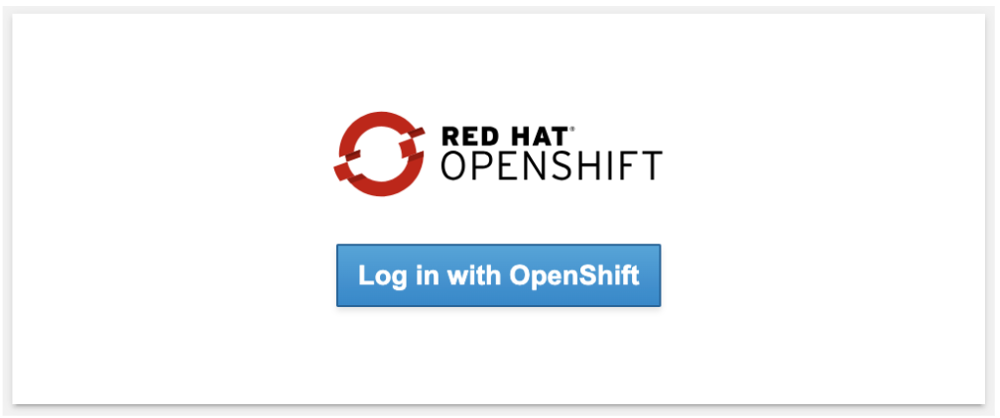
+
{blank}
+
. Then, log in using your username (`{user-username}`) and password (`{user-password}`)
+
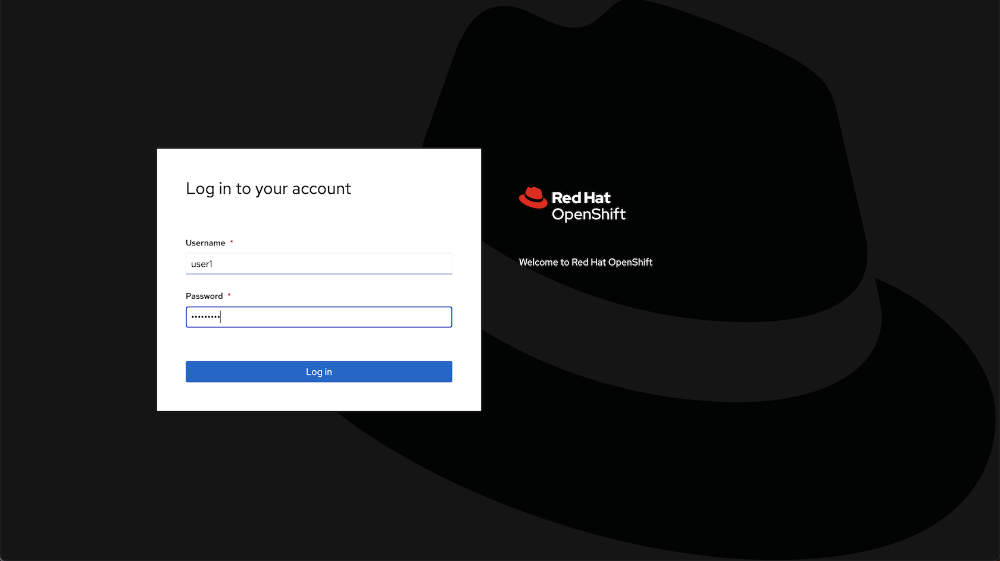
+
{empty} +
+
. Next, authorise access, click `Allow selected permissions`
+
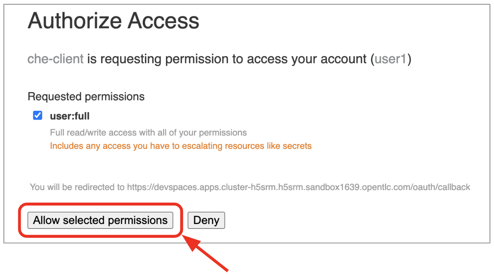
+
{empty} +
+
Once you are logged in, you'll see the CodeReady dashboard. This lists available workspaces.
+
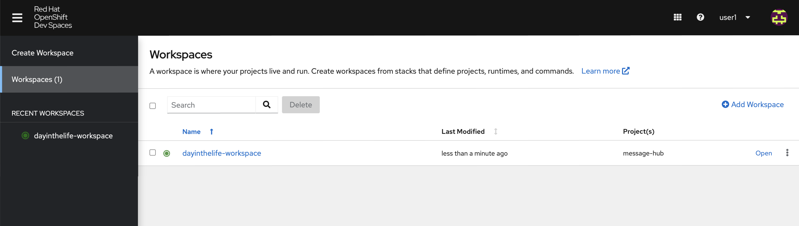

{empty} +

=== Accessing your DevSpaces Workspace

This workshop provides a single, pre-configured workspace with plugins, source code, and even container images that have various Command-Line Interface (CLI) tools installed.

. Click the *Open* link for the workspace named `dayinthelife-workspace`.
+
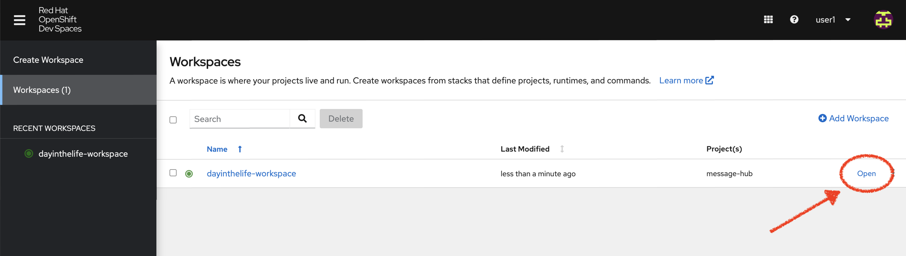
+
{blank}
+
This will start an instance of the workspace. Please wait a few moments while it downloads the required container images and configuration setup.
+
{empty} +

. When the IDE appears:
+
Ensure you click `Yes, I trust the authors` when the following message shows on your screen:
+
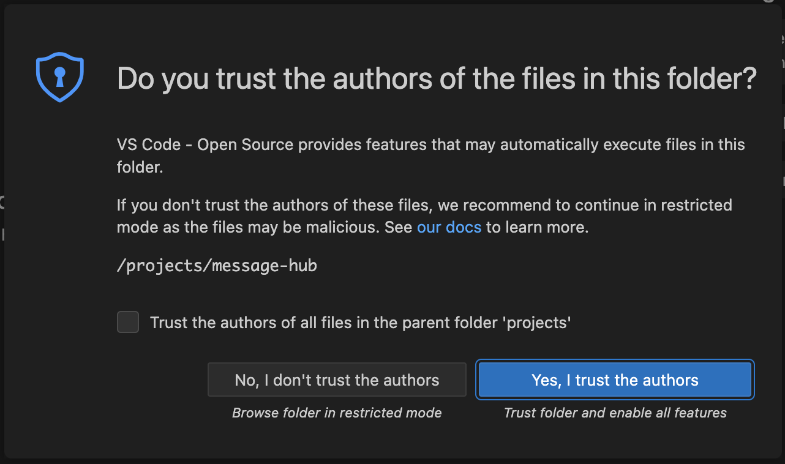
+
{empty} +

. Close the `welcome` tab by clicking the *x*. +
The Explorer shows you the *MESSAGE-HUB* folder where you will be working.
+
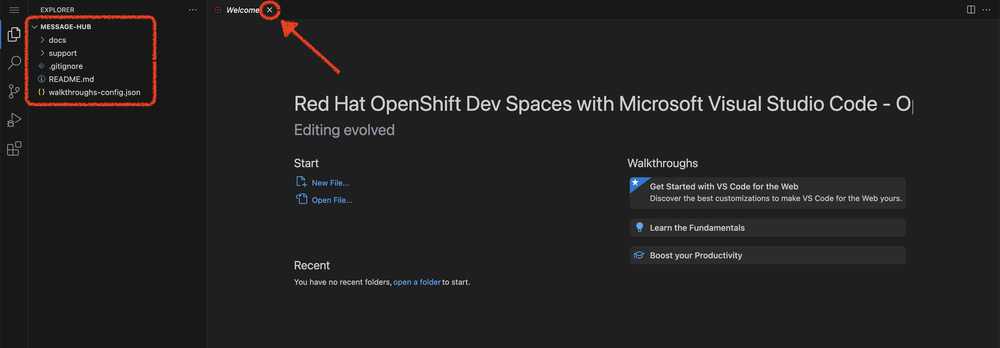
+
[NOTE]
====
This IDE is based on _Microsoft VSCode_. It will look familiar if you have already used it.
====
+
{empty} +

=== Accessing a Terminal

During the workshop you will use the OpenShift CLI along with other developer-focused Command Line Interface (CLI) tools.
These CLI tools are available directly inside your Workspace via tools containers.

Access the *tools* container(s) like so:

. Click on the _hamburger-icon_ button on the upper-left corner of your IDE.
. Then, select *Terminal* -> *New Terminal*.
+
{blank}
+
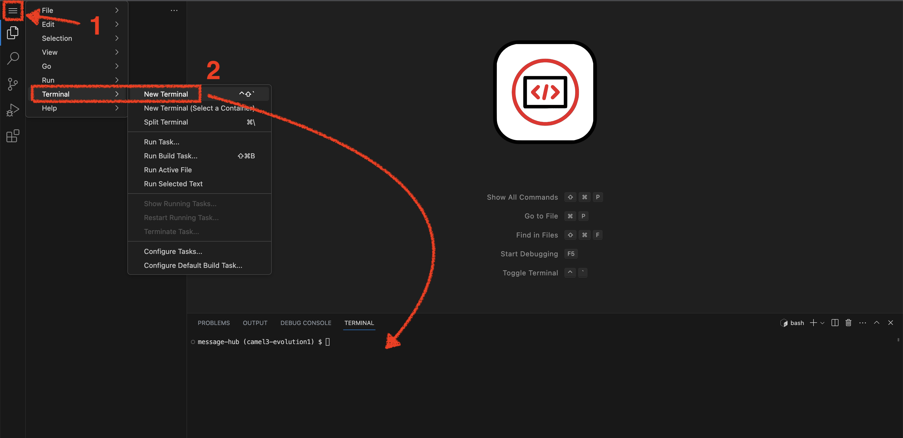
+
{blank}
+
A terminal window should open at the bottom of the screen. This terminal is attached to the running tools container and is also running on _OpenShift_. This is the place where you will issue most of the commands from this workshop.

{empty} +

=== Login into OpenShift using the CLI

. Open a terminal using the instructions from the previous section.

. In the terminal tab, issue the following command:
+
[source,bash,subs="attributes+"]
----
oc project {namespace}
----
+
{blank}
+
[TIP]
====
* To copy the content of snippets of code, as above, click on the copy button on the right side of snippet box.
* Perform the same copy action for other snippets along the workshop to complete the exercises.
====

. You should see something like the following:
+
[subs="attributes+"]
----
message-hub (main) $ oc project {user-username}
Now using project "{user-username}" on server "https://172.30.0.1:443".
message-hub (main) $ 
----
+
{empty} +
+
. Most of the work will be deployed into your own `{namespace}` project namespace.

{empty} +

[type=verification]
Did your terminal show you are connected to _OpenShift_ and pointing to the project `{namespace}`?

[type=verificationFail]
Make sure you follow the commands above. Try again.

[type=verificationSuccess]
You are now ready to start working !

[time=2]
[id='intro-camel-jbang']
== Introduction to Camel JBang
{style-all}

This workshop puts substantial focus on the prototyping phase. When a developer is tasked to deliver a solution, prototyping and experimentation are crucial to finding the best path forward, especially when adopting new, unfamiliar tools and techniques.

During this workshop, _Camel JBang_ will be one such important prototyping tool.

{empty} +

This chapter is an introductory taste of _Camel JBang_ showing you a basic group of commands. Hopefully you'll get to see how much you can sharpen your axe when making a good use of _Camel JBang_. 

{empty} +

=== Playing a game with Camel JBang

They say playing is a great way to learn, so let's play for a bit. While you're at it you'll discover a few tricks _Camel JBang_ has in the bag.

NOTE: Later, we'll get serious when diving into the core of the workshop.

{empty} +

Pretend we're about to organise a tennis tournament.
Let us introduce to you `player1`:

TIP: Click the copy button and paste in your terminal to create the file
--
{copypaste}
----
cat <<EOF > player1.yaml
- route:
    id: player1
    from:
      uri: file:court/side1
      parameters:
        delete: true
      steps:
        - log:
            message: (ping)⋅⋅⋅━━━► 🎾
        - delay:
            constant: "{{pace:2000}}"
        - to:
            uri: file:court/side2
EOF
----
--

NOTE: `player1` one plays on one side of the court and hits every ball that comes his way. +
When hitting the ball, it crosses the court (at a given pace) to the other side.

Run this command to get `player1` on the court, ready to play:

--
{copypaste}
----
camel run player1.yaml
----
--

NOTE: Observe the simplicty of it all, no more than one player in the game, no dependency descriptors, no additional files needed to run the show. _Camel JBang_ figures all out, it reads `player1` and provides all that is needed to the run the game.

In your terminal you'll see `player1` ready:

++++
<pre style="line-height: 1;white-space: pre-wrap">2025-10-26 12:40:32.210 INFO 2243 --- [           main] e.camel.impl.engine.AbstractCamelContext : Apache Camel 4.15.0 (player1) started in 242ms ...</pre>
++++

{blank}

Also, watching closely your folder structure, you'll see on which side `player1` stands waiting for balls:

* `court/side1`

{empty} +

=== Throw a ball

`player1` is ready, give him a 🎾.

From the terminal's top right corner, click `+` to open a second terminal, as shown below:

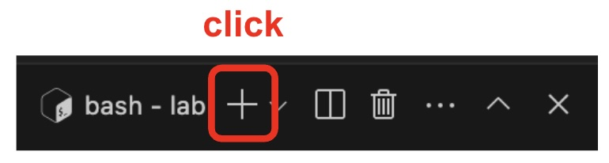

{blank}

From the new terminal, use _Camel JBang_ to hand a ball to `player1`:

TIP: The `send` command is very helpful to test the game, you can throw balls to players and see what happens.

--
{copypaste}
----
camel cmd send player1 --header CamelFileName=🎾
----
--

Get back to the first terminal where `player1` is running:

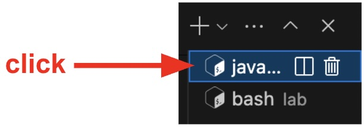

{blank}

Inspect the terminal's output, you should see `player1` hitting the ball to the other side of the court:

++++
<pre style="line-height: 1;white-space: pre-wrap">2025-10-26 12:50:12.951 INFO 2243 --- [e://court/side1] player1.yaml:8           : (ping)⋅⋅⋅━━━► 🎾</pre>
++++

{empty} +

Have a look to the court. You should see the ball resting on the other side:

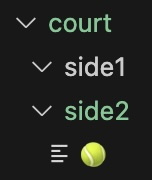

NOTE: The downside of playing tennis with a single player is that balls end up motionless on the other side of the court.

{empty} +

=== The ball boy

We introduce to you the ball boy, he will ensure the court is always tidy.

TIP: Click the copy button and paste in your terminal to create the file
--
{copypaste}
----
cat <<EOF > the-ballboy.yaml
- route:
    id: ballboy
    from:
      uri: timer:check-court
      steps:
        - filter:
            groovy:
              expression: >-
                def court = ['court/side1/🎾', 'court/side2/🎾'];
                def file = court.find { new File(it).exists() }?.with { new File(it) };

                if (file?.exists() && (System.currentTimeMillis() - file.lastModified()) > {{wait:5000}} )
                  return file.delete();
                else
                  return false;
            steps:
              - log:
                  message: "🎾 cleared, court ready."
EOF
----
--

NOTE: In _Camel_, certain tasks require agility. Notice the ballboy making use of _Groovy_ to look at both sides of the court, and retrieve any ball sitting on the court for too long (5 seconds).

Give `player1` some rest. The new hire needs some time to get dressed.  +
Stop the action with kbd:[Ctrl+C].

When you see everyone ready, use the command below to restart:

--
{copypaste}
----
camel run *
----
--

[NOTE]
====
_Camel JBang_ makes things easy:

* Use the `*` wildcard when you have multiple individuals on court. +
* The wildcard also picks up property files where you can configure a different game behaviour. +
Here's an (optional) example `game.properties` you could use:
+
++++
<pre style="line-height: 1;white-space: pre-wrap"># Ball pace (millis) when players hit. Lower value is faster.
pace=2000

# Ballboy waits (millis) before picking up the ball.
wait=5000</pre>
++++
====

Inspect the terminal logs, you should see the ball boy already at work:

++++
<pre style="line-height: 1;white-space: pre-wrap">2025-10-26 18:23:53.558 INFO 20299 --- [r://check-court] the-ballboy.yaml:17           : 🎾 cleared, court ready.</pre>
++++

{blank}

Look also at the court. You'll notice the ball has been cleared:

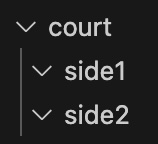

{empty} +

Ok, practice is over, let's organise a real game.

{empty} +

=== Set up the tournament

For a proper game to take place, you need more than just one player. +
We introduce to you `player2`:

TIP: Click the copy button and paste in your terminal to create the file
--
{copypaste}
----
cat <<EOF > player2.yaml
- route:
    id: player2
    from:
      uri: file:court/side2
      parameters:
        delete: true
      steps:
        - log:
            message: "      🎾 ◄━━━⋅⋅⋅(pong)"
        - delay:
            constant: "{{pace:2000}}"
        - to:
            uri: file:court/side1
EOF
----
--

NOTE: These players really train for doing just one thing.

Because this is a prestigious tournament, there's a protocol to follow:

{empty} +

. Let spectators sit confortably while players and staff wait in the locker rooms. +
Press kbd:[Ctrl+C] to follow on with preparations.
+
{empty} +
+
. Let the ball boy go on court first to get ready:
+
--
{copypaste}
----
camel run the-ballboy.yaml --background
----
--
+
NOTE: The flag `--background` indicates _Camel JBang_ to run the process detached.
+
{empty} +
+
. Present the players to the public and let them jump on court:
+
--
{copypaste}
----
camel run player1.yaml --background --dev
----
--
+
--
{copypaste}
----
camel run player2.yaml --background --dev
----
--
+
NOTE: The flag `--dev` indicates _Camel JBang_ to do live code reloads (new racket for example).
+
{empty} +
+
. Before the game starts, check everyone is ready:
+
--
{copypaste}
----
camel ps
----
--
+
NOTE: The `ps` command is handy to check who's playing and who's not, who's ready and who's not, and who's busy and who's not.
+
{empty} +
+
. Join the crowd and enjoy watching the game:
+
--
{copypaste}
----
camel log
----
--
+
[NOTE]
====
The `log` command aggregates all the action on court so that you're aware of all that's happening.

TIP: You can also focus on one single player, or even the ball boy if curious of what the job entails. +
For example to focus on player 1, you would run `camel log player1`.
====
+
{empty} +

Ok, the ball boy is ready, the players are ready, and the public is anxious waiting to see the game start.

{empty} +

=== Let the game begin

`player1` starts serving, hand him a 🎾

--
{copypaste}
----
camel cmd send player1 --header CamelFileName=🎾
----
--

Inspect your terminal output, you should see both players hitting the ball hard:

++++
<pre style="line-height: 1;white-space: pre-wrap;">player1    | 2025-10-26 19:01:36.006 INFO 22363 --- [e://court/side1] player1.yaml:8           : (ping)⋅⋅⋅━━━► 🎾
player2    | 2025-10-26 19:01:38.106 INFO 22578 --- [e://court/side2] player2.yaml:8           :       🎾 ◄━━━⋅⋅⋅(pong)
player1    | 2025-10-26 19:01:40.509 INFO 22363 --- [e://court/side1] player1.yaml:8           : (ping)⋅⋅⋅━━━► 🎾
player2    | 2025-10-26 19:01:42.610 INFO 22578 --- [e://court/side2] player2.yaml:8           :       🎾 ◄━━━⋅⋅⋅(pong)
...
</pre>
++++

{blank}

It's a long rally !

Also, see the ball on the court going back and forth:

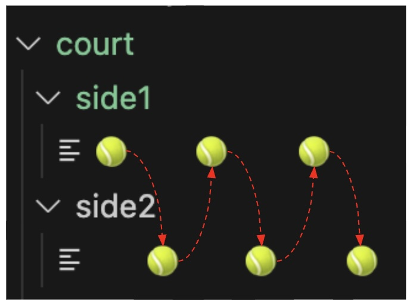

{empty} +

But `player1` feels the laces of his shoe are loose and needs to tie them up. +
Run the command:

--
{copypaste}
----
camel cmd stop-route --id player1
----
--

Because `player1` stopped hitting the ball, spectators will see `player2` hitting last, `player1` tying up his shoe laces, and the ball boy retrieving the ball:

++++
<pre style="line-height: 1;white-space: pre-wrap;">player2    | 2025-10-26 19:32:24.401 INFO 22578 --- [e://court/side2] player2.yaml:8               :       🎾 ◄━━━⋅⋅⋅(pong)
player1    | 2025-10-26 19:32:25.327 INFO 22363 --- [calCliConnector] .engine.AbstractCamelContext : Stopped player1 (file://court/side1)
the-ballboy| 2025-10-26 19:01:42.610 INFO 22140 --- [r://check-court] the-ballboy.yaml:17          : 🎾 cleared, court ready.
</pre>
++++

{empty} + 

==== Game statistics

It's a good moment to look at the game statistics. +
Get the stats with:

--
{copypaste}
----
camel get route
----
--

Stats will reveal who's hitting faster (and other measurements as well):

NOTE: Observe `player1` has stopped playing for a moment, but is still very much part of the game.

----
  PID   NAME         ID       FROM                            REMOTE  STATUS    AGE   COVER  MSG/S  TOTAL  FAIL  INFLIGHT  MEAN  MIN   MAX   LAST  DELTA  SINCE-LAST        
 22140  the-ballboy  ballboy  timer://check-court                     Started   6m3s    2/2   1.00    363     0         0     2     0   841     0      0            0s/0s/- 
 22363  player1      player1  file://court/side1?delete=true    x     Stopped           3/3   0.00     25     2         0  2001  2001  2007  2001      0  1m31s/1m29s/1m41s 
 22578  player2      player2  file://court/side2?delete=true    x     Started  5m21s    3/3   0.00     23     0         0  2001  2001  2012  2001      0      1m29s/1m27s/- 
----

{empty} + 

==== The game resumes

It seems `player1` sorted out the shoe laces problem and is ready to play again. +
Get the player in position again with:

--
{copypaste}
----
camel cmd start-route --id player1
----
--

It's `player2` 's turn to serve, hand him a 🎾

--
{copypaste}
----
camel cmd send player2 --header CamelFileName=🎾
----
--

Here they go again, another insane rally.

{empty} + 

==== Game conditions

It seems the wind is peaking up, some clouds have covered the sky and some spots of rain are dotting the court. +
Weather conditions can really change the game in tennis.

The rain drops make the ball wetter and heavier, the hitting starts to sound funny and the exchanges feel slower. + 

While the intense rally keeps going (ping/pong), make these changes on the players:

* In player 1, change the log message to `p1ng`, and the pace of the ball to `{{pace:3000}}` (slower) 
* In player 2, change the log message to `p0ng`, and the pace of the ball to `{{pace:3000}}` (slower)

NOTE: _Camel JBang_ reacts to live code changes and ensures the new game behaviour takes inmediate effect.

{blank}

You should see in the terminal _Camel_ reacting with reloads:

++++
<pre style="line-height: 1;">player1    | 2025-10-26 19:01:36.006 INFO 22363 --- [rReloadStrategy] RouteWatcherReloadStrategy : Routes reloaded summary (total:1 started:1)
player1    | 2025-10-26 19:01:40.509 INFO 22363 --- [rReloadStrategy] RouteWatcherReloadStrategy : Started player1 (file://court/side1) (source: player1.yaml:4)
</pre>
++++

++++
<pre style="line-height: 1">player2    | 2025-10-26 19:01:38.106 INFO 22578 --- [rReloadStrategy] RouteWatcherReloadStrategy : Routes reloaded summary (total:1 started:1)
player2    | 2025-10-26 19:01:42.610 INFO 22578 --- [rReloadStrategy] RouteWatcherReloadStrategy : Started player1 (file://court/side1) (source: player2.yaml:4)
</pre>
++++

{blank}

Now you'll notice more clearly, the funny sound from the rackets, and the game slowing down:

++++
<pre style="line-height: 1;white-space: pre-wrap;">player2    | 2025-10-26 19:01:43.106 INFO 22578 --- [e://court/side2] player2.yaml:8             :       🎾 ◄━━━⋅⋅⋅(p0ng)
player1    | 2025-10-26 19:01:46.509 INFO 22363 --- [e://court/side1] player1.yaml:8             : (p1ng)⋅⋅⋅━━━► 🎾
player2    | 2025-10-26 19:01:49.610 INFO 22578 --- [e://court/side2] player2.yaml:8             :       🎾 ◄━━━⋅⋅⋅(p0ng)
player1    | 2025-10-26 19:01:52.706 INFO 22363 --- [e://court/side1] player1.yaml:8             : (p1ng)⋅⋅⋅━━━► 🎾
...
</pre>
++++

{empty} +

=== Abrupt end

How unfortunate! +
`player1` slips in the wet court, were his laces well tied up? +
We fear he got injured. After close inspection its confirmed, he needs to quit the game.

--
{copypaste}
----
camel stop player1
----
--

NOTE: Run `camel ps` and you'll notice `player1` no longer takes part in the game.

At this point, it makes no sense to continue the event, the announcement is made, and the game is stopped:

--
{copypaste}
----
camel stop
----
--

NOTE: when no name is specified, _Camel JBang_ stops all.

{empty} +

We're sorry it ended this way, but don't let it spoil your day, there are many other matches to watch!

🎾🎾🎾
Jump to other chapters to see more.
🎾🎾🎾

[type=taskResource]
.Red Hat OpenShift Dev Spaces
****
* link:{codeready-url}[Console, window="_blank", , id="resources-codeready-url"]
****
[type=taskResource]
.Red Hat OpenShift Developer Console
****
* link:{openshift-host}/topology/ns/{namespace}[Topology View, window="_blank"]
****
[type=taskResource]
.Credentials
****
* *username:* `{user-username}`
* *password:* `{user-password}`
****

{empty} +
