// Attributes
:walkthrough: Scenario Introduction
:user-password: openshift
:namespace: {user-username}

// URLs
:codeready-url: http://codeready-che.{openshift-app-host}/


ifdef::env-github[]
endif::[]

[id='lab1-part1-intro']
// = Lab 1 - Gitter to Slack bridge (part-1, Introduction)
= Lab 1.intro - MessageHub - Scenario and Environment

Part 1 (out of 2) introduces the first integration flow to implement, helps you to onboard onto the chat platforms, and presents your development environment.

{empty} +

Target persona: +
--
* *Kubernetes User* +
{empty} +
--
Difficulty level: +
--
* *EASY* +
{empty} +
--
Estimated time: +
--
* *20 mn* +
{empty} +
--

{empty} +

No previous Camel experience is required. +

{empty} +

=== User profiles

This workshop has been designed to attend two different user profiles:


* *The Kubernetes user* (no previous Camel experience) +
The way this user consumes _Camel_ is by selecting catalog _Kamelets_ and creating _Kamelet Bindings_ in YAML definitions. The user creates local YAML files and then pushes them to _OpenShift_. The _Camel K_ operator automates the process of building, creating images and deploying the integrations.

* *The Camel developer* +
The traditional _Camel_ developer would typically, first, use his local environment for the inner loop development cycle. This strategy allows speeding up the process of prototyping and validating the code. Once the basics covered, it would follow the same deployment flow as the Kubernetes user.

{empty} +

[time=2]
[id="scenario-intro"]
== Scenario introduction

The picture billow illustrates the data flow traversing our Camel instance:

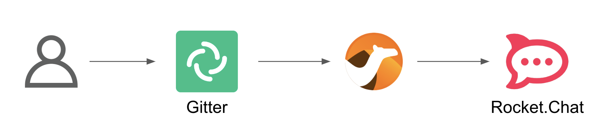

The above process bridges chat messages from _Gitter_ to _Slack_. It requires enabling access to both chat platforms.

Both _Gitter_ and _Slack_ are independent instant messaging systems. _Gitter_ is designed to be a developer collaboration tool while _Slack_ is more generic and aims to be the platform of choice for the entire office. They both have convenient online web access making them ideal for students to use in this workshop.

The tasks to complete in this lab will guide you on how to onboard to both chat systems.

{empty} +


[time=5]
[id="gitter-chat"]
== Gitter platform onboarding

TIP: If you're unfamiliar with Gitter, it is an open-source chat platform designed for developers to have a space where to collaborate and discuss project topics.

{empty} +

=== Create an App in Gitter.


. Login in Gitter
+
You can use one of the following accounts to join Gitter:
+
--
* GitHub
* GitLab
* Twitter
--
+
{empty} +
+
Login to Gitter's developer portal following the URL below: + 
https://developer.gitter.im/login
+
Once logged in, you'll be presented with your personal access token and an empty list of apps (if never created one before).
+
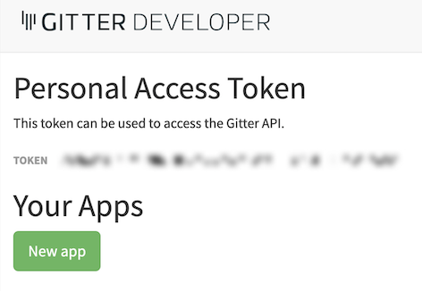
+
{empty} +

. Create a new App that will communicate with Gitter:

1. Click `Your Apps -> New app`
+
1. Give it a new name and set `\http://localhost:8080` as `Redirect URL`. +
For example:
+
--
* *Name*: +
`camelbot`
* *Redirect URL*: +
`\http://localhost:8080`
--
+
{empty} +
+
Gitter will generate your App's access credentials, for example:
+
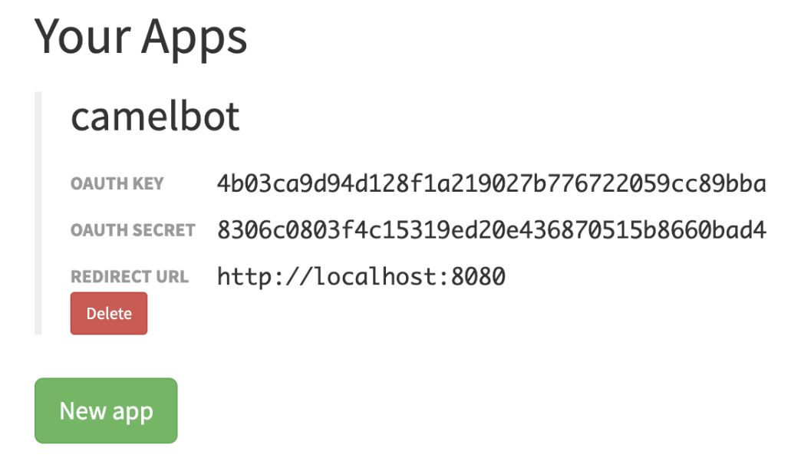
+
{empty} +

=== Authorise your App.

. We need to complete the OAuth web authentication flow.
+
[NOTE]
--
For reference, here's the specification describing the authentication flow:

* https://www.rfc-editor.org/rfc/rfc6749#section-4.1 
--
+
.. Compose the following URL call:
+
CAUTION: ensure you replace `YOUR_APP_OAUTH_KEY`
+
```http
https://gitter.im/login/oauth/authorize?client_id=YOUR_APP_OAUTH_KEY&response_type=code&redirect_uri=http://localhost:8080
```
+
{empty} +
+
For example:
+
* `\https://gitter.im/login/oauth/authorize?client_id=4b03ca9d94d128f1a219027b776722059cc89bba&response_type=code&redirect_uri=http://localhost:8080`
+
{empty} +

.. Open a browser tab, enter your URL in the address bar and press enter. The browser will load an authorization page as per the picture below:
+
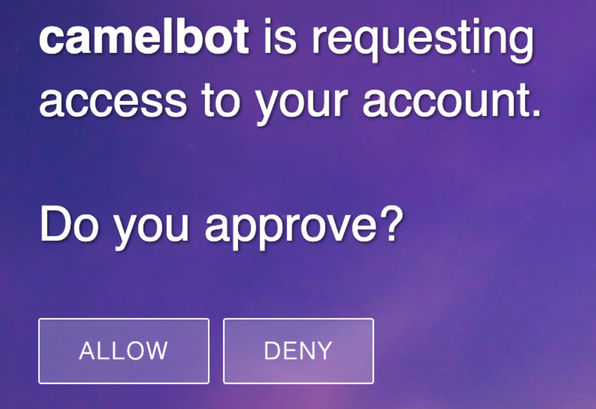
+
{empty} +
+
Click `ALLOW`.
+
The approval action will trigger a redirect that will cause a browser connection error since we we're not running a listening app on 8080, but it allows us to obtain the returned authorisation code from the address bar that should be similar to the following:
+
- \http://localhost:8080/?code=`0119b1eb4d69eb1c2bcf3c9a0570a711cd4b038b`
+
{empty} +

.. Take note of the code, now we have to exchange it to obtain an access token. +
Use the following cURL base command:
+
CAUTION: ensure you replace `YOUR_APP_OAUTH_KEY` / `YOUR_APP_OAUTH_SECRET` / `YOUR_REDIRECT_CODE`
+
```curl
CLIENT_ID=YOUR_APP_OAUTH_KEY \
CLIENT_SECRET=YOUR_APP_OAUTH_SECRET \
CODE=YOUR_REDIRECT_CODE \
&& \
curl -v https://gitter.im/login/oauth/token \
-H "accept: application/json" \
-d "client_id="$CLIENT_ID"&client_secret="$CLIENT_SECRET"&redirect_uri=http://localhost:8080&grant_type=authorization_code&code="$CODE
```
+
{empty} +
+
For example:
+
----
CLIENT_ID=4b03ca9d94d128f1a219027b776722059cc89bba \
CLIENT_SECRET=8306c0803f4c15319ed20e436870515b8660bad4 \
CODE=0119b1eb4d69eb1c2bcf3c9a0570a711cd4b038b \
&& \
curl -v https://gitter.im/login/oauth/token \
-H "accept: application/json" \
-d "client_id="$CLIENT_ID"&client_secret="$CLIENT_SECRET"&redirect_uri=http://localhost:8080&grant_type=authorization_code&code="$CODE
----
+
{empty} +
+
This above cURL command should return something like:
+
----
{"access_token":"2d482bdf092e0e2299832b1f38d9560243083894","token_type":"Bearer"}
----
+
{empty} +

.. Now, use the returned token to discover available Room IDs. Use the following base command:
+
CAUTION: ensure you replace `YOUR_ACCESS_TOKEN`
+
```curl
TOKEN=YOUR_ACCESS_TOKEN \
&& \
curl -v https://api.gitter.im/v1/rooms \
-H "Accept: application/json" \
-H "Authorization: Bearer "$TOKEN
```
+
{empty} +
+
For example:
+
----
TOKEN=2d482bdf092e0e2299832b1f38d9560243083894 \
&& \
curl -v https://api.gitter.im/v1/rooms \
-H "Accept: application/json" \
-H "Authorization: Bearer "$TOKEN
----
+
{empty} +
+
The command above will probably return an empty list if you have not yet joined any _Gitter_ room.

{empty} +

=== Join a Gitter room.

. A number of public rooms were made available for this workshop (roomX). Choose a room number that nobody uses to avoid noisy conversations. Use the invite URL below to join the lab room:
+
CAUTION: ensure you replace `YOUR_ROOM`
+
```http
https://gitter.im/test-lab-camel/YOUR_ROOM?utm_source=share-link&utm_medium=link&utm_campaign=share-link
```
+
{empty} +
+
For example, if choosing `room1`, use the following invite URL
+
----
https://gitter.im/test-lab-camel/room1?utm_source=share-link&utm_medium=link&utm_campaign=share-link
----
+
{empty} +
+
Click `JOIN ROOM` at the bottom of the chat room. At this point you see your avatar included in the room on the right hand side of the room.
+
Running the cURL command again to obtain the rooms should return the identifier of the room you just joined, something similar to:
+
----
[{"id":"6317569e6da03739849c519a"         }]
----
+
{empty} +
+
At this stage, you should have available all the configuration identifiers to define the Kamelet Binding in the next section using the following:
+
```properties
# Gitter credentials
gitter.token=YOUR_ACCESS_TOKEN
gitter.room=YOUR_ROOM_ID
```
+
{empty} +
+
For example
+
----
# Gitter credentials
gitter.token=2d482bdf092e0e2299832b1f38d9560243083894
gitter.room=6317569e6da03739849c519a
----

{empty} +

[type=verification]
Were you able to join a Gitter room successfully?

[type=verification]
Did you obtain the room ID?

{empty} +


[time=5]
[id="slack-chat"]
== Slack platform onboarding


=== Join a Slack workspace.

To accelerate the onboarding process in Slack, we've created a public workspace for anyone to freely join and use for the purpose of this enablement workshop. 

Follow the invite link to join the workshop's workspace in Slack:

* https://join.slack.com/t/camelworkshop/shared_invite/zt-1fvfhatch-HQKSJyob_YIY3nRGhJ7tWA
+
{empty} +
+
CAUTION: The workspace is open to the public, please be mindful of your actions, don't abuse the space.
+
NOTE: if you were unsuccessful joining the public workspace provided, feel free to create you own Slack workspace, you should be able to complete the workshop in the same manner.

{empty} +


=== Join a Slack room (channel).
. A number of public rooms were made available in the public workspace for the workshop (room1, room2, ...roomX). Choose a room number that nobody uses to avoid noisy conversations.
+
Alternatively, you can also create your own room, use the prefix `room_`, for example:

* `room_x`

{empty} +

=== Connect Camel to Slack

To connect from Camel to the chat platform, an App needs to be registered in Slack. You would just need to add the registered App to a particular room to allow Camel to pick up messages.

* If you are running the workshop on your own, you'll have to create an App in Slack. Click the link below to follow instructions on how to create your own App.

** link:#creating-your-own-app-for-slack[Creating your own App for Slack]

* If you're part of a workshop group, an App has been made available for all students to share. You can skip the next section and directly jump to the section with instructions to add the shared App to your selected room.

** link:#adding-an-app-to-a-room[Adding an App to a room]

{empty} +

==== [[creating-your-own-app-for-slack]] Creating your own App for Slack


. Connect to the following URL
+
* https://api.slack.com/apps
+
{empty} +

. Click on the `Create New App` button
+

+
Select `From scratch`, then
+
.. Give it a name, for example `MyCamelApp`.
.. Select `CamelWorkshop` (or your own workspace if you created one)
.. Click `Create App`
+
Once the App created you'll be presented with its `Basic Information`
+
{empty} +

. Select from the left menu:
+

* Features => OAuth & Permissions

+
.. Add scopes
+
Scroll down the screen to find the section `Scopes`. +
Include the following Bot scopes:
+
--
- channels:history
- channels:read
- chat:write
- mpim:history
--
+
{empty} +

.. Generate tokens
+
Scroll up until you find `OAuth Tokens for Your Workspace`. +
Click `Install in Workspace`.
+
You will be requested permissions to access the workspace, click `Allow`.
+
Slack then generates and presents the Oauth token for your App:
+
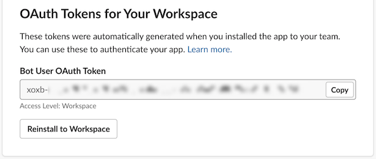

{empty} +

Once your App is created, you're ready to add it to your workspace room (or channel). +
Follow the instructions below on how to add your app:

{empty} +


==== [[adding-an-app-to-a-room]]Adding an App to a room

Once you have an App available, follow the steps below:

. Join a Slack room (channel)
+
A number of public rooms were made available for this workshop (roomX). Choose a room number that nobody uses to avoid noisy conversations.
+
You can also create your own room, use the prefix `room_`, for example:

* `room_x`
+
{empty} +


. Open the channel details of the room you joined
+
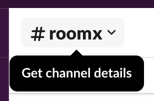
+
{empty} +

. Click on the `Integrations` tab, and add an App
+
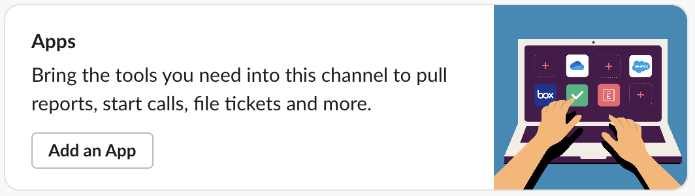
+
{empty} +

. Find the `CamelWorkshopApp` (or your own app), and click `Add`
+
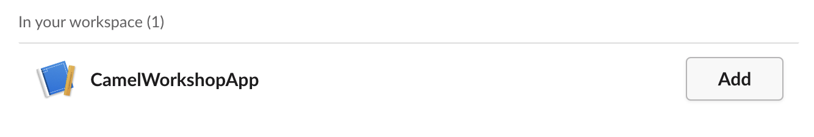
+
{empty} +

Your room has now the App included. Camel can use the App credentials to communicate with Slack.

If you are sharing the App with a group, ask your workshop's admin for the App credentials to configure Camel.

{empty} +

=== Completion checks

[type=verification]
Were you able to add an App to a Slack room?

[type=verification]
Did you complete Slack's onboarding successfully?

{empty} +


[time=2]
[id='dev-environment']
== Development environment

The following instructions introduce you to your development environment, and the cluster where you'll deploy your applications throughout this workshop.

=== Overview

Built on the open Eclipse Che project, Red Hat OpenShift Dev Spaces uses Kubernetes and containers to provide any member of the development or IT team with a consistent, secure, and zero-configuration development environment. The experience is as fast and familiar as an integrated development environment on your laptop.

OpenShift Dev Spaces is included with your OpenShift subscription and is available in the Operator Hub. It provides development teams a faster and more reliable foundation on which to work, and it gives operations centralized control and peace of mind.


[type=walkthroughResource,serviceName=codeready]
.Red Hat OpenShift Dev Spaces
****
* link:{codeready-url}[Console, window="_blank", , id="resources-codeready-url"]
****
[type=walkthroughResource]
.Red Hat OpenShift Developer Console
****
* link:{openshift-host}/topology/ns/{namespace}[Topology View, window="_blank"]
****
[type=walkthroughResource]
.Credentials
****
* *username:* `{user-username}`
* *password:* `{user-password}`
****

// :sectnums:
{empty} +

=== Accessing a Development Environment

The development environment you use throughout the workshop is a web-hosted IDE known as link:https://developers.redhat.com/products/codeready-workspaces/overview[Red Hat OpenShift Dev Spaces, window="_blank"].

{empty} +

=== Login to OpenShift Dev Spaces

To access your development environment:

. Click the link:{codeready-url}[Console, window="_blank"] link under the *Red Hat OpenShift Dev Spaces* in the *Resources* panel on the right.
. Log in using your username (`{user-username}`) and password (`{user-password}`)
+
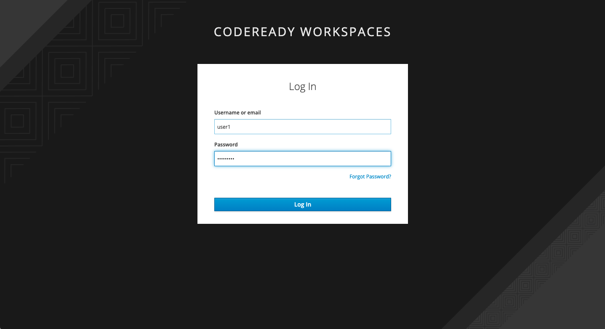
+
{empty} +
+
Once you are logged in, you'll see the CodeReady dashboard. This lists available workspaces.
+
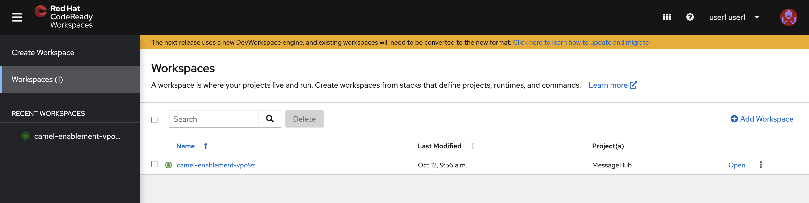

{empty} +

=== Accessing your CodeReady Workspace

This workshop provides a single, pre-configured workspace with plugins, source code, and even container images that have various Command-Line Interface (CLI) tools installed.

. Click the *Open* link for the workspace named `camel-enablement-{user-username}`.
+
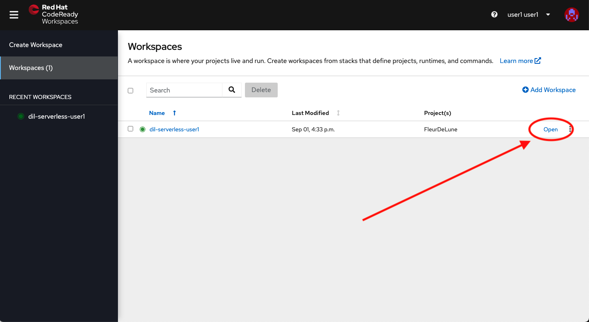
. This will start an instance of the workspace. Please wait a few moments while it downloads the required container images and configuration setup.
. Close the welcome and README tab and the other open dialogs by clicking the *x*, then click on the Explorer (file) icon on the left side bar. The Explorer shows you the *dil-serverless* folder with the required projects and lab files.
+
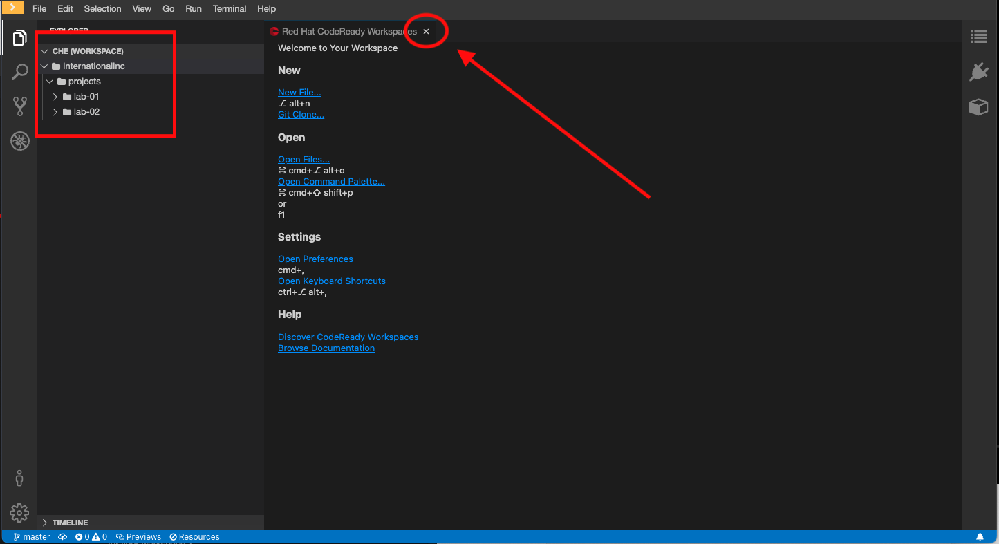
+
[NOTE]
====
This IDE is based on *CodeReady*, which is in turn is based on Microsoft VSCode. It will look familiar if you have already used it.

You can close the _Problems_ and _Output_ views to clear space.
====

=== Accessing a Terminal

During the workshop you will use the OpenShift CLI along with other developer-focused Command Line Interface (CLI) tools.
These CLI tools are available directly inside your Workspace via tools containers.

Access the tools container(s) like so:

. Click on the _My Workspace_ (cube) icon on the right side panel.
. Expand the *User Runtimes* folder.
. Expand the *tools* section.
. Click on *>_ New terminal*.

{blank}

A terminal window should be open at the bottom of the screen. This terminal is attached to the running CodeReady container and is also running on OpenShift. This is the place where you will issue most of the commands from this workshop.

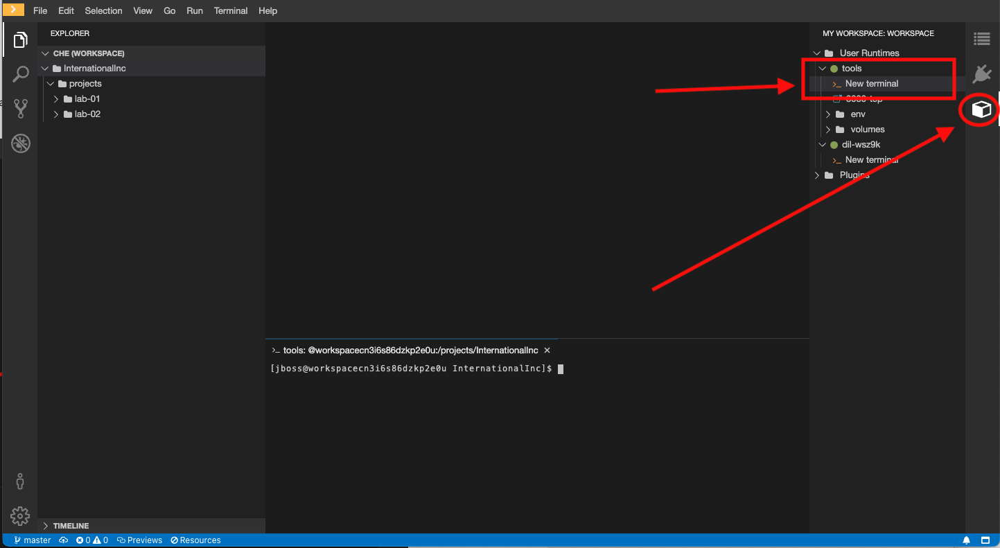

=== Login into OpenShift using the CLI

. Open a terminal using the instructions from the previous section.
. In the terminal tab, issue the following command:
+
[source,bash,subs="attributes+"]
----
oc login -u {user-username} -p {user-password} https://$KUBERNETES_SERVICE_HOST:$KUBERNETES_SERVICE_PORT --insecure-skip-tls-verify=true
----
+
{blank}
+
[NOTE]
====
You can use the right copy button to copy this type of commands along all the lab instructions.
====
. You should see something like the following (the project names may be different):
+
[subs="attributes+"]
----
Login successful.

You have access to the following projects and can switch between them with 'oc project <projectname>':

  * {user-username}
    {user-username}-che
    {user-username}-shared-475f
    {user-username}-workshop-a14c

Using project "user1".
Welcome! See 'oc help' to get started.
----
+
{blank}
+
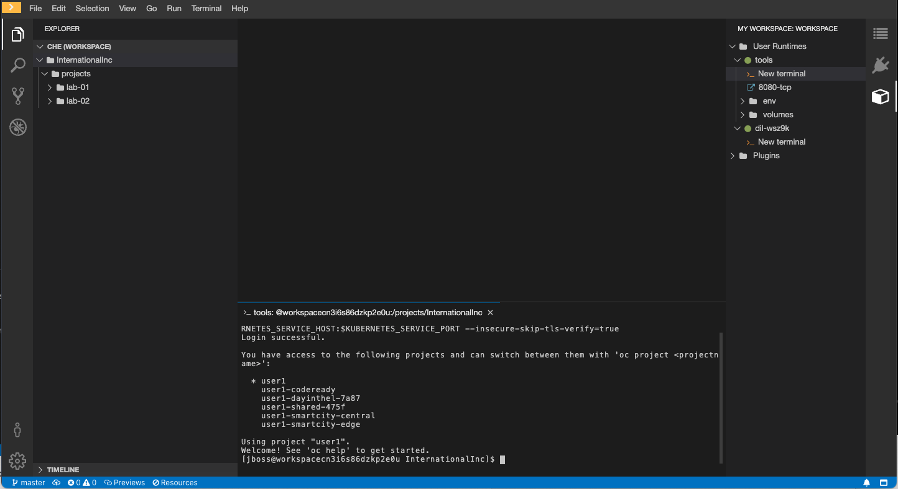
+
{empty} +

. Most of the work will be deploy to your own `{namespace}` project namespace. +
Be sure to have it as a _working_ project by executing the following command:
+
[source,bash,subs="attributes+"]
----
oc project {namespace}
----

{blank}

Now you are ready to start working on the application services!


[time=2]
[id="flow"]
== Preview of the integration flow

=== Process overview

The diagram below illustrates the processing flow you're about to create:

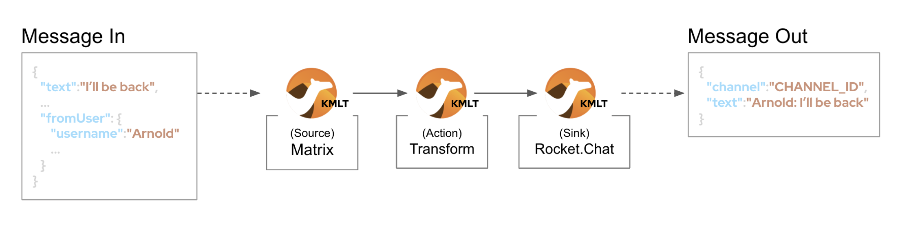

There are 3 Kamelets in use:

====
* *A source* +
Consumes events from _Gitter_.

* *An action* +
Transforms _Gitter_ events to _Slack_ events (in JSON format).

* *A sink* +
Produces events to _Slack_.
====


{empty} +

=== User profiles

This workshop has been designed to attend two different user profiles:


* *The Kubernetes user* (no previous Camel experience) +
The way this user consumes _Camel_ is by selecting catalog _Kamelets_ and creating _Kamelet Bindings_ in YAML definitions. The user creates local YAML files and then pushes them to _OpenShift_. The _Camel K_ operator automates the process of building, creating images and deploying the integrations.

* *The Camel developer* +
The traditional _Camel_ developer would typically, first, use his local environment for the inner loop development cycle. This strategy allows speeding up the process of prototyping and validating the code. Once the basics covered, it would follow the same deployment flow as the Kubernetes user.
+
{empty} +
+
NOTE: The YAML definitions are identical for both profiles. Although this first lab is targeted for the Kubernetes user, we also want to introduce how the Camel developer uses development tooling to accelerate the creation process.

{empty} +

It's up to you to choose which user to impersonate. Considering how easy are the instructions to follow, we recommend choosing the Camel developer, which will anyway mimic the Kubernetes user when deploying in OpenShift. However, if time is a constraint then choose the Kubernetes user.

You've reached the end of Part 1. To complete Lab 1, choose from the main dashboard part 2, it can either be the Camel developer, or the Kubernetes user as per the picture below:

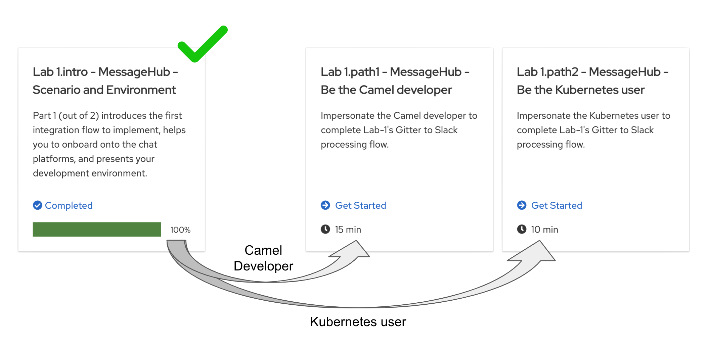

{empty} +

[type=verification]
Are you ready to choose a path?


{empty} +
