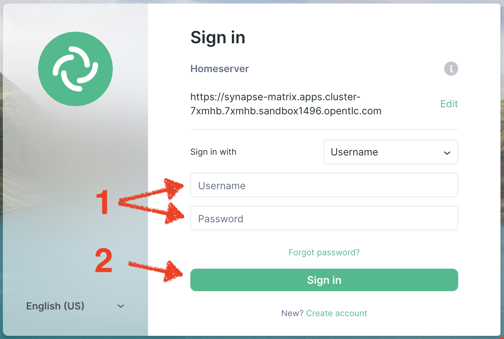

// Attributes
:walkthrough: Scenario Introduction
:user-password: openshift
:namespace: {user-username}
:url-element: https://app.element.io
:url-rocketchat: https://rocketchat-rocketchat.{openshift-app-host}

// URLs
:codeready-url: http://codeready-che.{openshift-app-host}/
:invite-url: http://invite-webapp.{openshift-app-host}

ifdef::env-github[]
endif::[]

[id='lab1-part1-intro']
// = Lab 1 - Matrix to Rocket.Chat bridge (part-1, Introduction)
= Lab 1.intro - MessageHub - Scenario and Onboarding

Part 1 (out of 2) introduces the first integration flow to implement and helps you to onboard onto the chat platforms.

{empty} +

Estimated time: +
--
* *10 mn* +
--

{empty} +

// === User profiles

++++
<h3>User Profiles</h3>
++++

{blank}

* *The Kubernetes user* (no previous Camel experience) +
The way this user consumes _Camel_ is by selecting catalog _Kamelets_ and creating _Kamelet Bindings_ in YAML definitions. The user creates local YAML files and then pushes them to _OpenShift_. The _Camel K_ operator automates the process of building, creating images and deploying the integrations.

* *The Camel developer* +
The traditional _Camel_ developer would typically, first, use his local environment for the inner loop development cycle. This strategy allows speeding up the process of prototyping and validating the code. Once the basics covered, it would follow the same deployment flow as the Kubernetes user.

{empty} +

[time=2]
[id="scenario-intro"]
== Scenario introduction

The picture billow illustrates the data flow traversing our Camel instance:

The above process bridges chat messages from _Matrix_ to _Rocket.Chat_.

* _Matrix_ is an open standard and communication protocol for real-time decentralised communication. It works seamlessly between different service providers.

* _Rocket.Chat_ is also an open-source communications platform with high data protection standards. It enables real-time conversations between colleagues, other companies, or your customers across web, desktop, or mobile devices.

They are both deployed in _OpenShift_ with convenient web access, making them ideal for students to use in this workshop.

The tasks to complete in this lab will guide you on how to onboard to both chat systems.

{empty} +

[time=3]
[id="matrix-chat"]
== Matrix platform onboarding

TIP: If you're unfamiliar with link:https://matrix.org/[_Matrix_,window="_blank"], it is an open standard and communication protocol for real-time decentralised communication. It works seamlessly between different service providers.

{empty} +

=== Join a Matrix room.

. Your dedicated Matrix room
+ 
A number of rooms have been made available for this workshop (roomX). 
+
To work on a room number that nobody uses and avoid noisy conversations, you've been assigned a dedicated room matching your username. +
For example, if your username is:
+
--
* `user1` -> use `room1`
* `user2` -> use `room2`
* `userN` -> use `roomN`
--
+
{empty} +

. Join your room in Matrix
+
Click on the link below to open the Login page in _Matrix_ (opens a new tab).
+
--
- link:{url-element}[Matrix Login page,window="_blank"]
--
+
{blank}
+
You'll be presented with a Login page, as shown below:
+

+
{blank}
+
Click _"Sign In"_.
+
{empty} +

. Follow the steps below to complete the Matrix onboarding:
+
To sign in, first click `Edit` where indicated by the red arrow in the image below to switch the homeserver to use:
+

+
{blank}
+
Then choose the option `Other homeserver`:
+

+
{blank}
+
Now, copy and paste the following _OpenShift_ URL where the homeserver is deployed, and click _"Continue"_
+
[source,bash,subs="attributes+"]
----
https://synapse-matrix.{openshift-app-host}
----
+
{blank}
+
Then, you will be prompted to enter your credentials, as shown below:
+

+
{blank}
+
====
. Enter the following:
+
--
* Username: `{user-username}`
* Password: `{user-password}`
--
+
{blank}
+
. Then, click _"Sign in"_
====
+
{empty} +
+
If you're presented with a _"Verify this device"_, simply discard the window by clicking on the top right corner cross, as shown below:
+

+
{blank}
+
Confirm by clicking on _"I'll verify later"_.
+
{empty} +
+
Finally, you'll notice looking at your Matrix screen you have a pending invitation to join your room. Follow the steps below to accept your invitation:
+

+
--
. Click on your room.
. And, click on _"Accept"_.
--

{empty} +

[type=verification]
Were you able to join the Matrix room successfully?

{empty} +

[time=3]
[id="rocketchat-chat"]
== Rocket.Chat platform onboarding

TIP: If you're unfamiliar with link:https://www.rocket.chat/[_Rocket.Chat_,window="_blank"], it is an open-source communications platform with high data protection standards. It enables real-time conversations between colleagues, other companies, or your customers across web, desktop, or mobile devices.

{empty} +

=== Join your Rocket.Chat room.

. Your dedicated _Rocket.Chat_ room
+ 
A number of rooms have been made available for this workshop (roomX). 
+
To work on a room number that nobody uses and avoid noisy conversations, you've been assigned a dedicated room matching your username. +
For example, if your username is:
+
--
* `user1` -> use `room1`
* `user2` -> use `room2`
* `userN` -> use `roomN`
--
+
{empty} +

. Join your room in _Rockat.Chat_
+
Click on the link below to open the Login page in _Rocket.Chat_ (opens a new tab).
+
--
- link:{url-rocketchat}[Rocket.Chat Login page,window="_blank"]
--
+
{empty} +

. You will be prompted to enter your credentials, as shown below:
+

+
{blank}
+
====
. Enter the following:
+
--
* Username: `{user-username}`
* Password: `{user-password}`
--
+
{blank}
+
. Then, click _"Login"_
====
+
{empty} +

. When you login, you'll see your home page in _Rocket.Chat_, and your room listed in the left panel of your screen, as shown below:
+
image::images/rchat-room.png[align="left", width=50%]

{empty} +

[type=verification]
Were you able to join the _Rocket.Chat_ room successfully?

{empty} +

[time=2]
[id="flow"]
== Preview of the integration flow

=== Process overview

The diagram below illustrates the processing flow you're about to create:

There are 3 Kamelets in use:

====
* *A source* +
Consumes events from _Matrix_.

* *An action* +
Transforms _Matrix_ events to _Slack_ events (in JSON format).

* *A sink* +
Produces events to _Slack_.
====

{empty} +

=== User profiles

This workshop has been designed to attend two different user profiles:

* *The Kubernetes user* (no previous Camel experience) +
The way this user consumes _Camel_ is by selecting catalog _Kamelets_ and creating _Kamelet Bindings_ in YAML definitions. The user creates local YAML files and then pushes them to _OpenShift_. The _Camel K_ operator automates the process of building, creating images and deploying the integrations.
+

* *The Camel developer* +
The traditional _Camel_ developer would typically, first, use his local environment for the inner loop development cycle. This strategy allows speeding up the process of prototyping and validating the code. Once the basics covered, it would follow the same deployment flow as the Kubernetes user.
+

+
{empty} +
+
NOTE: The YAML definitions are identical for both profiles. Although this first lab is targeted for the Kubernetes user, we also want to introduce how the Camel developer uses development tooling to accelerate the creation process.

{empty} +

It's up to you to choose which user to impersonate. Considering how easy are the instructions to follow, we recommend choosing the Camel developer, which will anyway mimic the Kubernetes user when deploying in OpenShift. However, if time is a constraint then choose the Kubernetes user.

You've reached the end of Part 1. To complete Lab 1, choose from the main dashboard part 2, it can either be the Camel developer, or the Kubernetes user as per the picture below:

image::images/continue-part-2.png[align="center", width=80%]

{empty} +

[type=verification]
Are you ready to choose a path?

{empty} +
