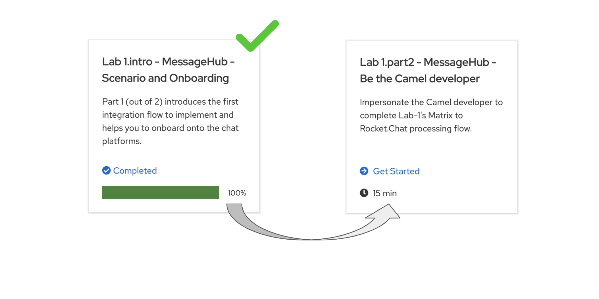

// Attributes
:walkthrough: Scenario Introduction
:user-password: openshift
:namespace: {user-username}

// URLs
:codeready-url: http://codeready-che.{openshift-app-host}/

:invite-url: http://invite-webapp.{openshift-app-host}/


ifdef::env-github[]
endif::[]

[id='lab1-part1-intro']
// = Lab 1 - Gitter to Slack bridge (part-1, Introduction)
= Lab 1.intro - MessageHub - Scenario and Onboarding

Part 1 (out of 2) introduces the first integration flow to implement and helps you to onboard onto the chat platforms.

{empty} +

Estimated time: +
--
* *15 mn* +
{empty} +
--

{empty} +

=== User profiles

This workshop has been designed to attend two different user profiles:


* *The Kubernetes user* (no previous Camel experience) +
The way this user consumes _Camel_ is by selecting catalog _Kamelets_ and creating _Kamelet Bindings_ in YAML definitions. The user creates local YAML files and then pushes them to _OpenShift_. The _Camel K_ operator automates the process of building, creating images and deploying the integrations.

* *The Camel developer* +
The traditional _Camel_ developer would typically, first, use his local environment for the inner loop development cycle. This strategy allows speeding up the process of prototyping and validating the code. Once the basics covered, it would follow the same deployment flow as the Kubernetes user.

{empty} +

[time=2]
[id="scenario-intro"]
== Scenario introduction

The picture billow illustrates the data flow traversing our Camel instance:

image::images/data-flow.png[align="center", width=80%]

The above process bridges chat messages from _Gitter_ to _Slack_. It requires enabling access to both chat platforms.

Both _Gitter_ and _Slack_ are independent instant messaging systems. _Gitter_ is designed to be a developer collaboration tool while _Slack_ is more generic and aims to be the platform of choice for the entire office. They both have convenient online web access making them ideal for students to use in this workshop.

The tasks to complete in this lab will guide you on how to onboard to both chat systems.

{empty} +


[time=5]
[id="gitter-chat"]
== Gitter platform onboarding

TIP: If you're unfamiliar with Gitter, it is an open-source chat platform designed for developers to have a space where to collaborate and discuss project topics.

{empty} +

=== Join a Gitter room.

. Choose your room
+ 
A number of public rooms were made available for this workshop (roomX). 
+
To choose a room number that nobody uses and avoid noisy conversations, select one with the same number as your workshop username. +
For example, if your username is:
+
--
* `user1` -> then select `room1`
* `user2` -> then select `room2`
* `userN` -> then select `roomN`
--
+
{empty} +


. Join your room in Gitter
+
.. Click on the link below to generate your invitation to _Gitter_ (opens a new tab).
+
NOTE: The generated invitation will automatically assign your room as above explained (`userN` -> `roomN`)
+
--
- link:{invite-url}/invite/gitter?user={user-username}[Generate Gitter invite,window="_blank"]
--
{empty} +

.. Then, follow the link generated (click on it) to join your _Gitter_ room.
+
image::images/invite-link.png[align="left", width=50%]
+
{empty} +

. Follow the steps below to complete the Gitter invitation:
+
Your browser might present to you the following screen, prompting you to confirm you use the `gitter.im` server. +
Click `Continue`.
+
image::images/matrix-join-0.png[align="left", width=40%]
+
{blank}
+
To continue, you'll be presented on screen with a series of apps to choose from. +
As per the image below, select _Element_ which has a browser based client.
+
image::images/matrix-join-1.png[align="left", width=40%]
+
{blank}
+
Then select `Continue in your browser`, as per the image below.
+
image::images/matrix-join-2.png[align="left", width=40%]
+
{blank} 
+
Next, click `Sign In`:
+
image::images/matrix-join-3.png[align="left", width=30%]
+
{blank}
+
To sign in, first click `Edit` where indicated by the red arrow in the image below to switch the homeserver to use:
+
image::images/matrix-join-4-pre.png[align="left", width=50%]
+
{blank}
+
Then choose the option `Other homeserver`, type in `gitter.im` and click `Continue` as illustrated in the caption below:
+
image::images/matrix-join-4-pre2.png[align="left", width=50%]
+
{blank}
+
Now, to sign in, you can choose your preferred identity provider, as shown below:
+
image::images/matrix-join-4.png[align="left", width=50%]
+
{blank}
+
If you're asked to confirm your account, click `Continue`:
+
image::images/matrix-join-5.png[align="left", width=40%]
+
{blank}
+
Finally, click `Join the discussion` to join the room:
+
image::images/matrix-join-6.png[align="left", width=30%]
+
{empty} +


[type=verification]
Were you able to join the Gitter room successfully?

=== Obtain the room ID.

Your _Camel_ definitions need to be configured using Gitter's internal Room ID.

To find the room's ID, follow the steps indicated below:

. Expand the options by clicking in your room details and select `Settings`, as shown below:
+
image::images/matrix-roomid-1.png[align="left", width=40%]
+
{blank}
+
. Select `Advanced` and copy the `Internal room ID`, as per the illustration below:
+
image::images/matrix-roomid-2.png[align="left", width=40%]
+
{empty} +
+
IMPORTANT: Keep the returned room ID safely as you'll need it later to configure _Camel_.

{empty} +

[type=verification]
Were you able to obtain the internal room ID?

{empty} +

=== Obtain an authorization token.

You'll need to obtain an _OAuth_ token for _Camel_ to use when consuming or producing events to _Gitter_.

To complete the OAuth flow and obtain a token, follow the instructions below.

{empty} +

1. Initiate your access token request.
+
The command below will obtain your access token. +
It waits for you to paste the `loginToken` value you will obtain in step 2.
+
Proceed by executing the following command in your terminal:
+
```curl
read -p "Paste here your 'loginToken': " LOGIN_TOKEN \
&& \
curl -s -X POST https://gitter.ems.host/_matrix/client/v3/login -d "{\"type\": \"m.login.token\",\"token\": \"$LOGIN_TOKEN\"}" | jq -r .access_token
```
+
NOTE: Proceed with step 2 to obtain your `loginToken` in order to complete the command's execution.
+
{empty} +

1. Obtain your `loginToken`
+
IMPORTANT: The sequence of steps that follows need to happen quickly, as the temporary token's expiry time is very short.
+
.. Click the link below to initiate the authorization flow: +
(opens a new tab)
+
--
- link:https://gitter.ems.host/_matrix/client/v3/login/sso/redirect?redirectUrl=http://localhost:8080[Authorization flow,window="_blank"]
--
+
{empty} +

.. In the new tab, choose any of the given identity providers.
+
You can use one of the following:
+
--
* GitHub
* GitLab
* Twitter
--
+
{blank}
+
The approval action triggers a redirect that will cause a browser connection error since we're not running a listening app on 8080, but it allows us to obtain the returned authorisation code from the address bar that should be similar to the following:
+
- \http://localhost:8080/?loginToken=`syl_GnyBmyaMSUUhRLRVZHCs_4ddppY`
+
{empty} +

1. Take note of the returned `loginToken` (copy the value) 

1. Paste the value in the prompt from step 1. +
The command will complete its execution and an access token similar to the sample below should be returned:
+
----
syt_Ym1lc2VndWUtBGVtby02MzE1ZjBlOTZkYTAzNzM5ODQ5YzQzM2Y_PvFLHTpEUVJNfHXYZkDO_0YDnHx
----
+
{empty} +
+
IMPORTANT: Keep the returned `access_token` safely as you'll need it later to configure _Camel_.
+
{empty} +

At this stage, you should have now all the configuration values required to configure your data flows in the lab.


[type=verification]
Did you take note of your access token?


{empty} +


[time=5]
[id="slack-chat"]
== Slack platform onboarding


=== Join a Slack workspace.

To accelerate the onboarding process in Slack, we've created a public workspace for anyone to freely join and use for the purpose of this enablement workshop. 

. Click on the link below to generate your invitation to _Slack_ (opens a new tab).
+
--
- link:{invite-url}/invite/slack[Generate _Slack_ invite,window="_blank"]
--
+
{empty} +

. Then, follow the link generated (click on it) to join your _Slack_ workspace.
+
image::images/invite-link.png[align="left", width=50%]

. In the new tab, navigate as indicated to join the workshop's workspace in _Slack_.

{empty} +

CAUTION: The workspace is open to the public, please be mindful of your actions, don't abuse the space.

TIP: If during the login process in _Slack_ you have problems with the SSO server, try again from an incognito window in your browser.

NOTE: if you were unsuccessful joining the public workspace provided, feel free to create you own _Slack_ workspace, you should be able to complete the workshop in the same manner.

{empty} +


=== Join a Slack room (channel).
. A number of public rooms were made available in the public workspace for the workshop (room1, room2, ...roomN).
+
To choose a room number that nobody uses and avoid noisy conversations, select one with the same number as your workshop username. +
For example, if your username is:
+
--
* `user1` -> then select `room1`
* `user2` -> then select `room2`
* `userN` -> then select `roomN`
--
+
{empty} +
+
You can also create your own room, use the prefix `room`, for example:

* `roomx`
+
{empty} +

=== Connect Camel to Slack

To connect from _Camel_ to the chat platform, an App needs to be registered in _Slack_. You would just need to add the registered App to a particular room to allow _Camel_ to pick up messages.

{blank}

* An App has been made available for all students to share.
+
[TIP]
--
Ask your classroom administrator for the shared App's credentials. +
The workshop slides should contain the token values valid for today's session:

image::images/apps-tokens.png[align="left", width=80%]
--
+
You can skip the next part (app creation) and directly jump to the section with instructions to add the shared App to your selected room.
+
TIP: Some browsers misbehave, if the link below fails, simply scroll down to the section they're pointing to.
+
** link:#adding-an-app-to-a-room[Adding an App to a room]

{empty} +

* If you are running the workshop on your own, you'll have to create an App in _Slack_. Click the link below to follow instructions on how to create your own App.
+
--
TIP: Some browsers misbehave, if the link below fails, simply scroll down to the section they're pointing to.

** link:#creating-your-own-app-for-slack[Creating your own App for Slack]

WARNING: Instead of creating your own app, we recommend the option above to use the shared App already available, contact the DIL-Camel admins. +
_Slack_ limits the number of apps in a _Workspace_ to 10 and the workshop's space might already be full. If you can't associate your app, contact the DIL-Camel admins. _Slack_ might take 24h to completely process the deletion of old apps to make room to yours.

WARNING: DIL-Camel admins will periodically perform a clean-up of old workspace apps. If you create a new app and add it to the workspace, it might get deleted after a few days/weeks. 
--
+
{empty} +


==== [[creating-your-own-app-for-slack]] Creating your own App for Slack


IMPORTANT: You can skip this part if a shared App was made available for the workshop, ask your administrator.


. Connect to the following URL
+
* link:https://api.slack.com/apps[window="_blank"]
+
{empty} +

. Click on the `Create New App` button
+
image::images/slack-create-app.png[align="left", width=20%]
+
{blank}
+
Select `From scratch`, then
+
.. Give it a unique name to prevent naming clashes, for example `MyUniqueNameApp`.
.. Select `CamelWorkshop` (or your own workspace if you created one)
.. Click `Create App`
+
Once the App created you'll be presented with its `Basic Information`
+
{empty} +

. Select from the left menu:
+

* Features => OAuth & Permissions

+
.. Add scopes
+
Scroll down the screen to find the section `Scopes`. +
Include the following Bot scopes:
+
--
- channels:history
- channels:read
- chat:write
- mpim:history
--
+
{empty} +

.. Generate tokens
+
Scroll up until you find `OAuth Tokens for Your Workspace`. +
Click `Install in Workspace`.
+
You will be requested permissions to access the workspace, click `Allow`.
+
Slack then generates and presents the Oauth token for your App:
+
image::images/slack-app-oauth-token.png[align="left", width=50%]

{empty} +

Once your App is created, you're ready to add it to your workspace room (or channel). +
Follow the instructions below on how to add your app:

{empty} +


==== [[adding-an-app-to-a-room]]Adding an App to a room

Once you have an App available, follow the steps below:

. Join a Slack room (channel)
+
A number of public rooms were made available for this workshop (roomX).
+
To choose a room number that nobody uses and avoid noisy conversations, select one with the same number as your workshop username. +
For example, if your username is:
+
--
* `user1` -> then select `room1`
* `user2` -> then select `room2`
* `userN` -> then select `roomN`
--
+
{empty} +


+
You can also create your own room, use the prefix `room`, for example:

* `roomx`
+
{empty} +


. Open the channel details of the room you joined
+
image::images/slack-room-details.png[align="left", width=20%]
+ 
{empty} +

. Click on the `Integrations` tab, and add an App
+
NOTE: Your selected room might already have the *_CamelWorkshopApp_* added. If that is the case you can ignore these actions.
+
image::images/slack-add-app.png[align="left", width=50%]
+
{empty} +

. Find the `CamelWorkshopApp` (or your own app), and click `Add`
+
NOTE: If the room already has the *_CamelWorkshopApp_* you can ignore this action.
+
image::images/slack-add-app-to-room.png[align="left", width=60%]
+
{empty} +

Your room has now the App included. Camel can use the App credentials to communicate with Slack.

If you are sharing the App with a group, ask your workshop's admin for the App credentials to configure Camel.

{empty} +

=== Completion checks

[type=verification]
Did you complete Slack's onboarding successfully?

{empty} +


[time=2]
[id="flow"]
== Preview of the integration flow

=== Process overview

The diagram below illustrates the processing flow you're about to create:

image::images/processing-flow.png[align="center", width=80%]

There are 3 Kamelets in use:

====
* *A source* +
Consumes events from _Gitter_.

* *An action* +
Transforms _Gitter_ events to _Slack_ events (in JSON format).

* *A sink* +
Produces events to _Slack_.
====


{empty} +

=== User profiles

This workshop has been designed to attend two different user profiles:


* *The Kubernetes user* (no previous Camel experience) +
The way this user consumes _Camel_ is by selecting catalog _Kamelets_ and creating _Kamelet Bindings_ in YAML definitions. The user creates local YAML files and then pushes them to _OpenShift_. The _Camel K_ operator automates the process of building, creating images and deploying the integrations.
+
image::images/workflow-kube-user.png[align="center", width=80%]


* *The Camel developer* +
The traditional _Camel_ developer would typically, first, use his local environment for the inner loop development cycle. This strategy allows speeding up the process of prototyping and validating the code. Once the basics covered, it would follow the same deployment flow as the Kubernetes user.
+
image::images/workflow-camel-user.png[align="center", width=80%]
+
{empty} +
+
NOTE: The YAML definitions are identical for both profiles. Although this first lab is targeted for the Kubernetes user, we also want to introduce how the Camel developer uses development tooling to accelerate the creation process.

{empty} +

It's up to you to choose which user to impersonate. Considering how easy are the instructions to follow, we recommend choosing the Camel developer, which will anyway mimic the Kubernetes user when deploying in OpenShift. However, if time is a constraint then choose the Kubernetes user.

You've reached the end of Part 1. To complete Lab 1, choose from the main dashboard part 2, it can either be the Camel developer, or the Kubernetes user as per the picture below:



{empty} +

[type=verification]
Are you ready to choose a path?


{empty} +
