:walkthrough: Matrix to Rocket.Chat bridge ()
:user-password: openshift
:namespace: {user-username}
:invite-url: http://invite-webapp.{openshift-app-host}

:url-element: https://app.element.io
:url-rocketchat: https://rocketchat-rocketchat.{openshift-app-host}
:url-codeready: http://codeready-che.{openshift-app-host}/
:url-devconsole: {openshift-host}/topology/ns/{namespace}

ifdef::env-github[]
endif::[]

[id='lab1-part2-camel']
= Lab 1.part2 - MessageHub - Be the Camel developer

Impersonate the Camel developer to complete Lab-1's Matrix to Rocket.Chat processing flow.

{empty} +

Prerequisites: +
--
* Ensure you have previously completed the following tiles:
+
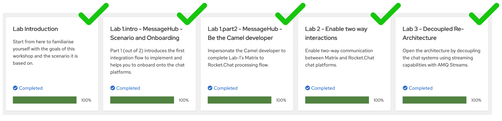

{empty} +
--

Technical goals and milestones:

* Development of a _no-code_ integration (_Kamelet_ binding)
* Define JSON data transformers.
* Use of _Camel JBang_ for fast prototyping
* Local execution and testing
* Deployment in OpenShift

{empty} +

The instructions below are divided in two segments:

* Local development (and testing)
* Deployment in OpenShift

{empty} +

[time=10]
[id="local"]
== Local development 

[type=taskResource]
.Credentials
****
* *username:* `{user-username}`
* *password:* `{user-password}`
****
[type=taskResource]
.Red Hat OpenShift Dev Spaces
****
* link:{url-codeready}[Console, window="_blank"]
****
[type=taskResource]
.Red Hat OpenShift Developer Console
****
* link:{url-devconsole}[Topology View, window="_blank"]
****
[type=taskResource]
.Matrix
****
* link:{url-element}[Matrix Web Client, window="_blank"]
****
[type=taskResource]
.Rocket.Chat
****
* link:{url-rocketchat}/topology/ns/{namespace}[Rocket.Chat Web Client, window="_blank"]
****

This workshop has been designed to attend two different user profiles:

For reference, here's again the processing flow to implement:

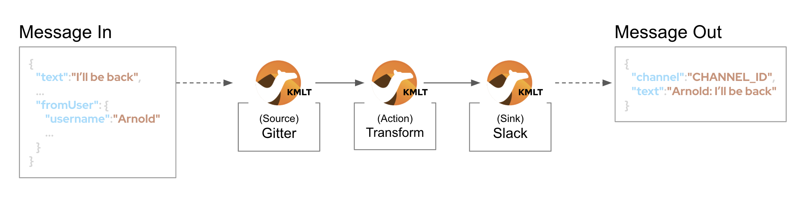

You will include 3 Kamelets:

====
* *A source* +
Consumes events from _Matrix_.

* *An action* +
Transforms _Matrix_ events to _Rocket.Chat_ events (in JSON format).

* *A sink* +
Produces events to _Rocket.Chat_.
====

{empty} +

[IMPORTANT] 
--
You need to already be onboarded into _Matrix_ and _Rocket.Chat_. +
Ensure you have previously completed: 

- *_Lab 1.intro - MessageHub - Scenario and Onboarding_*.
--

{empty} +

The development tool that will help us iterate our code in our local environment is _Camel JBang_.

image::images/camel-jbang.png[align="left", width=40%]

{empty} +

TIP: Camel JBang is an upstream tool for _Camel_. It is not supported yet by Red Hat but it is an extremely useful tool for all things Camel. It simplifies many of the common tasks a Camel developer undergoes. 

. From your UI terminal...
+
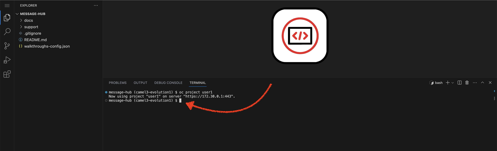
+
{blank}
+
Create a folder and resources where you will work. +
Copy and paste in your terminal the following:
+
[source, subs=]
----
mkdir lab1
cd lab1
touch m2r.yaml
touch stage1.properties<br>
----
+
NOTE: The commands above also create the file sources you need for the exercise.
+
{empty} +

. Create the definitions
+
.. Open the `m2r.yaml` file in your editor.
+
Select from your project tree:
+
* MessageHub -> Lab1 -> m2r.yaml
+
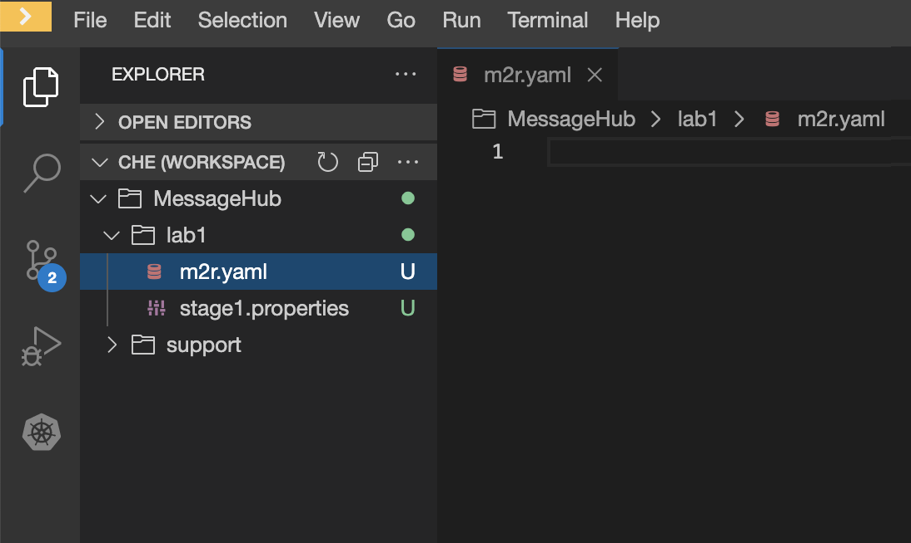
+
{empty} +

.. To start with, we will simply consume Matrix messages and log them. We select the following 2 Kamelets to bind:
+
--
- matrix-source
- log-sink
--
+
NOTE: The `matrix-source` _Kamelet_ is not provided out of the box by Camel K. It has been specifically created and deployed for this workshop.
+
{empty} +
+
Include in your YAML file `m2r.yaml` (matrix to rocketchat) the following definition:
+
```yaml
apiVersion: camel.apache.org/v1alpha1
kind: KameletBinding
metadata:
  name: m2r
  # paste annotations here (when instructed)
spec:

  source:
    ref:
      kind: Kamelet
      apiVersion: camel.apache.org/v1
      name: matrix-source
    properties:
      token: "{{matrix.token}}"
      room:  "{{matrix.room}}"

  # paste JSLT action here (when instructed)

  sink:
    ref:
      kind: Kamelet
      apiVersion: camel.apache.org/v1
      name: log-sink 
```
+
NOTE: The `matrix-source` kamelet is implemented following the specification of the Matrix Sync API (new Matrix's API) to consume events from the server. To know more, read its API documentation here: https://spec.matrix.org/v1.6/client-server-api/#syncing
+
{empty} +
+
.. Now include in your properties file `stage1.properties` the following entries:
+
```properties
# On shutdown it reduces waiting time when stoping Camel's streaming listener
camel.main.shutdownTimeout = 5

# Matrix credentials
matrix.token=YOUR_ACCESS_TOKEN
matrix.room=YOUR_ROOM_ID
```
+
{empty} +
+
... To configure the `matrix.token` parameter, obtain its value from  the sequence of steps shown in the image below:
+
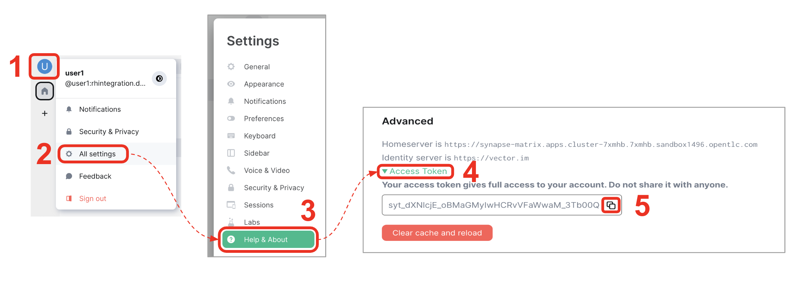
+
--
From Matrix: 

. Start from the _"User Menu"_
. Then, click _"All settings"_
. Select _"Help & About"_
. Scroll to the very bottom, and click _"Access Token"_
. Finally, click the _Copy_ button
--
+
{empty} +
+
... To configure the `matrix.room` parameter, obtain its value from the sequence of steps shown in the image below:
+
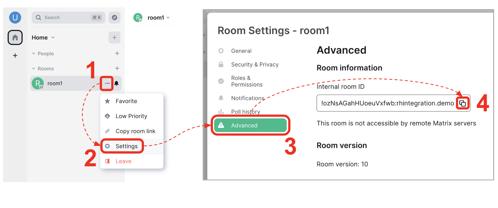
+
--
From Matrix: 

. Start from the _"Room options"_.
. Then, click _"Settings"_.
. Select _"Advanced"_.
. Finally, click the _Copy_ button of the _"Internal room ID"_.
--
+
{empty} +

. Run your YAML definition with Camel JBang
+ 
Use the following command to run locally your Kamelet Binding:
+
```bash
camel run * --local-kamelet-dir=../support/deploy/kamelets
```
+
NOTE: Observe the simplicity of the command `camel run \*`. The wildcard `*` allows _Camel JBang_ to automatically scan the folder and recognise the type of each file found (code, properties, resource, etc.).
+
NOTE: The command includes a flag to find custom kamelets. The _Matrix_ kamelet has been created for this workshop and does not come out-of-the-box from the default _Camel_ catalog.
+
[WARNING]
--
If the command above failed with the following output:

----
[jbang] [ERROR] Could not download https://github.com/apache/camel/blob/HEAD/jbang-catalog.json
[jbang] Run with --verbose for more details
----

{blank}

Run the following command and try again:
```bash
jbang cache clear
```
--
+
[WARNING]
--
If the command above failed with the message `camel not found`, you may have instantiated the wrong terminal. Make sure you open the *Tools* terminal as per the picture below:

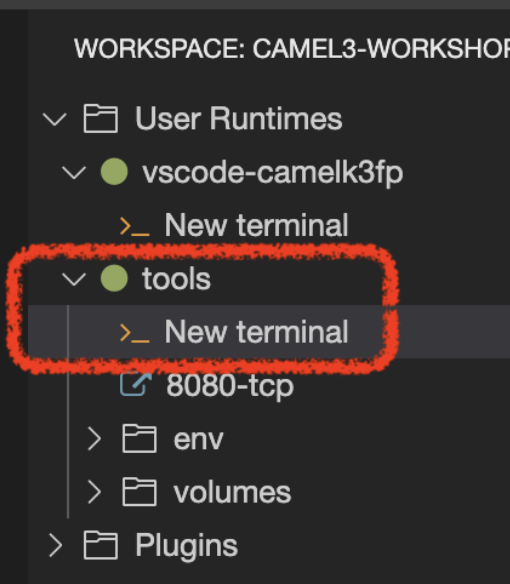

--
+
{blank}
+
_Camel JBang_ will build a local runnable and start it. +
In the output logs you should see _Camel_ connecting to _Matrix_, similar to the following:
+
----
... : Apache Camel 3.19.0 (m2r) started in 1s658ms (build:118ms init:1s323ms start:217ms JVM-uptime:3s)
... : Opening connection to Matrix...
... : Matrix HTTP Streaming started
----
+
{empty} +
+
Now, from the _Matrix_ chat room, send a message, for example `Hello Camel`.
+
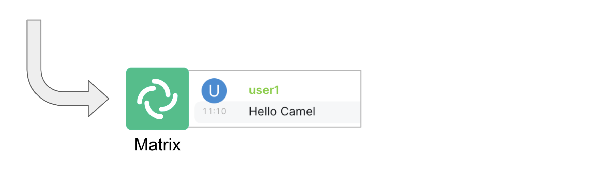
+
{blank}
+
Your terminal should show the arrival of a _Matrix_ event similar to the following JSON payload:
+
[subs="attributes+"]
----
{"fromUser":{"username":"{user-username}","displayName":"{user-username}"},"text":"Hello Camel","sent":"2023-06-19T10:10:20.000Z"}
----
+
{blank}
+
Hopefully you've been successful in capturing _Matrix_ messages with _Camel_. +
Press `Ctrl`+`C` to stop _Camel_.
+
[TIP]
--
_Camel JBang_ also implements the following very handy commands when running multiple _Camel_ integrations:

* `camel ps` to list running _Camel_ integrations.
* `camel stop <instance_name>` to shut down a running _Camel_ integration.  
--
+
{empty} +

. Now we need to extend the _Kamelet Binding_ definition to include data transformation that matches the JSON structure the target system (_Rocket.Chat_) expects.
+
We choose from the Kamelet Catalog the JSLT action to transform the body.
+
TIP: JSLT is a very convenient transformer to manipulate JSON payloads. It's inspired in XSLT (XML Transformation) to define stylesheets containing transformation rules for JSON.
+
Create the JSLT file `m2r.jslt` with the command:
+
```bash
touch m2r.jslt
```
+
{blank}
+
Open the new file in your editor and copy/paste the following definition:
+
```
{
    "channel":"YOUR_ROOM",
    "text":"*"+.fromUser.username+"@matrix*: "+.text
}
```
+
[IMPORTANT]
====
The field `channel` denotes the target room in _Rocket.Chat_ where messages will be pushed. +
Make sure you replace `YOUR_ROOM` with your designated room, for example:

* `user1` -> use `room1`
* `user2` -> use `room2`
* `userN` -> use `roomN`
====
+
[NOTE]
====
The field `text` includes JsonPath rules extracting values from the input Matrix event.
====
{empty} +

. Modify your YAML definition to include the JSLT action between your Kamelet source and sink.
+
NOTE: The JSLT action is defined as a step in a _KameletBinding_ definition. `steps` are a high-level block in the same column as the `source` and `sink`.
+
[TIP]
--
For clarity, the picture below illustrates how copy/paste actions  should be performed all along the lab exercises.

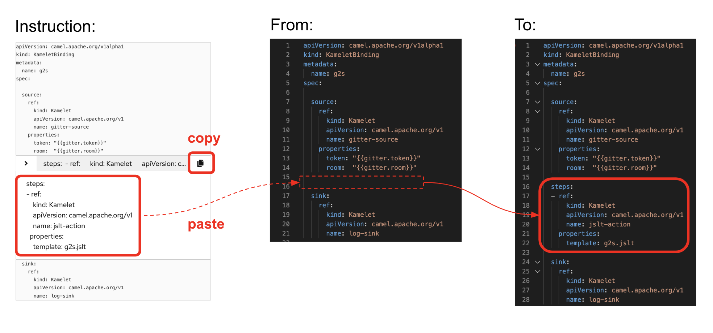
--
+
Following the above illustration, copy and paste the snippet from below into your code:
+
----
apiVersion: camel.apache.org/v1alpha1
kind: KameletBinding
metadata:
  name: m2r
spec:

  source:
    ref:
      kind: Kamelet
      apiVersion: camel.apache.org/v1
      name: matrix-source
    properties:
      token: "{{matrix.token}}"
      room:  "{{matrix.room}}"
----
+
```yaml
  steps:
  - ref:
      kind: Kamelet
      apiVersion: camel.apache.org/v1
      name: jslt-action
    properties:
      template: m2r.jslt
```
+
----
  sink:
    ref:
      kind: Kamelet
      apiVersion: camel.apache.org/v1
      name: log-sink 
----
{empty} +
+

. Run Camel JBang again ensuring you include your JSLT file. It should look as follows:
+
```bash
camel run * --local-kamelet-dir=../support/deploy/kamelets
```
{empty} +

. From Matrix send another chat message and inspect your terminal output. +
You should see an incoming event now transformed and looking similar to this:
+
[subs="attributes+"]
----
{"channel":"room1","text":"*{user-username}@matrix*: Hello Camel"}
----
+
{empty} +
+
At this stage you're ready to replace the `log-sink` by the real one, the `rocketchat-sink` _Kamelet_.
+
{empty} +

. [[step-rocketchat-sink]]Replace your Log sink Kamelet by the Rocket.Chat one.
+
Copy from below the `rocketchat-sink` definition, and replace your old `log-sink` code.
+
----
apiVersion: camel.apache.org/v1alpha1
kind: KameletBinding
metadata:
  name: m2r
spec:

  source:
    ref:
      kind: Kamelet
      apiVersion: camel.apache.org/v1
      name: matrix-source
    properties:
      token: "{{matrix.token}}"
      room:  "{{matrix.room}}"

  steps:
  - ref:
      kind: Kamelet
      apiVersion: camel.apache.org/v1
      name: jslt-action
    properties:
      template: m2r.jslt
----
+
```yaml
  sink:
    ref:
      kind: Kamelet
      apiVersion: camel.apache.org/v1
      name: rocketchat-sink
    properties:
      userid: "{{rocketchat.userid}}"
      token: "{{rocketchat.token}}"
```
+
{blank}
+
[TIP]
--
If you want to keep the `log-sink` activity, you can move it to the `steps` group as an action using the following definition:

----
  - ref:
      kind: Kamelet
      apiVersion: camel.apache.org/v1
      name: log-sink   
----
--
+
{empty} +

. Include your Rocket.Chat credentials in your configuration file.
+
.. Copy from below the parameter definitions `rocketchat.*`, paste them into your properties file, and configure their values with your _Rocket.Chat_ credentials, as per the instructions that follow.
+
----
# On shutdown it reduces waiting time when stoping Camel's streaming listener
camel.main.shutdownTimeout = 5

# Matrix credentials
matrix.token=2d482bdf092e0e2299832b1f38d9560243083894
matrix.room=6317569e6da03739849c519a
----
+
```properties
# Rocket.Chat credentials
rocketchat.token=YOUR_TOKEN
rocketchat.userid=YOUR_USER_ID
```
+
{empty} +
+
.. To configure the _Rocket.Chat_ credentials, obtain them from the sequence of steps shown in the image below:
+
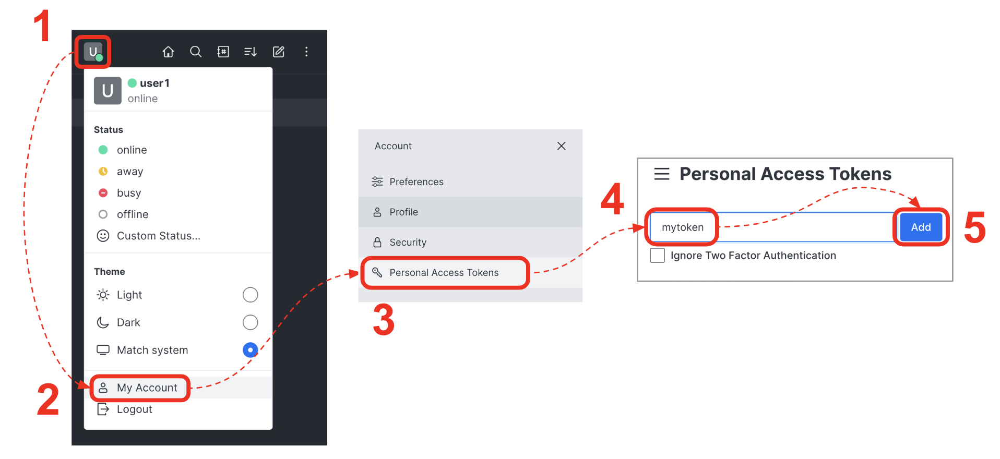
+
--
From _Rocket.Chat_: 

. Start from the _"User Menu"_.
. Then, click _"My Account"_.
. Select _"Personal Access Tokens"_.
. Type in a name for your token, for example `mytoken`.
. Click the _Add_ button
--
+
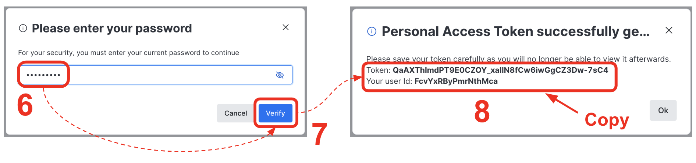
+
{blank}
+
--
[start=6]
. Enter the password `{user-password}`.
. Click _"Verify"_.
. Your token and user id will be generated.
+
Copy the values and configure your Camel parameters.
--
+
{empty} +

. Run Camel JBang from your terminal as follows:
+
```bash
camel run * --local-kamelet-dir=../support/deploy/kamelets
```
{empty} +

. One more time, from _Matrix_ send one last message. If all goes well you should see the message listed in your _Rocket.Chat_ chat window
+
image::images/stage1-msg-gitter-slack.png[align="left", width=80%]
+
{empty} +
+
Hopefully you'll see a successful interaction between both chat systems, similar to the image above.
+
Press `Ctrl`+`C` to stop your Camel instance.
+
{empty} +
+
We can consider the local development done. We have a full data flow definition that routes messages from _Matrix_ to _Rocket.Chat_. The next step is to deploy the definition in _OpenShift_

{empty} +

[type=verification]
Did you see the message in _Matrix_ showing up in _Rocket.Chat_?

[time=5]
[id="openshift"]
== Deployment in OpenShift

[type=taskResource]
.Credentials
****
* *username:* `{user-username}`
* *password:* `{user-password}`
****
[type=taskResource]
.Red Hat OpenShift Dev Spaces
****
* link:{url-codeready}[Console, window="_blank"]
****
[type=taskResource]
.Red Hat OpenShift Developer Console
****
* link:{url-devconsole}[Topology View, window="_blank"]
****
[type=taskResource]
.Matrix
****
* link:{url-element}[Matrix Web Client, window="_blank"]
****
[type=taskResource]
.Rocket.Chat
****
* link:{url-rocketchat}/topology/ns/{namespace}[Rocket.Chat Web Client, window="_blank"]
****

Up until now you've only worked locally (in your dev UI and terminal). This phase has allowed you to prototype fast and produce code you feel confident with.

As per the diagram below, the _Camel_ developer can work at accelerated speed by editing sources and running locally.

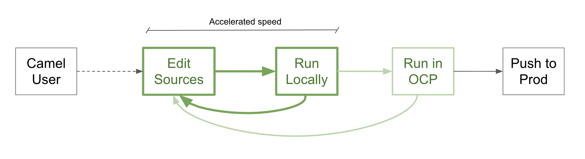

{empty} +

Now that you have validated your code locally, you can proceed to deploy and run in _OpenShift_.

The definitions that you have implemented can practically be taken 'as-is' into _OpenShift_. 

The only additional actions really to do are:
--
* Ensure we keep tokens secured with Secrets
* Ensure the Kamelet Binding can load the JSLT file as a resource. 
--

{empty} +

. To start with, make sure you have stopped you local Camel instance. +
If it is still running, press `Ctrl`+`C` to stop it.
+
{empty} +

. Include annotations
+
Copy from below the `annotations` snippet and include it in your _Kamelet Binding_.
+
----
apiVersion: camel.apache.org/v1alpha1
kind: KameletBinding
metadata:
  name: m2r
----
+
```yaml
  annotations:
    trait.camel.apache.org/mount.resources: "configmap:stage1-transform"
    trait.camel.apache.org/mount.configs: "secret:stage1"
```
+
----
spec:

  source:
    ref:
      kind: Kamelet
      apiVersion: camel.apache.org/v1
      name: matrix-source
    properties:
      token: "{{matrix.token}}"
      room:  "{{matrix.room}}"

  steps:
  - ref:
      kind: Kamelet
      apiVersion: camel.apache.org/v1
      name: jslt-action
    properties:
      template: m2r.jslt

  sink:
    ref:
      kind: Kamelet
      apiVersion: camel.apache.org/v1
      name: rocketchat-sink
    properties:
      token: "{{rocketchat.token}}"
----
+
{empty} +


. Push configuration and resources to _OpenShift_
+
.. If you didn't log in yet to _OpenShift_, run the following command:
+
[source,bash,subs="attributes+"]
----
oc login -u {user-username} -p {user-password} https://$KUBERNETES_SERVICE_HOST:$KUBERNETES_SERVICE_PORT --insecure-skip-tls-verify=true
----
+
.. Make sure the _working_ project in _OpenShift_ is selected by executing the following command:
+
[source,bash,subs="attributes+"]
----
oc project {namespace}
----
+
{blank}
+
.. Create a _Secret_ containing your configuration. Run the following `oc` command:
+
```bash
oc create secret generic stage1 --from-file=stage1.properties
```
+
{blank}
+
.. Create a _ConfigMap_ containing your JSLT mapping. Run the following `oc` command:
+
```bash
oc create cm stage1-transform --from-file=m2r.jslt
```
{empty} +

. Deploy your YAML definition containing your Kamelet Binding
.. Run the following `oc` command to deploy the integration:
+
```bash
oc apply -f m2r.yaml
```
+
{empty} +
+
The Camel K operator will immediately react. It will start building the integration and deploy it.
+
NOTE: Be patient, this action may take some time to complete. If the flow was previously built by other students, it will only take a minute. If not, the operator needs to download all the maven dependencies, build the application and create the image before the integration can be deployed (could take up to 10mn the first time).
+
{empty} +
+
You can monitor the state of the resource with the following command:
+
```bash
oc get klb
```
+
TIP: the argument `klb` stands for _Kamelet Binding_.
+
While Camel K builds the integration, the command above shows:
+
----
NAME   PHASE      REPLICAS
m2r    Creating   
----
+
{empty} +

.. Check the logs from your terminal.
+
You can use the `kamel` client to inspect the logs from the running pod where you integration `m2r` is deployed.
+
Run the command:
+
```bash
kamel logs m2r
```
+
{empty} +
+
After a while, when the operator deploys the integration, you should see Camel connecting to Matrix and starting the streaming listener:
+
----
... : Apache Camel 3.14.2.redhat-00047 (camel-1) started in 1s193ms (build:0ms init:1s1ms start:192ms)
...
... : Opening connection to Matrix...
... : Matrix HTTP Streaming started
----
+
{empty} +


.. Check your deployment from the _Developer_ console
+
Inspect in your link:{openshift-host}/topology/ns/{namespace}[OpenShift Developer view, window="_blank"] your pod is in healthy state and running:
+
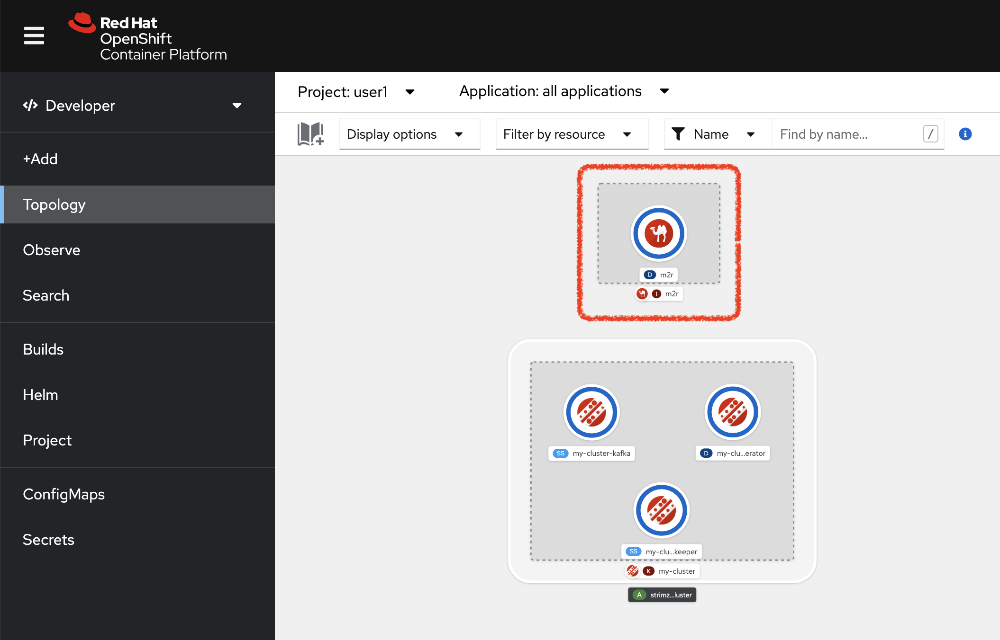
+
TIP: You can zoom in/out the canvas by using your mouse scrolling function, and move it around by clicking and dragging the background.
+
{empty} +
+
NOTE: You will observe your project also includes a pre-deployed _AMQ Streams (Kafka)_ cluster. Later in the workshop, you will use this dedicated _Kafka_ cluster to stream data in and out.
+
{empty} +

.. Check the logs.
+
You can open the logs of the _Camel_ instance by:
+
--
. Clicking in the pod's icon
. From the right pane, click `Resources`
. Click `View logs`
--
+
{blank}
+
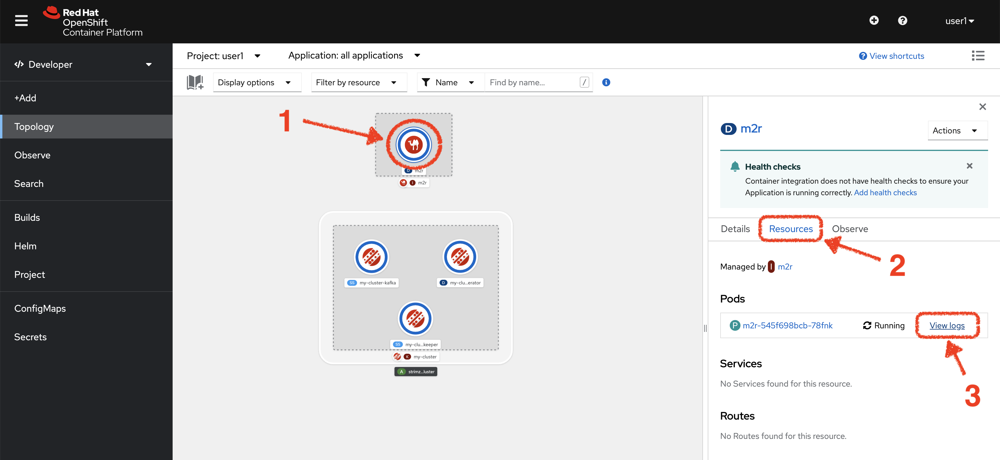
+
{blank}
+
You should see _Camel_ connecting to _Matrix_ and indicating the stream has started:
+
----
... : Apache Camel 3.14.2.redhat-00047 (camel-1) started in 825ms (build:0ms init:708ms start:117ms)
...
... : Opening connection to Matrix...
... : Matrix HTTP Streaming started
----
+
{empty} +


. Test your deployment
+
One more time, from Matrix send one last message. If all goes well you should see the message listed in your Rocket.Chat chat window
+
image::images/stage1-msg-gitter-slack.png[align="left", width=80%]
+
{empty} +


[type=verification]
Did you see the message going from _Matrix_ to _Rocket.Chat_?

[type=verificationSuccess]
You've successfully completed stage 1 !!

[type=verificationFail]
Inspect in the pod logs to investigate possible failure causes.
