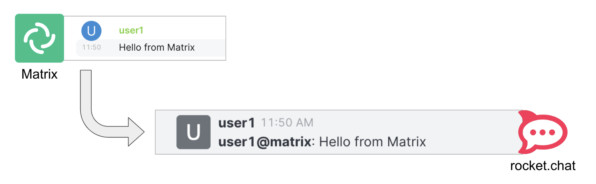

:walkthrough: Gitter to Slack bridge ()

ifdef::env-github[]
endif::[]

[id='lab1-part2-camel']
= Lab 1.path1 - MessageHub - Be the Camel developer

Impersonate the Camel developer to complete Lab-1's Gitter to Slack processing flow.

Technical goals and milestones:

* Development of a _no-code_ integration (_Kamelet_ binding)
* Define JSON data transformers.
* Use of _Camel JBang_ for fast prototyping
* Local execution and testing
* Deployment in OpenShift

{empty} +

The instructions below are divided in two segments:

* Local development (and testing)
* Deployment in OpenShift

{empty} +

[time=10]
[id="local"]
== Local development 

The development tool that will help us iterate our code in our local environment is _Camel JBang_.


{empty} +

TIP: Camel JBang is an upstream tool for Camel. It is not supported yet by Red Hat but it is an extremely useful tool for all things Camel. It simplifies many of the common tasks a Camel developer undergoes. 

. Create a folder and resources where you will work
+
For example:
+
```bash
mkdir lab1
cd lab1
touch g2s.yaml
touch stage1.properties
```
+
NOTE: The commands above also create the file sources you need for the exercise.
+
{empty} +

. Create the definitions
+
.. To start with, we will simply consume Gitter messages and log them. We select the following 2 Kamelets to bind:
+
--
- gitter-source
- log-sink
--
+
NOTE: The `gitter-source` _Kamelet_ is not provided out of the box by Camel K. It has been specifically created and deployed for this workshop.
+
{empty} +
+
Include in your YAML file `g2s.yaml` (gitter to slack) the following definition:
+
```yaml
apiVersion: camel.apache.org/v1alpha1
kind: KameletBinding
metadata:
  name: g2s
spec:

  source:
    ref:
      kind: Kamelet
      apiVersion: camel.apache.org/v1
      name: gitter-source
    properties:
      token: "{{gitter.token}}"
      room:  "{{gitter.room}}"

  sink:
    ref:
      kind: Kamelet
      apiVersion: camel.apache.org/v1
      name: log-sink 
```
+
{empty} +
+
.. Now include in your properties file `stage1.properties` the following entries:
+
```properties
# Allows HTTP streaming from Gitter
camel.main.streamCachingEnabled=false

# On shutdown it reduces waiting time when stoping Camel's streaming listener
camel.main.shutdownTimeout = 5

# Gitter credentials
gitter.token=YOUR_ACCESS_TOKEN
gitter.room=YOUR_ROOM_ID
```
+
{empty} +
+
NOTE: The `gitter-source` kamelet is implemented following the specification of Gitter's Streaming API to consume events from the server. To know more, read its API documentation here: https://developer.gitter.im/docs/streaming-api
+
IMPORTANT: You will notice the presence of the property `streamCachingEnabled` that requires to be disabled. This allows Camel to process the input as an continuous input stream.
+
{empty} +

. Run your YAML definition with Camel JBang
+ 
Use the following command to run locally your Kamelet Binding:
+
```bash
camel run g2s.yaml \
--local-kamelet-dir=$PWD/../kamelets \
--properties=stage1.properties
```
+
{empty} +
+
Camel JBang will build a local runnable and start Camel. +
In the output logs you should see Camel connecting to Gitter, similar to the following:
+
----
... : Apache Camel 3.18.0 (CamelJBang) started in 2s124ms (build:170ms init:1s738ms start:216ms JVM-uptime:4s)
... : Opening connection to Gitter...
----
+
{empty} +
+
Now, from Gitter's chat room, send a message, for example "Hello Camel". +
Your terminal should show the arrival of a Gitter event similar to the following JSON payload:
+
----
{"id":"6318848405ad4a3701dccfb4","text":"Hello Camel","html":"Hello Camel","sent":"2022-09-07T11:46:12.825Z","readBy":0,"urls":[],"mentions":[],"issues":[],"meta":[],"v":1,"fromUser":{"id":"xxxxxxxxxxxxxxxx","username":"demo-user"         }}
----
+
{empty} +
+
Hopefully you've been successful in capturing Gitter messages with Camel. +
Press `Ctrl`+`C` to stop Camel.
+
{empty} +

. Now we need to extend the Kamelet Binding definition to include data transformation that matches the JSON structure the target system (Slack) expects.
+
We choose from the Kamelet Catalog the JSLT action to transform the body.
+
TIP: JSLT is a very convenient transformer to manipulate JSON payloads. It's inspired by XSLT (XML Transformation) to define stylesheets containing transformation rules for JSON.
+
Create the JSLT file `g2s.jslt` containing the following definition:
+
----
{
    "channel":"TO_BE_DEFINED",
    "text":"*"+.fromUser.username+"@gitter*: "+.text
}
----
+
[NOTE]
====
* The field `channel` denotes the target room in Slack where messages will be pushed. For now we use a temporary value. +
* The field `text` includes JsonPath rules extracting values from the input Gitter event.
====
{empty} +

. Modify your YAML definition to include the JSLT action between your Kamelet source and sink.
+
The resulting YAML file should look as follows (you can copy the middle snippet into your code):
+
----
apiVersion: camel.apache.org/v1alpha1
kind: KameletBinding
metadata:
  name: g2s
spec:

  source:
    ref:
      kind: Kamelet
      apiVersion: camel.apache.org/v1
      name: gitter-source
    properties:
      token: "{{gitter.token}}"
      room:  "{{gitter.room}}"
----
+
```yaml
  steps:
  - ref:
      kind: Kamelet
      apiVersion: camel.apache.org/v1
      name: jslt-action
    properties:
      template: g2s.jslt
```
+
----
  sink:
    ref:
      kind: Kamelet
      apiVersion: camel.apache.org/v1
      name: log-sink 
----
{empty} +


. Run Camel JBang again ensuring you include your JSLT file. It should look as follows:
+
```bash
camel run g2s.yaml g2s.jslt \
--local-kamelet-dir=$PWD/../kamelets \
--properties=stage1.properties
```
{empty} +

. From Gitter send another chat message and inspect your terminal output. +
You should see an incoming event now transformed and looking similar to this:
+
```json
{"channel":"TO_BE_DEFINED","text":"*demo-user@gitter*: Hello Camel"}
```
+
{empty} +
+
At this stage you're ready to replace the `log-sink` by the real one, the `slack-sink` _Kamelet_.
+
{empty} +

. [[step-slack-sink]]Replace your Log sink Kamelet by the Slack one.
+
Copy from below the `slack-sink` definition, and replace your old `log-sink` code.
+
----
apiVersion: camel.apache.org/v1alpha1
kind: KameletBinding
metadata:
  name: g2s
spec:

  source:
    ref:
      kind: Kamelet
      apiVersion: camel.apache.org/v1
      name: gitter-source
    properties:
      token: "{{gitter.token}}"
      room:  "{{gitter.room}}"

  steps:
  - ref:
      kind: Kamelet
      apiVersion: camel.apache.org/v1
      name: jslt-action
    properties:
      template: g2s.jslt
----
+
```yaml
  sink:
    ref:
      kind: Kamelet
      apiVersion: camel.apache.org/v1
      name: slack-sink
    properties:
      token: "{{slack.token}}"
```
+
{empty} +

. Configure your target Slack `channel`
+
Previously we defined a dummy value in our JSLT transformation (where the `channel` field is defined). Now we need to replace the dummy value with the real one.
+
.. Open in Slack the room details
+

+
{empty} +

.. Copy the Channel ID at the bottom of the details frame
+

+
{empty} +

.. Paste its value in your JSLT mapping. It should you similar to the following:
+
```
{
    "channel":"C041XMH9M41",
    "text":"*"+.fromUser.username+"@gitter*: "+.text
}
```
+
{empty} +
+
Slack will read the `channel` field (target room), from the JSON payload we send, to know where to place the message. +
+
{empty} +

. Include your Slack token in your configuration file.
+
Copy from below the parameter definition `slack.token`, paste it into your properties file, and configure its value with your Slack access token value.
+
----
# Allows HTTP streaming from Gitter
camel.main.streamCachingEnabled=false

# On shutdown it reduces waiting time when stoping Camel's streaming listener
camel.main.shutdownTimeout = 5

# Gitter credentials
gitter.token=2d482bdf092e0e2299832b1f38d9560243083894
gitter.room=6317569e6da03739849c519a
----
+
```properties
# Slack credentials
slack.token=YOUR_TOKEN
```
+
{empty} +
+
* If you're sharing an App with the group, use the App's token your admin has provided.
* If you created your own App, use your App's `Bot User OAuth Token`
+
{empty} +

. Run Camel JBang from your terminal as follows:
+
```bash
camel run g2s.yaml g2s.jslt \
--local-kamelet-dir=$PWD/../kamelets \
--properties=stage1.properties
```
{empty} +

. One more time, from _Gitter_ send one last message. If all goes well you should see the message listed in your _Slack_ chat window
+

+
{empty} +
+
Hopefully you'll see a successful interaction between both chat systems, similar to the image above.
+
Press `Ctrl`+`C` to stop your Camel instance.
+
{empty} +
+
We can consider the local development done. We have a full data flow definition that routes messages from _Gitter_ to _Slack_. The next step is to deploy the definition in _OpenShift_

{empty} +

[type=verification]
Did you see the message in _Gitter_ showing up in _Slack_?

[time=5]
[id="openshift"]
== Deployment in OpenShift

The definitions that you have implemented can practically be taken 'as-is' into _OpenShift_. 

The only amendments really to be done are:
--
* Ensure we keep tokens secured with Secrets
* Ensure the Kamelet Binding can load the JSLT file as a resource. 
--

{empty} +

. To start with, make sure you have stopped you local Camel instance. +
If it is still running, press `Ctrl`+`C` to stop it.
+
{empty} +

. Apply configuration changes.
+
Copy from below the portions of YAML to be modified in your definition, and include/replace them in your Kamelet Binding.
+
[NOTE]
====
There are 3 pieces to include/replace:

. secret/configmap configuration
. kamelet source properties
. kamelet sink properties
====
+
----
apiVersion: camel.apache.org/v1alpha1
kind: KameletBinding
metadata:
  name: g2s
----
+
```yaml
  annotations:
    trait.camel.apache.org/mount.resources: "configmap:stage1-transform"
    trait.camel.apache.org/mount.configs: "secret:stage1"
```
+
----
spec:

  source:
    ref:
      kind: Kamelet
      apiVersion: camel.apache.org/v1
      name: gitter-source
    properties:
      token: "{{gitter.token}}"
      room:  "{{gitter.room}}"

  steps:
  - ref:
      kind: Kamelet
      apiVersion: camel.apache.org/v1
      name: jslt-action
    properties:
      template: g2s.jslt

  sink:
    ref:
      kind: Kamelet
      apiVersion: camel.apache.org/v1
      name: slack-sink
    properties:
      token: "{{slack.token}}"
----
+
{empty} +


. Push configuration and resources to _OpenShift_
+
.. Be sure your _working_ project in _OpenShift_ is selected by executing the following command:
+
[source,bash,subs="attributes+"]
----
oc project {namespace}
----
+
.. Create a _Secret_ containing your configuration. Run the following `oc` command:
+
```bash
oc create secret generic stage1 --from-file=stage1.properties
```
+
.. Create a _ConfigMap_ containing your JSLT mapping. Run the following `oc` command:
+
```bash
oc create cm stage1-transform --from-file=g2s.jslt
```
{empty} +

. Deploy your YAML definition containing your Kamelet Binding
.. Run the following `oc` command to deploy the integration:
+
```bash
oc apply -f g2s.yaml
```
+
{empty} +
+
The Camel K operator will immediately react. It will start building the integration and deploy it.
+
NOTE: Be patient, this action will take some time to complete as the operator needs to download all the maven dependencies, build the application and create the image before the integration can be deployed.
+
{empty} +

.. Check the logs.
+
You can use the `kamel` client to inspect the logs from the running pod where you integration `g2s` is deployed.
+
Run the command:
+
```bash
kamel logs g2s
```
+
{empty} +
+
When the operator deploys the integration, you should see Camel connecting to Gitter and starting the streaming listener:
+
----
... : Apache Camel 3.14.2.redhat-00047 (camel-1) started in 1s193ms (build:0ms init:1s1ms start:192ms)
...
... : Opening connection to Gitter...
----
+
{empty} +


. Test your deployment
+
One more time, from Gitter send one last message. If all goes well you should see the message listed in your Slack chat window
+

+
{empty} +


[type=verification]
Did you see the message going from _Gitter_ to _Slack_?

[type=verificationSuccess]
You've successfully completed stage 1 !!

[type=verificationFail]
Inspect in the pod logs to investigate possible failure causes.
