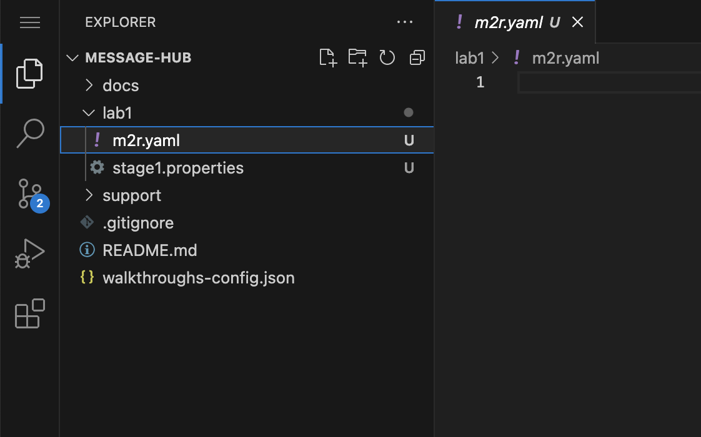
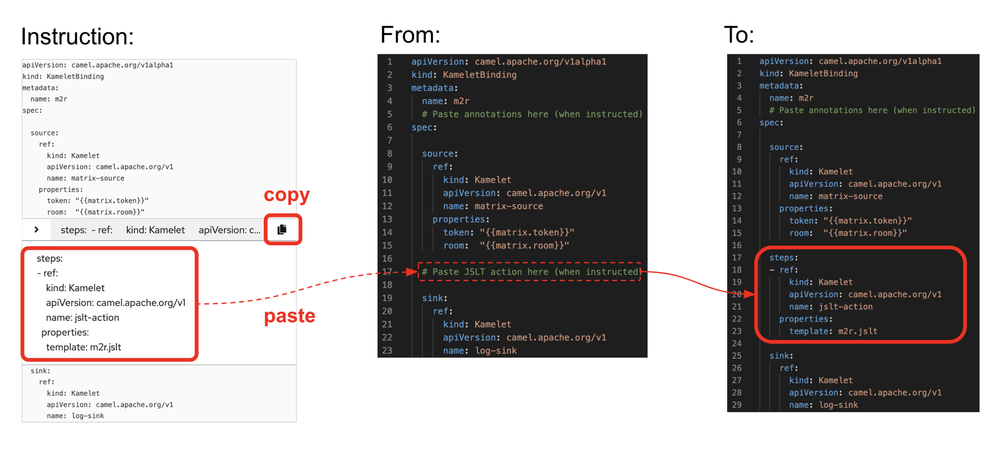

:walkthrough: Matrix to Rocket.Chat bridge ()
:user-password: openshift
:namespace: {user-username}
:invite-url: http://invite-webapp.{openshift-app-host}

ifdef::env-github[]
endif::[]

[id='lab1-part2-camel']
= Lab 1.path1 - MessageHub - Be the Camel developer

Impersonate the Camel developer to complete Lab-1's Matrix to Rocket.Chat processing flow.

Technical goals and milestones:

* Development of a _no-code_ integration (_Kamelet_ binding)
* Define JSON data transformers.
* Use of _Camel JBang_ for fast prototyping
* Local execution and testing
* Deployment in OpenShift

{empty} +

The instructions below are divided in two segments:

* Local development (and testing)
* Deployment in OpenShift

{empty} +

[time=10]
[id="local"]
== Local development 

[type=taskResource]
.Credentials
****
* *username:* `{user-username}`
* *password:* `{user-password}`
****
[type=taskResource]
.Matrix
****
* link:{url-element}[Console, window="_blank", , id="resources-codeready-url"]
****
[type=taskResource]
.Rocket.Chat
****
* link:{url-rocketchat}/topology/ns/{namespace}[Console, window="_blank"]
****

This workshop has been designed to attend two different user profiles:

For reference, here's again the processing flow to implement:

image::images/processing-flow.png[align="center", width=80%]

You will include 3 Kamelets:

====
* *A source* +
Consumes events from _Matrix_.

* *An action* +
Transforms _Matrix_ events to _Rocket.Chat_ events (in JSON format).

* *A sink* +
Produces events to _Rocket.Chat_.
====

{empty} +

[IMPORTANT] 
--
You need to already be onboarded into _Matrix_ and _Rocket.Chat_. +
Ensure you have previously completed: 

- *_Lab 1.intro - MessageHub - Scenario and Onboarding_*.
--

{empty} +

The development tool that will help us iterate our code in our local environment is _Camel JBang_.

image::images/camel-jbang.png[align="left", width=40%]

{empty} +

TIP: Camel JBang is an upstream tool for _Camel_. It is not supported yet by Red Hat but it is an extremely useful tool for all things Camel. It simplifies many of the common tasks a Camel developer undergoes. 

. Create a folder and resources where you will work
+
For example:
+
[source, subs=]
----
mkdir lab1
cd lab1
touch m2r.yaml
touch stage1.properties<br>
----
+
NOTE: The commands above also create the file sources you need for the exercise.
+
{empty} +

. Create the definitions
+
.. Open the `m2r.yaml` file in your editor.
+
Select from your project tree:
+
* MessageHub -> Lab1 -> m2r.yaml
+

+
{empty} +

.. To start with, we will simply consume Matrix messages and log them. We select the following 2 Kamelets to bind:
+
--
- matrix-source
- log-sink
--
+
NOTE: The `matrix-source` _Kamelet_ is not provided out of the box by Camel K. It has been specifically created and deployed for this workshop.
+
{empty} +
+
Include in your YAML file `m2r.yaml` (matrix to rocketchat) the following definition:
+
```yaml
apiVersion: camel.apache.org/v1alpha1
kind: KameletBinding
metadata:
  name: m2r
spec:

  source:
    ref:
      kind: Kamelet
      apiVersion: camel.apache.org/v1
      name: matrix-source
    properties:
      token: "{{matrix.token}}"
      room:  "{{matrix.room}}"

  sink:
    ref:
      kind: Kamelet
      apiVersion: camel.apache.org/v1
      name: log-sink 
```
+
NOTE: The `matrix-source` kamelet is implemented following the specification of the Matrix Sync API (new Matrix's API) to consume events from the server. To know more, read its API documentation here: https://spec.matrix.org/v1.6/client-server-api/#syncing
+
{empty} +
+
.. Now include in your properties file `stage1.properties` the following entries:
+
```properties
# On shutdown it reduces waiting time when stoping Camel's streaming listener
camel.main.shutdownTimeout = 5

# Matrix credentials
matrix.token=YOUR_ACCESS_TOKEN
matrix.room=YOUR_ROOM_ID
```
+
{empty} +
+
... To configure the `matrix.token` parameter, obtain its value from  the sequence of steps shown in the image below:
+

+
--
From Matrix: 

. Start from the _"User Menu"_
. Then, click _"All settings"_
. Select _"Help & About"_
. Scroll to the very bottom, and click _"Access Token"_
. Finally, click the _Copy_ button
--
+
{empty} +
+
... To configure the `matrix.room` parameter, obtain its value from the sequence of steps shown in the image below:
+

+
--
From Matrix: 

. Start from the _"Room options"_.
. Then, click _"Settings"_.
. Select _"Advanced"_.
. Finally, click the _Copy_ button of the _"Internal room ID"_.
--
+
{empty} +

. Run your YAML definition with Camel JBang
+ 
Use the following command to run locally your Kamelet Binding:
+
```bash
camel run * --local-kamelet-dir=../support/deploy/kamelets
```
+
NOTE: Observe the simplicity of the command `camel run \*`. The wildcard `*` allows _Camel JBang_ to automatically scan the folder and recognise the type of each file found (code, properties, resource, etc.).
+
NOTE: The command includes a flag to find custom kamelets. The _Matrix_ kamelet has been created for this workshop and does not come out-of-the-box from the default _Camel_ catalog.
+
[WARNING]
--
If the command above failed with the message `camel not found`, you may have instantiated the wrong terminal. Make sure you open the *Tools* terminal as per the picture below:

image::images/tools-terminal.png[align="left", width=15%]

--
+
{blank}
+
_Camel JBang_ will build a local runnable and start it. +
In the output logs you should see _Camel_ connecting to _Matrix_, similar to the following:
+
----
... : Apache Camel 3.19.0 (m2r) started in 1s658ms (build:118ms init:1s323ms start:217ms JVM-uptime:3s)
... : Opening connection to Matrix...
... : Matrix HTTP Streaming started
----
+
{empty} +
+
Now, from the _Matrix_ chat room, send a message, for example `Hello Camel`.
+

+
{blank}
+
Your terminal should show the arrival of a _Matrix_ event similar to the following JSON payload:
+
----
{"fromUser":{"username":"user1","displayName":"user1"},"text":"Hello Camel","sent":"2023-06-19T10:10:20.000Z"}
----
+
CAUTION: If your terminal does not log JSON events (as above), you might be sending messages from the _Matrix_ server instead of the _Matrix_ server. Ensure you connect to the _Matrix_ server when you login to the platform from your browser. Follow carefully the instructions in the section *Matrix platform onboarding* where the login process is described in detail.
+
{blank}
+
Hopefully you've been successful in capturing _Matrix_ messages with _Camel_. +
Press `Ctrl`+`C` to stop _Camel_.
+
[TIP]
--
_Camel JBang_ also implements the following very handy commands when running multiple _Camel_ integrations:

* `camel ps` to list running _Camel_ integrations.
* `camel stop <instance_name>` to shut down a running _Camel_ integration.  
--
+
{empty} +

. Now we need to extend the _Kamelet Binding_ definition to include data transformation that matches the JSON structure the target system (_Rocket.Chat_) expects.
+
We choose from the Kamelet Catalog the JSLT action to transform the body.
+
TIP: JSLT is a very convenient transformer to manipulate JSON payloads. It's inspired in XSLT (XML Transformation) to define stylesheets containing transformation rules for JSON.
+
Create the JSLT file `m2r.jslt` with the command:
+
```bash
touch m2r.jslt
```
+
{blank}
+
Open the new file in your editor and copy/paste the following definition:
+
```
{
    "channel":"YOUR_ROOM",
    "text":"*"+.fromUser.username+"@matrix*: "+.text
}
```
+
[IMPORTANT]
====
The field `channel` denotes the target room in _Rocket.Chat_ where messages will be pushed. +
Make sure you replace `YOUR_ROOM` with your designated room, for example:

* `user1` -> use `room1`
* `user2` -> use `room2`
* `userN` -> use `roomN`
====
+
[NOTE]
====
The field `text` includes JsonPath rules extracting values from the input Matrix event.
====
{empty} +

. Modify your YAML definition to include the JSLT action between your Kamelet source and sink.
+
NOTE: The JSLT action is defined as a step in a _KameletBinding_ definition. `steps` are a high-level block in the same column as the `source` and `sink`.
+
[TIP]
--
For clarity, the picture below illustrates how copy/paste actions  should be performed all along the lab exercises.


--
+
Following the above illustration, copy and paste the snippet from below into your code:
+
----
apiVersion: camel.apache.org/v1alpha1
kind: KameletBinding
metadata:
  name: m2r
spec:

  source:
    ref:
      kind: Kamelet
      apiVersion: camel.apache.org/v1
      name: matrix-source
    properties:
      token: "{{matrix.token}}"
      room:  "{{matrix.room}}"
----
+
```yaml
  steps:
  - ref:
      kind: Kamelet
      apiVersion: camel.apache.org/v1
      name: jslt-action
    properties:
      template: m2r.jslt
```
+
----
  sink:
    ref:
      kind: Kamelet
      apiVersion: camel.apache.org/v1
      name: log-sink 
----
{empty} +
+

. Run Camel JBang again ensuring you include your JSLT file. It should look as follows:
+
```bash
camel run * --local-kamelet-dir=../support/deploy/kamelets
```
{empty} +

. From Matrix send another chat message and inspect your terminal output. +
You should see an incoming event now transformed and looking similar to this:
+
----
{"channel":"room1","text":"*user1@matrix*: Hello Camel"}
----
+
{empty} +
+
At this stage you're ready to replace the `log-sink` by the real one, the `rocketchat-sink` _Kamelet_.
+
{empty} +

. [[step-rocketchat-sink]]Replace your Log sink Kamelet by the Rocket.Chat one.
+
Copy from below the `rocketchat-sink` definition, and replace your old `log-sink` code.
+
----
apiVersion: camel.apache.org/v1alpha1
kind: KameletBinding
metadata:
  name: m2r
spec:

  source:
    ref:
      kind: Kamelet
      apiVersion: camel.apache.org/v1
      name: matrix-source
    properties:
      token: "{{matrix.token}}"
      room:  "{{matrix.room}}"

  steps:
  - ref:
      kind: Kamelet
      apiVersion: camel.apache.org/v1
      name: jslt-action
    properties:
      template: m2r.jslt
----
+
```yaml
  sink:
    ref:
      kind: Kamelet
      apiVersion: camel.apache.org/v1
      name: rocketchat-sink
    properties:
      userid: "{{rocketchat.userid}}"
      token: "{{rocketchat.token}}"
```
+
{blank}
+
[TIP]
--
If you want to keep the `log-sink` activity, you can move it to the `steps` group as an action using the following definition:

----
  - ref:
      kind: Kamelet
      apiVersion: camel.apache.org/v1
      name: log-sink   
----
--
+
{empty} +


. Include your Rocket.Chat credentials in your configuration file.
+
Copy from below the parameter definition `rocketchat.token`, paste it into your properties file, and configure its value with your Rocket.Chat access token value.
+
----
# On shutdown it reduces waiting time when stoping Camel's streaming listener
camel.main.shutdownTimeout = 5

# Matrix credentials
matrix.token=2d482bdf092e0e2299832b1f38d9560243083894
matrix.room=6317569e6da03739849c519a
----
+
```properties
# Rocket.Chat
# credentials
rocketchat.userid=YOUR_USER_ID
rocketchat.token=YOUR_TOKEN
```
+
{empty} +
+
Obtain the _Rocket.Chat_ token with 1 of these 3 options, and replace `YOUR_TOKEN`:
+
* *Option 1*: Try the link below:
+
--
WARNING: The link may fail if the cluster did not enable token resolution. +
If it fails, choose [*Option 2*] or [*Option 3*].
--
+
- link:{invite-url}/token/rocketchat[Obtain _Rocket.Chat_ token,window="_blank"]
+
{empty} +

* *Option 2*: if you're sharing an App with the group, use the App's token your admin has provided.
* *Option 3*: if you created your own App, use your App's `Bot User OAuth Token`
+
{empty} +

. Run Camel JBang from your terminal as follows:
+
```bash
camel run * --local-kamelet-dir=../support/deploy/kamelets
```
{empty} +

. One more time, from _Matrix_ send one last message. If all goes well you should see the message listed in your _Rocket.Chat_ chat window
+

+
{empty} +
+
Hopefully you'll see a successful interaction between both chat systems, similar to the image above.
+
Press `Ctrl`+`C` to stop your Camel instance.
+
{empty} +
+
We can consider the local development done. We have a full data flow definition that routes messages from _Matrix_ to _Rocket.Chat_. The next step is to deploy the definition in _OpenShift_

{empty} +

[type=verification]
Did you see the message in _Matrix_ showing up in _Rocket.Chat_?

[time=5]
[id="openshift"]
== Deployment in OpenShift

The definitions that you have implemented can practically be taken 'as-is' into _OpenShift_. 

The only additional actions really to do are:
--
* Ensure we keep tokens secured with Secrets
* Ensure the Kamelet Binding can load the JSLT file as a resource. 
--

{empty} +

. To start with, make sure you have stopped you local Camel instance. +
If it is still running, press `Ctrl`+`C` to stop it.
+
{empty} +

. Include annotations
+
Copy from below the `annotations` snippet and include it in your _Kamelet Binding_.
+
----
apiVersion: camel.apache.org/v1alpha1
kind: KameletBinding
metadata:
  name: m2r
----
+
```yaml
  annotations:
    trait.camel.apache.org/mount.resources: "configmap:stage1-transform"
    trait.camel.apache.org/mount.configs: "secret:stage1"
```
+
----
spec:

  source:
    ref:
      kind: Kamelet
      apiVersion: camel.apache.org/v1
      name: matrix-source
    properties:
      token: "{{matrix.token}}"
      room:  "{{matrix.room}}"

  steps:
  - ref:
      kind: Kamelet
      apiVersion: camel.apache.org/v1
      name: jslt-action
    properties:
      template: m2r.jslt

  sink:
    ref:
      kind: Kamelet
      apiVersion: camel.apache.org/v1
      name: rocketchat-sink
    properties:
      token: "{{rocketchat.token}}"
----
+
{empty} +


. Push configuration and resources to _OpenShift_
+
.. If you didn't log in yet to _OpenShift_, run the following command:
+
[source,bash,subs="attributes+"]
----
oc login -u {user-username} -p {user-password} https://$KUBERNETES_SERVICE_HOST:$KUBERNETES_SERVICE_PORT --insecure-skip-tls-verify=true
----
+
.. Make sure the _working_ project in _OpenShift_ is selected by executing the following command:
+
[source,bash,subs="attributes+"]
----
oc project {namespace}
----
+
{blank}
+
.. Create a _Secret_ containing your configuration. Run the following `oc` command:
+
```bash
oc create secret generic stage1 --from-file=stage1.properties
```
+
{blank}
+
.. Create a _ConfigMap_ containing your JSLT mapping. Run the following `oc` command:
+
```bash
oc create cm stage1-transform --from-file=m2r.jslt
```
{empty} +

. Deploy your YAML definition containing your Kamelet Binding
.. Run the following `oc` command to deploy the integration:
+
```bash
oc apply -f m2r.yaml
```
+
{empty} +
+
The Camel K operator will immediately react. It will start building the integration and deploy it.
+
NOTE: Be patient, this action may take some time to complete. If the flow was previously built by other students, it will only take a minute. If not, the operator needs to download all the maven dependencies, build the application and create the image before the integration can be deployed (could take up to 10mn the first time).
+
{empty} +
+
You can monitor the state of the resource with the following command:
+
```bash
oc get klb
```
+
TIP: the argument `klb` stands for _Kamelet Binding_.
+
While Camel K builds the integration, the command above shows:
+
----
NAME   PHASE      REPLICAS
m2r    Creating   
----
+
{empty} +

.. Check the logs.
+
You can use the `kamel` client to inspect the logs from the running pod where you integration `m2r` is deployed.
+
Run the command:
+
```bash
kamel logs m2r
```
+
{empty} +
+
After a while, when the operator deploys the integration, you should see Camel connecting to Matrix and starting the streaming listener:
+
----
... : Apache Camel 3.14.2.redhat-00047 (camel-1) started in 1s193ms (build:0ms init:1s1ms start:192ms)
...
... : Opening connection to Matrix...
----
+
{empty} +


. Test your deployment
+
One more time, from Matrix send one last message. If all goes well you should see the message listed in your Rocket.Chat chat window
+

+
{empty} +


[type=verification]
Did you see the message going from _Matrix_ to _Rocket.Chat_?

[type=verificationSuccess]
You've successfully completed stage 1 !!

[type=verificationFail]
Inspect in the pod logs to investigate possible failure causes.
