:walkthrough: Matrix to Rocket.Chat bridge ()
:user-password: openshift
:namespace: {user-username}
:invite-url: http://invite-webapp.{openshift-app-host}

:url-element: https://app.element.io
:url-rocketchat: https://rocketchat-rocketchat.{openshift-app-host}

ifdef::env-github[]
endif::[]

[id='lab1-part2-kubernetes']
// = Lab 1 - Matrix to Rocket.Chat bridge (part-2, Kubernetes user)
= Lab 1.path2 - MessageHub - Be the Kubernetes user

// = [[kubernetes-user]] The Kubernetes user deployment flow

Impersonate the Kubernetes user to complete Lab-1's Matrix to Rocket.Chat processing flow.

In this second part, the instructions will guide you in defining a _Kamelet Binding_ that enables the data flow, and pushing it to the _OpenShift_ environment where it becomes live.

Technical goals and milestones:

* Creation process of a _no-code_ integration (_Kamelet_ binding)
* Define JSON data transformers.
* Deployment in OpenShift

{empty} +


[time=10]
[id="main"]
== Bridge definition and deployment 

type=taskResource]
.Credentials
****
* *username:* `{user-username}`
* *password:* `{user-password}`
****
[type=taskResource]
.Red Hat OpenShift Dev Spaces
****
* link:{url-codeready}[Console, window="_blank", , id="resources-codeready-url"]
****
[type=taskResource]
.Red Hat OpenShift Developer Console
****
* link:{openshift-host}/topology/ns/{namespace}[Topology View, window="_blank"]
****
[type=taskResource]
.Matrix
****
* link:{url-element}[Matrix Web Client, window="_blank", , id="resources-codeready-url"]
****
[type=taskResource]
.Rocket.Chat
****
* link:{url-rocketchat}/topology/ns/{namespace}[Rocket.Chat Web Client, window="_blank"]
****

For reference, here's again the processing flow to implement:

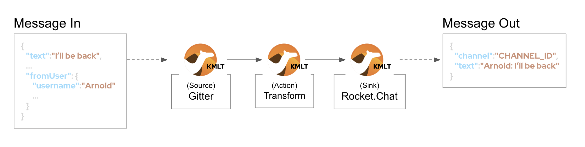

You will include 3 Kamelets:

====
* *A source* +
Consumes events from _Matrix_.

* *An action* +
Transforms _Matrix_ events to _Rocket.Chat_ events (in JSON format).

* *A sink* +
Produces events to _Rocket.Chat_.
====

{empty} +

[IMPORTANT] 
--
You need to already be onboarded into _Matrix_ and _Rocket.Chat_. +
Ensure you have previously completed: 

- *_Lab 1.intro - MessageHub - Scenario and Onboarding_*.
--

{empty} +

The instructions below will make you progress one _Camel_ step at a time rather than providing a complete _Kamelet Binding_ of the full data flow. This will allow you to play with different _Kamelets_ and understand better the mechanics of _Kamelet Bindings_.


. From your UI terminal...
+
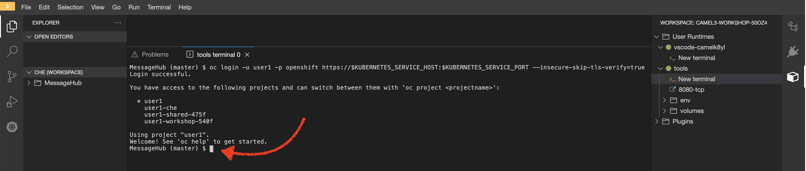
+
{blank}
+
Create a folder and resources where you will work. +
Copy and paste in your terminal the following:
+
[source, subs=]
----
mkdir lab1
cd lab1
touch m2r.yaml
touch stage1.properties<br>
----
+
NOTE: The commands above also create the file sources you need for the exercise.
+
{empty} +

. Create the definitions

.. Open the `m2r.yaml` file in your editor.
+
Select from your project tree:
+
* MessageHub -> Lab1 -> m2r.yaml
+
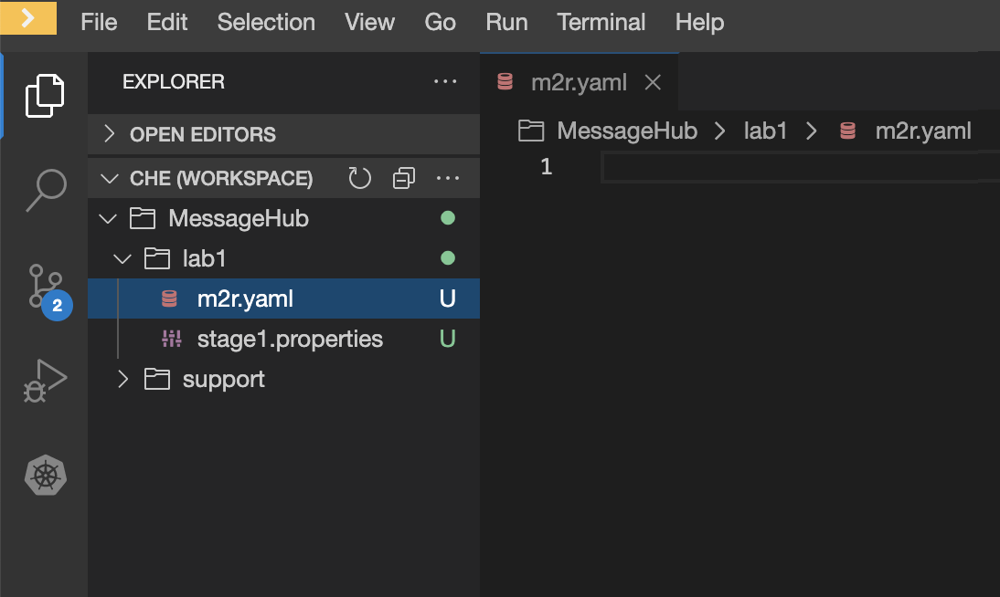
+
{empty} +

.. To start with, we will simply consume Matrix messages and log them. We select the following 2 Kamelets to bind:
+
--
- matrix-source
- log-sink
--
+
NOTE: The `matrix-source` _Kamelet_ is not provided out of the box by Camel K. It has been specifically created and deployed for this workshop.
+
{empty} +
+
Include in your YAML file `m2r.yaml` (matrix to rocketchat) the following definition:
+
```yaml
apiVersion: camel.apache.org/v1alpha1
kind: KameletBinding
metadata:
  name: m2r
  annotations:
    trait.camel.apache.org/mount.configs: "secret:stage1"

spec:

  source:
    ref:
      kind: Kamelet
      apiVersion: camel.apache.org/v1
      name: matrix-source
    properties:
      token: "{{matrix.token}}"
      room:  "{{matrix.room}}"

  sink:
    ref:
      kind: Kamelet
      apiVersion: camel.apache.org/v1
      name: log-sink 
```
+
NOTE: The `matrix-source` kamelet is implemented following the specification of the Matrix Sync API (new Matrix's API) to consume events from the server. To know more, read its API documentation here: https://spec.matrix.org/v1.6/client-server-api/#syncing
+
{empty} +

.. Now include in your properties file `stage1.properties` the following entries:
+
```properties
# Matrix credentials
matrix.token=YOUR_ACCESS_TOKEN
matrix.room=YOUR_ROOM_ID
```
+
{empty} +
+
... To configure the `matrix.token` parameter, obtain its value from the sequence of steps shown in the image below:
+
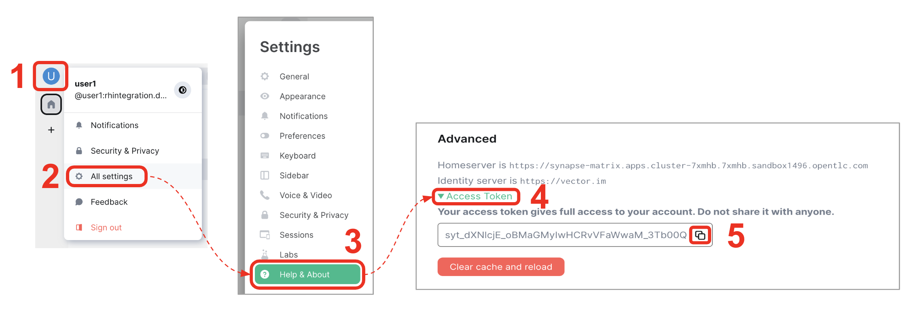
+
--
From Matrix: 

. Start from the _"User Menu"_
. Then, click _"All settings"_
. Select _"Help & About"_
. Scroll to the very bottom, and click _"Access Token"_
. Finally, click the _Copy_ button
--
+
{empty} +
+
... To configure the `matrix.room` parameter, obtain its value from the sequence of steps shown in the image below:
+
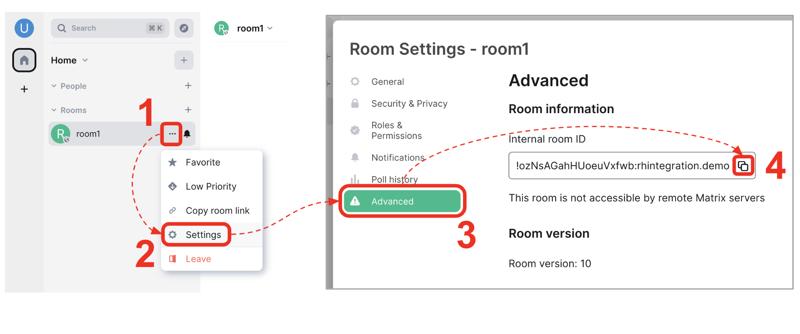
+
--
From Matrix: 

. Start from the _"Room options"_.
. Then, click _"Settings"_.
. Select _"Advanced"_.
. Finally, click the _Copy_ button of the _"Internal room ID"_.
--
+
{empty} +

. Push the configuration to _OpenShift_
+
If you didn't log in yet to _OpenShift_, run the following command:
+
[source,bash,subs="attributes+"]
----
oc login -u {user-username} -p {user-password} https://$KUBERNETES_SERVICE_HOST:$KUBERNETES_SERVICE_PORT --insecure-skip-tls-verify=true
----
+
Make sure the _working_ project in _OpenShift_ is selected by executing the following command:
+
[source,bash,subs="attributes+"]
----
oc project {namespace}
----
+
{empty} +
+
Then create a _Secret_ containing your configuration. Run the following `oc` command:
+
```bash
oc create secret generic stage1 --from-file=stage1.properties
```
{empty} +

. Deploy your YAML definition containing your Kamelet Binding
.. Run the following `oc` command to deploy the integration:
+
```bash
oc apply -f m2r.yaml
```
+
{empty} +
+
The Camel K operator will immediately react. It will start building the integration and deploy it.
+
NOTE: Be patient, this action may take some time to complete. If the flow was previously built by other students, it will only take a minute. If not, the operator needs to download all the maven dependencies, build the application and create the image before the integration can be deployed (could take up to 10mn the first time).
+
{empty} +
+
You can monitor the state of the resource with the following command:
+
```bash
oc get klb -w
```
+
TIP: the argument `klb` stands for _Kamelet Binding_.
+
During the time you see _Camel K_ building and deploying the integration, the output for the command above should show something similar to:
+
----
NAME   PHASE      REPLICAS
m2r    Creating   
m2r    Ready      0
m2r    Ready      1
m2r    Ready      1
----
+
{blank}
+
The last entry indicates the pod is ready.
+
{empty} +

.. Check your deployment
+
Inspect in your link:{openshift-host}/topology/ns/{namespace}[OpenShift Developer view, window="_blank"] your pod is in healthy state and running:
+
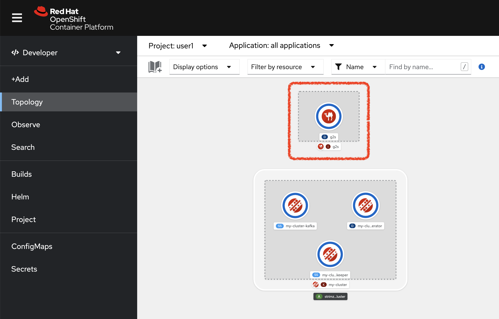
+
TIP: You can zoom in/out the canvas by using your mouse scrolling function, and move it around by clicking and dragging the background.
+
{empty} +
+
NOTE: You will observe your project also includes a pre-deployed _AMQ Streams (Kafka)_ cluster. Later in the workshop, you will use this dedicated _Kafka_ cluster to stream data in and out.
+
{empty} +

.. Check the logs.
+
You can open the logs of the _Camel_ instance by:
+
--
. Clicking in the pod's icon
. From the right pane, click `Resources`
. Click `View logs`
--
+
{blank}
+
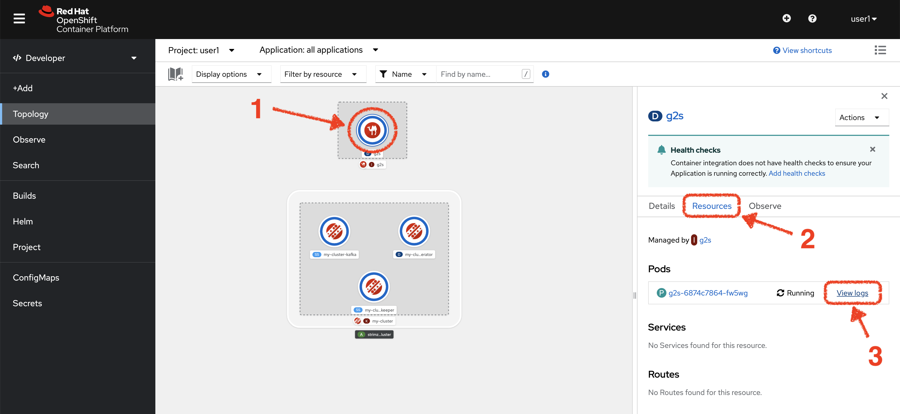
+
{blank}
+
You should see Camel connecting to Matrix and wait for the stream to start:
+
----
... : Apache Camel 3.14.2.redhat-00047 (camel-1) started in 825ms (build:0ms init:708ms start:117ms)
...
... : Opening connection to Matrix...
... : Matrix HTTP Streaming started
----
+
{empty} +

. Send a message from _Matrix_
+
Now, from _Matrix_'s chat room, send a message, for example `Hello Camel`.
+
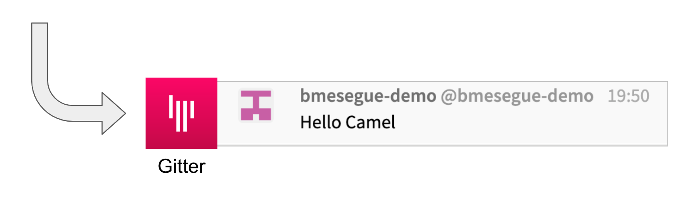
+
{blank}
+
The logs in your pod should show the arrival of a _Matrix_ event similar to the following JSON payload:
+
----
{"fromUser":{"username":"user1","displayName":"user1"},"text":"Hello Camel","sent":"2023-06-19T10:10:20.000Z"}
----
+
CAUTION: If your terminal does not log JSON events (as above), you might be sending messages from the _Matrix_ server instead of the _Matrix_ server. Ensure you connect to the _Matrix_ server when you login to the platform from your browser. Follow carefully the instructions in the section *Matrix platform onboarding* where the login process is described in detail.
+
{blank}
+
{empty} +
+
Hopefully you've been successful in capturing _Matrix_ messages with _Camel_. 
+
{empty} +

. Now we need to extend the _Kamelet Binding_ definition to include data transformation matching the JSON structure the target system (Rocket.Chat) expects.
+
We choose from the Kamelet Catalog the JSLT action to transform the body.
+
TIP: JSLT is a very convenient transformer to manipulate JSON payloads. It's inspired in XSLT (XML Transformation) to define stylesheets containing transformation rules for JSON.
+
.. Create the JSLT file `m2r.jslt` using the command:
+
```bash
touch m2r.jslt
```
+
{empty} +

.. Open it in your editor and paste the following definition:
+
```
{
    "channel":"YOUR_ROOM",
    "text":"*"+.fromUser.username+"@matrix*: "+.text
}
```
+
[IMPORTANT]
====
The field `channel` denotes the target room in _Rocket.Chat_ where messages will be pushed. +
Make sure you replace `YOUR_ROOM` with your designated room, for example:

* `user1` -> use `room1`
* `user2` -> use `room2`
* `userN` -> use `roomN`
====
+
[NOTE]
====
The field `text` includes JsonPath rules extracting values from the input _Matrix_ event.
====
{empty} +

.. Now, let's push the JSLT transformation as a _ConfigMap_ resource the Kamelet Binding will use.
+
Run the following `oc` command:
+
```bash
oc create cm stage1-transform --from-file=m2r.jslt
```
{empty} +

. Modify your YAML definition.
+
Include the following pieces of definitions:
+
--
* the trait to mount your _ConfigMap_
* the JSLT action between your _Kamelet_ source and sink.
--
+
{blank}
+
NOTE: The JSLT action is defined as a step in a _KameletBinding_ definition. `steps` are a high-level block in the same column as the `source` and `sink`.
+
[TIP]
--
For clarity, the picture below illustrates how copy/paste actions  should be performed all along the lab exercises.

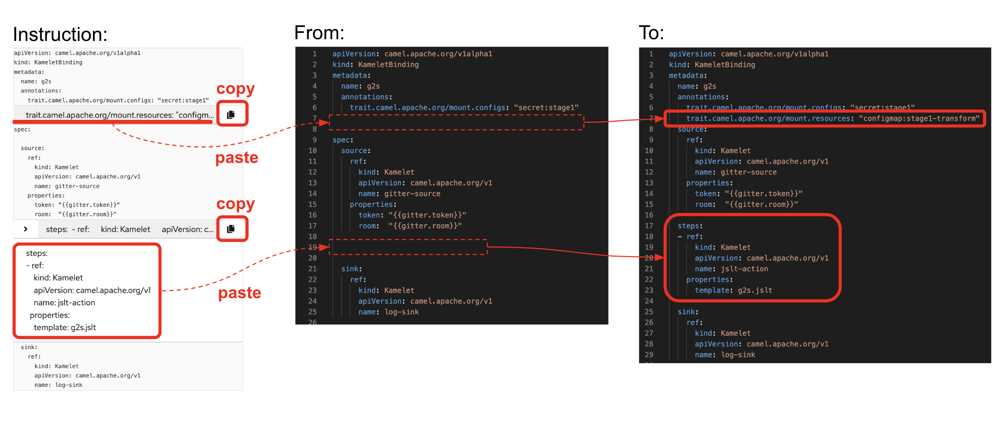
--
+
Following the above illustration, copy and paste the snippets from below into your code:
+
----
apiVersion: camel.apache.org/v1alpha1
kind: KameletBinding
metadata:
  name: m2r
  annotations:
    trait.camel.apache.org/mount.configs: "secret:stage1"
----
+
```yaml
    trait.camel.apache.org/mount.resources: "configmap:stage1-transform"
```
+
----
spec:

  source:
    ref:
      kind: Kamelet
      apiVersion: camel.apache.org/v1
      name: matrix-source
    properties:
      token: "{{matrix.token}}"
      room:  "{{matrix.room}}"
----
+
```yaml
  steps:
  - ref:
      kind: Kamelet
      apiVersion: camel.apache.org/v1
      name: jslt-action
    properties:
      template: m2r.jslt
```
+
----
  sink:
    ref:
      kind: Kamelet
      apiVersion: camel.apache.org/v1
      name: log-sink 
----
+
{empty} +
+


. Redeploy your YAML definition by running again:
+
```bash
oc apply -f m2r.yaml
```
+
{empty} +
+
The Camel K operator needs again to download dependencies (JSLT), but after some time it will replace the pod with a new instance containing the data transformation.
+
IMPORTANT: The old version will keep running until _Camel K_ finishes building and deploying the new version. Make sure you wait until the new version has been rolled out.
+
You can monitor the state of the deployment with the following command:
+
```bash
oc get klb -w
```
+
{blank}
+
During the time you see _Camel K_ building and deploying the new version, the output for the command above should show something similar to:
+
----
NAME   PHASE      REPLICAS
m2r    Creating 
m2r    Ready      2
m2r    Ready      1
----
+
{blank}
+
The first entry indicates the new version is being rollet out (while the previous version still is running) and the second entry indicates the roll out has concluded.
+
As per the picture below, in your console's topology view you will see a new pod being rolled out:
+
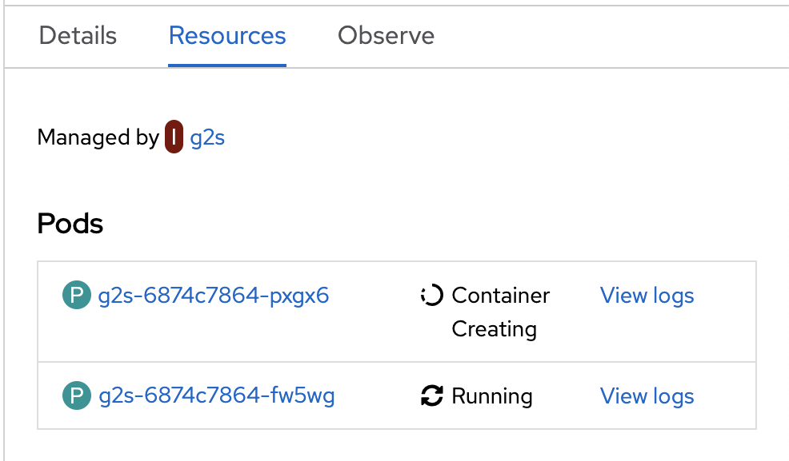
+
{empty} +
+

. Send test message
+
When the new pod is ready, from _Matrix_ send another chat message and inspect your terminal output. +
You should see an incoming event now transformed and looking similar to this:
+
----
{"channel":"room1","text":"*user1@matrix*: Hello Camel"}
----
+
{empty} +
+
At this stage you're ready to replace the `log-sink` kamelet by the real one, the `rocketchat-sink` kamelet.
+
{empty} +

. [[step-rocketchat-sink]]Replace your _Log_ sink _Kamelet_ by the _Rocket.Chat_ one.
+
Copy from below the `rocketchat-sink` definition, and replace your old `log-sink` code.
+
----
apiVersion: camel.apache.org/v1alpha1
kind: KameletBinding
metadata:
  name: m2r
  annotations:
    trait.camel.apache.org/mount.configs: "secret:stage1"
    trait.camel.apache.org/mount.resources: "configmap:stage1-transform"
spec:

  source:
    ref:
      kind: Kamelet
      apiVersion: camel.apache.org/v1
      name: matrix-source
    properties:
      token: "{{matrix.token}}"
      room:  "{{matrix.room}}"

  steps:
  - ref:
      kind: Kamelet
      apiVersion: camel.apache.org/v1
      name: jslt-action
    properties:
      template: m2r.jslt
----
+
```yaml
  sink:
    ref:
      kind: Kamelet
      apiVersion: camel.apache.org/v1
      name: rocketchat-sink
    properties:
      userid: "{{rocketchat.userid}}"
      token: "{{rocketchat.token}}"
```
+
{blank}
+
[TIP]
--
If you want to keep the `log-sink` activity, you can move it to the `steps` group as an action using the following definition:

----
  - ref:
      kind: Kamelet
      apiVersion: camel.apache.org/v1
      name: log-sink   
----
--
+
{empty} +


. Include your _Rocket.Chat_ credentials in your configuration file.
+
.. Copy from below the parameter definitions `rocketchat.*`, paste them into your properties file, and configure their values with your _Rocket.Chat_ credentials, as per the instructions that follow.
+
----
# Matrix credentials
matrix.token=2d482bdf092e0e2299832b1f38d9560243083894
matrix.room=6317569e6da03739849c519a
----
+
```properties
# Rocket.Chat Credentials
rocketchat.userid=YOUR_USER_ID
rocketchat.token=YOUR_TOKEN
```
+
{empty} +
+
.. To configure the _Rocket.Chat_ credentials, obtain them from the sequence of steps shown in the image below:
+
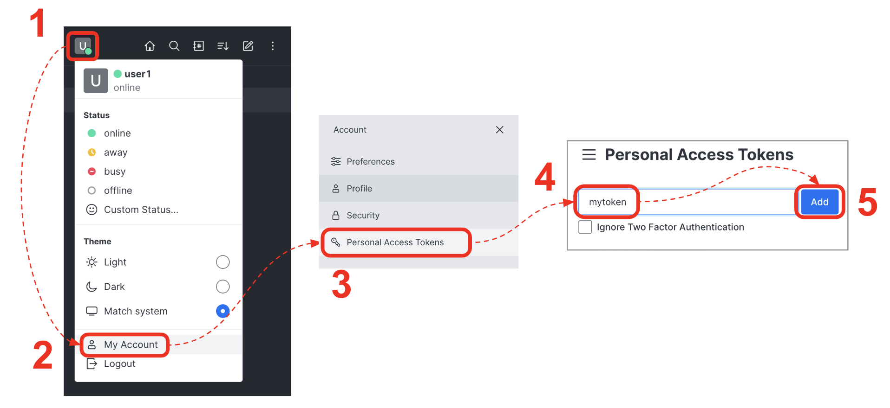
+
--
From _Rocket.Chat_: 

. Start from the _"User Menu"_.
. Then, click _"My Account"_.
. Select _"Personal Access Tokens"_.
. Type in a name for your token, for example `mytoken`.
. Click the _Add_ button
--
+
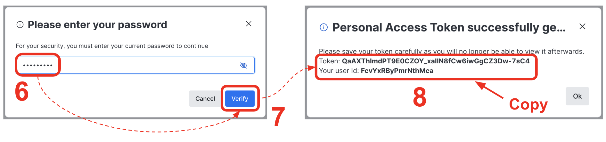
+
{blank}
+
--
[start=6]
. Enter the password `{user-password}`.
. Click _"Verify"_.
. Your token and user id will be generated.
+
Copy the values and configure your Camel parameters.
--
+
{empty} +
+
{empty} +
.. Update your _Secret_ by running:
+
[source, subs=]
----
oc delete secret stage1
oc create secret generic stage1 --from-file=stage1.properties
<br>
----
{empty} +

. Redeploy your Kamelet Binding:
+
```bash
oc apply -f m2r.yaml
```
+
{empty} +
+
Once more the _Camel K_ operator will rebuild the integration and replace the pod with a new instance that points to _Rocket.Chat_.
+
IMPORTANT: The old version will keep running until _Camel K_ finishes building and deploying the new version. Make sure you wait until the new version has been rolled out.
+
{empty} +

. One more time, from Matrix send one last message. If all goes well you should see the message listed in your Rocket.Chat chat window
+
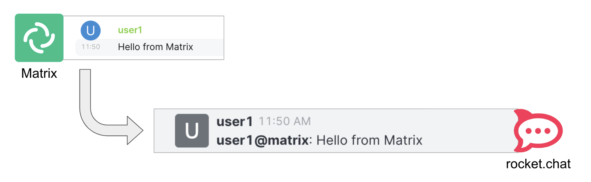
+
{empty} +


[type=verification]
Did you see the message going from _Matrix_ showing to _Rocket.Chat_?

[type=verificationFail]
Inspect in the pod logs to investigate possible failure causes.

[type=verificationSuccess]
You've successfully completed stage 1 !!