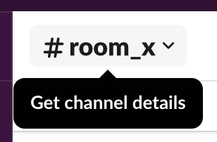

:walkthrough: Gitter to Slack bridge ()
:user-password: openshift
:namespace: {user-username}

ifdef::env-github[]
endif::[]

[id='lab1-part2-kubernetes']
// = Lab 1 - Gitter to Slack bridge (part-2, Kubernetes user)
= Lab 1.path2 - MessageHub - Be the Kubernetes user

// = [[kubernetes-user]] The Kubernetes user deployment flow

Impersonate the Kubernetes user to complete Lab-1's Gitter to Slack processing flow.

In this second part, the instructions will guide you in defining a _Kamelet Binding_ that enables the data flow, and pushing it to the _OpenShift_ environment where it becomes live.

Technical goals and milestones:

* Creation process of a _no-code_ integration (_Kamelet_ binding)
* Define JSON data transformers.
* Deployment in OpenShift

{empty} +


[time=10]
[id="main"]
== Bridge definition and deployment 

For reference, here's again the processing flow to implement:

image::images/processing-flow.png[align="center", width=80%]

You will include 3 Kamelets:

====
* *A source* +
Consumes events from _Gitter_.

* *An action* +
Transforms _Gitter_ events to _Slack_ events (in JSON format).

* *A sink* +
Produces events to _Slack_.
====

{empty} +

The instructions below will make you progress one _Camel_ step at a time rather than providing a complete _Kamelet Binding_ of the full data flow. This will allow you to play with different _Kamelets_ and understand better the mechanics of _Kamelet Bindings_.

. Create a folder and resources where you will work
+
For example:
+
```bash
mkdir lab1
cd lab1
touch g2s.yaml
touch stage1.properties
:
```
+
NOTE: The commands above also create the file sources you need for the exercise.
+
{empty} +

. Create the definitions

.. Open the `g2s.yaml` file in your editor.
+
Select from your project tree:
+
* MessageHub -> Lab1 -> g2s.yaml
+
image::images/crw-open-yaml.png[align="left", width=50%]
+
{empty} +

.. To start with, we will simply consume Gitter messages and log them. We select the following 2 Kamelets to bind:
+
--
- gitter-source
- log-sink
--
+
NOTE: The `gitter-source` _Kamelet_ is not provided out of the box by Camel K. It has been specifically created and deployed for this workshop.
+
{empty} +
+
Include in your YAML file `g2s.yaml` (gitter to slack) the following definition:
+
```yaml
apiVersion: camel.apache.org/v1alpha1
kind: KameletBinding
metadata:
  name: g2s
  annotations:
    trait.camel.apache.org/mount.configs: "secret:stage1"

spec:

  source:
    ref:
      kind: Kamelet
      apiVersion: camel.apache.org/v1
      name: gitter-source
    properties:
      token: "{{gitter.token}}"
      room:  "{{gitter.room}}"

  sink:
    ref:
      kind: Kamelet
      apiVersion: camel.apache.org/v1
      name: log-sink 
```
+
{empty} +

.. Now include in your properties file `stage1.properties` the following entries:
+
```properties
# Allows HTTP streaming from Gitter
camel.main.streamCachingEnabled=false

# Gitter credentials
gitter.token=YOUR_ACCESS_TOKEN
gitter.room=YOUR_ROOM_ID
```
+
{empty} +
+
[IMPORTANT]
====
Ensure you replace `YOUR_ACCESS_TOKEN` and `YOUR_ROOM_ID` with the values you obtained from the _Gitter_ onboarding process.
====
+
NOTE: The `gitter-source` kamelet is implemented following the specification of Gitter's Streaming API to consume events from the server. To know more, read its API documentation here: https://developer.gitter.im/docs/streaming-api
+
IMPORTANT: You will notice the presence of the property `streamCachingEnabled` that requires to be disabled. This allows Camel to process the input as an continuous input stream.
+
{empty} +

. Push the configuration to _OpenShift_
+
If you didn't log in yet to _OpenShift_, run the following command:
+
[source,bash,subs="attributes+"]
----
oc login -u {user-username} -p {user-password} https://$KUBERNETES_SERVICE_HOST:$KUBERNETES_SERVICE_PORT --insecure-skip-tls-verify=true
----
+
Make sure the _working_ project in _OpenShift_ is selected by executing the following command:
+
[source,bash,subs="attributes+"]
----
oc project {namespace}
----
+
{empty} +
+
Then create a _Secret_ containing your configuration. Run the following `oc` command:
+
```bash
oc create secret generic stage1 --from-file=stage1.properties
```
{empty} +

. Deploy your YAML definition containing your Kamelet Binding
.. Run the following `oc` command to deploy the integration:
+
```bash
oc apply -f g2s.yaml
```
+
{empty} +
+
The Camel K operator will immediately react. It will start building the integration and deploy it.
+
NOTE: Be patient, this action will take some time to complete as the operator needs to download all the maven dependencies, build the application and create the image before the integration can be deployed (could take up to 10mn the first time).
+
{empty} +
+
You can monitor the state of the resource with the following command:
+
```bash
oc get klb -w
```
+
TIP: the argument `klb` stands for _Kamelet Binding_.
+
During the time you see _Camel K_ building and deploying the integration, the output for the command above should show something similar to:
+
----
NAME   PHASE      REPLICAS
g2s    Creating   
g2s    Ready      0
g2s    Ready      1
g2s    Ready      1
----
+
{blank}
+
The last entry indicates the pod is ready.
+
{empty} +

.. Check your deployment
+
Inspect in your link:{openshift-host}/topology/ns/{namespace}[OpenShift Developer view, window="_blank"] your pod is in healthy state and running:
+
image::images/ocp-dev-pod-healthy.png[align="left", width=80%]
+
TIP: You can zoom in/out the canvas by using your mouse scrolling function, and move it around by clicking and dragging the background.
+
{empty} +
+
NOTE: You will observe your project also includes a pre-deployed _AMQ Streams (Kafka)_ cluster. Later in the workshop, you will use this dedicated _Kafka_ cluster to stream data in and out.
+
{empty} +

.. Check the logs.
+
You can open the logs of the _Camel_ instance by:
+
--
. Clicking in the pod's icon
. From the right pane, click `Resources`
. Click `View logs`
--
+
{blank}
+
image::images/ocp-dev-pod-logs.png[align="left", width=90%]
+
{blank}
+
You should see Camel connecting to Gitter and wait for the stream to start:
+
----
... : Apache Camel 3.14.2.redhat-00047 (camel-1) started in 825ms (build:0ms init:708ms start:117ms)
...
... : Opening connection to Gitter...
----
+
{empty} +

. Send a message from _Gitter_
+
Now, from _Gitter_'s chat room, send a message, for example `Hello Camel`.
+
image::images/gitter-send-message.png[align="left", width=60%]
+
{blank}
+
The logs in your pod should show the arrival of a _Gitter_ event similar to the following JSON payload:
+
----
{"id":"6318848405ad4a3701dccfb4","text":"Hello Camel","html":"Hello Camel","sent":"2022-09-07T11:46:12.825Z","readBy":0,"urls":[],"mentions":[],"issues":[],"meta":[],"v":1,"fromUser":{"id":"xxxxxxxxxxxxxxxx","username":"demo-user"         }}
----
+
{empty} +
+
Hopefully you've been successful in capturing _Gitter_ messages with _Camel_. 
+
{empty} +

. Now we need to extend the _Kamelet Binding_ definition to include data transformation matching the JSON structure the target system (Slack) expects.
+
We choose from the Kamelet Catalog the JSLT action to transform the body.
+
TIP: JSLT is a very convenient transformer to manipulate JSON payloads. It's inspired in XSLT (XML Transformation) to define stylesheets containing transformation rules for JSON.
+
.. Create the JSLT file `g2s.jslt` using the command:
+
```bash
touch g2s.jslt
```
+
{empty} +

.. Open it in your editor and paste the following definition:
+
```
{
    "channel":"TO_BE_DEFINED",
    "text":"*"+.fromUser.username+"@gitter*: "+.text
}
```
+
[NOTE]
====
* The field `channel` denotes the target room in _Slack_ where messages will be pushed. For now we use a temporary value. +
* The field `text` includes JsonPath rules extracting values from the input _Gitter_ event.
====
{empty} +

.. Now, let's push the JSLT transformation as a _ConfigMap_ resource the Kamelet Binding will use.
+
Run the following `oc` command:
+
```bash
oc create cm stage1-transform --from-file=g2s.jslt
```
{empty} +

. Modify your YAML definition.
+
Include the following pieces of definitions:
+
--
* the trait to mount your _ConfigMap_
* the JSLT action between your _Kamelet_ source and sink.
--
+
{empty} +
+
The resulting YAML file should look as follows (copy the snippets into your code):
+
----
apiVersion: camel.apache.org/v1alpha1
kind: KameletBinding
metadata:
  name: g2s
  annotations:
    trait.camel.apache.org/mount.configs: "secret:stage1"
----
+
```yaml
    trait.camel.apache.org/mount.resources: "configmap:stage1-transform"
```
+
----
spec:

  source:
    ref:
      kind: Kamelet
      apiVersion: camel.apache.org/v1
      name: gitter-source
    properties:
      token: "{{gitter.token}}"
      room:  "{{gitter.room}}"
----
+
```yaml
  steps:
  - ref:
      kind: Kamelet
      apiVersion: camel.apache.org/v1
      name: jslt-action
    properties:
      template: g2s.jslt
```
+
----
  sink:
    ref:
      kind: Kamelet
      apiVersion: camel.apache.org/v1
      name: log-sink 
----
+
{empty} +


. Redeploy your YAML definition by running again:
+
```bash
oc apply -f g2s.yaml
```
+
{empty} +
+
The Camel K operator needs again to download dependencies (JSLT), but after some time it will replace the pod with a new instance containing the data transformation.
+
IMPORTANT: The old version will keep running until _Camel K_ finishes building and deploying the new version. Make sure you wait until the new version has been rolled out.
+
You can monitor the state of the deployment with the following command:
+
```bash
oc get klb -w
```
+
{blank}
+
During the time you see _Camel K_ building and deploying the new version, the output for the command above should show something similar to:
+
----
NAME   PHASE      REPLICAS
g2s    Creating 
g2s    Ready      2
g2s    Ready      1
----
+
{blank}
+
The first entry indicates the new version is being rollet out (while the previous version still is running) and the second entry indicates the roll out has concluded.
+
As per the picture below, in your console's topology view you will see a new pod being rolled out:
+
image::images/ocp-dev-pod-new-version.png[align="left", width=40%]
+
{empty} +
+

. Send test message
+
When the new pod is ready, from _Gitter_ send another chat message and inspect your terminal output. +
You should see an incoming event now transformed and looking similar to this:
+
----
{"channel":"TO_BE_DEFINED","text":"*demo-user@gitter*: Hello Camel"}
----
+
{empty} +
+
At this stage you're ready to replace the `log-sink` kamelet by the real one, the `slack-sink` kamelet.
+
{empty} +

. [[step-slack-sink]]Replace your _Log_ sink _Kamelet_ by the _Slack_ one.
+
Copy from below the `slack-sink` definition, and replace your old `log-sink` code.
+
----
apiVersion: camel.apache.org/v1alpha1
kind: KameletBinding
metadata:
  name: g2s
  annotations:
    trait.camel.apache.org/mount.configs: "secret:stage1"
    trait.camel.apache.org/mount.resources: "configmap:stage1-transform"
spec:

  source:
    ref:
      kind: Kamelet
      apiVersion: camel.apache.org/v1
      name: gitter-source
    properties:
      token: "{{gitter.token}}"
      room:  "{{gitter.room}}"

  steps:
  - ref:
      kind: Kamelet
      apiVersion: camel.apache.org/v1
      name: jslt-action
    properties:
      template: g2s.jslt
----
+
```yaml
  sink:
    ref:
      kind: Kamelet
      apiVersion: camel.apache.org/v1
      name: slack-sink
    properties:
      token: "{{slack.token}}"
```
+
{empty} +

. Configure your target Slack `channel`
+
Previously we defined a dummy value in our JSLT transformation (where the `channel` field is defined). Now we need to replace the dummy value with the real one.
+
.. Open in Slack the room details
+

+
{empty} +

.. Copy the Channel ID at the bottom of the details frame
+

+
{empty} +

.. Paste its value in your JSLT mapping. It should you similar to the following:
+
```
{
    "channel":"C041XMH9M41",
    "text":"*"+.fromUser.username+"@gitter*: "+.text
}
```
+
IMPORTANT: The above `channel` is an example, make sure you replace `C041XMH9M41` with your _Channel ID_.
+
{empty} +
+
Slack will read the `channel` field (target room), from the JSON payload we send, to know where to place the message. +
+
{empty} +
.. Update your _ConfigMap_ by running:
+
```bash
oc delete cm stage1-transform
oc create cm stage1-transform --from-file=g2s.jslt
:
```
{empty} +

. Include your _Slack_ token in your configuration file.
+
.. Copy from below the parameter definition `slack.token`, paste it into your properties file, and configure its value with your Slack access token value.
+
----
# Allows HTTP streaming from Gitter
camel.main.streamCachingEnabled=false

# Gitter credentials
gitter.token=2d482bdf092e0e2299832b1f38d9560243083894
gitter.room=6317569e6da03739849c519a
----
+
```properties
# Slack 
# Credentials
slack.token=YOUR_TOKEN
```
+
{empty} +
+
* If you're sharing an App with the group, use the App's token your admin has provided.
* If you created your own App, use your App's `Bot User OAuth Token`
+
{empty} +
.. Update your _Secret_ by running:
+
```bash
oc delete secret stage1
oc create secret generic stage1 --from-file=stage1.properties
:
```
{empty} +

. Redeploy your Kamelet Binding:
+
```bash
oc apply -f g2s.yaml
```
+
{empty} +
+
Once more the _Camel K_ operator will rebuild the integration and replace the pod with a new instance that points to _Slack_.
+
IMPORTANT: The old version will keep running until _Camel K_ finishes building and deploying the new version. Make sure you wait until the new version has been rolled out.
+
{empty} +

. One more time, from Gitter send one last message. If all goes well you should see the message listed in your Slack chat window
+
image::images/stage1-msg-gitter-slack.png[align="left", width=80%]
+
{empty} +


[type=verification]
Did you see the message going from _Gitter_ showing to _Slack_?

[type=verificationFail]
Inspect in the pod logs to investigate possible failure causes.

[type=verificationSuccess]
You've successfully completed stage 1 !!