:walkthrough: Matrix to Rocket.Chat bridge ()
:user-password: openshift
:namespace: {user-username}-devspaces
:invite-url: http://invite-webapp.{openshift-app-host}

:url-element: https://element-matrix.{openshift-app-host}
:url-rocketchat: https://rocketchat-rocketchat.{openshift-app-host}
:url-codeready: http://devspaces.{openshift-app-host}/
:url-devconsole: {openshift-host}/topology/ns/{namespace}

:experimental:

// WORKS
:style-kbd: kbd { \
  color: black; \
  background-color: lightgrey; \
  border: 1px solid black; \
  box-shadow: 0px 1px black; \
  font-size: .85em; \
  line-height: .85em; \
  display: inline-block; \
  font-weight: 600; \
  letter-spacing: .05em; \
  padding: 3px 5px; \
  white-space: nowrap; \
  border-radius:5px; \
} \

:style-preview: pre {background-color: #272822; color: white; padding: 5px 15px; font-size: 15px}
:style-indent: .indent2 {padding-left: 2rem;}
:style-all: pass:a[]

:url-docserver: https://docserver-webapp.{openshift-app-host}
//:url-docserver: http://0.0.0.0:8080

:docserver-status: pass:a[ response.text()) \
        .then(data => this.parentElement.innerHTML = 'Status: 

') \
        .catch(error => this.parentElement.innerHTML = 'Status: 

') \
      ">]

:freplace: pass:[function replaceTokens(templateString, values) { \
    const valueArray = values.split(',').map(val => val.trim()); \
    let result = templateString; \
    let replaceIndex = 0; \
    while (result.includes('REPLACE') && replaceIndex < valueArray.length) { \
        result = result.replace('REPLACE', valueArray[replaceIndex]); \
        replaceIndex++; \
    } \
    return result; \
}]

:fdocserver: pass:a[function docserver(target,template,params) { \
    {freplace} \
    fetch('{url-docserver}/roomid?user='+params) \
        .then(response => response.text()) \
        .then(data => {target.firstChild.data=replaceTokens(text, data);}) \
        .catch(error => room = 'Error fetching data: ' + error.message); \
}]

:fcopy: pass:a[function copy(el) { \
  el.previousElementSibling.select(); \
  text = el.previousElementSibling.textContent; \
  console.log(text); \
  navigator.clipboard.writeText(text + '\n') \
        .then(response => console.log('Text with carriage return copied to clipboard!')) \
        .catch(err => console.error('Failed to copy: ', err)); \
}]

:copypaste: pass:a[ \

 \
  <textarea readonly style="field-sizing: content;border: none; background-color: #f0f0f0; width: 100%; resize: none; font-size:14px; font-family: monospace;padding: 5px 15px" rows="4">function example() { \
  console.log("Hello {replace-with-previous}!"); \
  return true; \
}</textarea> \
  <button class="mytooltip" onclick="{fcopy} copy(this);" style="border: none; background-color: white; padding: 5px 15px; border-bottom: 1px solid transparent; transition: border-bottom-color 0.2s;"> \
    <svg fill="currentColor" height="1em" width="1em" viewBox="0 0 448 512" aria-hidden="true" role="img" style="vertical-align: -0.125em;"> \
      <path d="M320 448v40c0 13.255-10.745 24-24 24H24c-13.255 0-24-10.745-24-24V120c0-13.255 10.745-24 24-24h72v296c0 30.879 25.121 56 56 56h168zm0-344V0H152c-13.255 0-24 10.745-24 24v368c0 13.255 10.745 24 24 24h272c13.255 0 24-10.745 24-24V128H344c-13.2 0-24-10.8-24-24zm120.971-31.029L375.029 7.029A24 24 0 0 0 358.059 0H352v96h96v-6.059a24 24 0 0 0-7.029-16.97z"></path> \
    </svg> \
    Copy to clipboard \
  </button> \
   \

 \
 \
]

:snippet: pass:a[ \

 \

 \
 \
]

ifdef::env-github[]
endif::[]

[id='lab1-camel']
= Lab 1 - (b) - Be the Camel developer

Impersonate the Camel developer to complete Lab-1's Matrix to Rocket.Chat processing flow.

[type=walkthroughResource,serviceName=openshift]
.Invite System
****
[subs=attributes]
++++

{docserver-status}

++++
****

Prerequisites: +
--
* Ensure you have previously completed the following tiles:
+
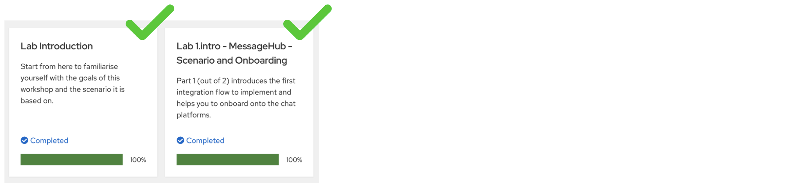

{empty} +
--

Technical goals and milestones:

* Development of a _no-code_ integration (_Kamelet_ binding)
* Define JSON data transformers.
* Use of _Camel JBang_ for fast prototyping
* Local execution and testing
* Deployment in OpenShift

{empty} +

The instructions below are divided in two segments:

* Local development (and testing)
* Deployment in OpenShift

{empty} +

[time=10]
[id="local"]
== Local development 
{style-all}

[type=taskResource]
.Credentials
****
* *username:* `{user-username}`
* *password:* `{user-password}`
****
[type=taskResource]
.Red Hat OpenShift Dev Spaces
****
* link:{url-codeready}[Console, window="_blank"]
****
[type=taskResource]
.Red Hat OpenShift Developer Console
****
* link:{url-devconsole}[Topology View, window="_blank"]
****
[type=taskResource]
.Matrix
****
* link:{url-element}[Matrix Web Client, window="_blank"]
****
[type=taskResource]
.Rocket.Chat
****
* link:{url-rocketchat}[Rocket.Chat Web Client, window="_blank"]
****

This workshop has been designed to attend two different user profiles:

For reference, here's again the processing flow to implement:

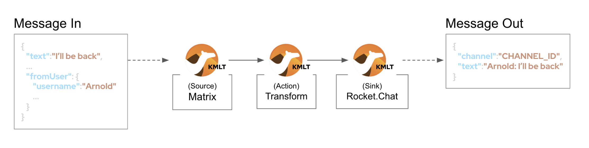

You will include 3 Kamelets:

====
* *A source* +
Consumes events from _Matrix_.

* *An action* +
Transforms _Matrix_ events to _Rocket.Chat_ events (in JSON format).

* *A sink* +
Produces events to _Rocket.Chat_.
====

{empty} +

[IMPORTANT] 
--
You need to already be onboarded into _Matrix_ and _Rocket.Chat_. +
Ensure you have previously completed: 

- *_Lab 1.intro - MessageHub - Scenario and Onboarding_*.
--

{empty} +

The development tool that will help us iterate our code in our local environment is _Camel JBang_.

image::images/camel-jbang.png[align="left", width=40%]

{empty} +

TIP: Camel JBang is an upstream tool for _Camel_. It is not supported yet by Red Hat but it is an extremely useful tool for all things Camel. It simplifies many of the common tasks a Camel developer undergoes. 

=== Start the lab

At first, your `lab` directory is empty:

--
[.indent2]
📁 message-hub +
&nbsp;&nbsp;📁 *lab* +
pass:[<mark style="padding-left: 1rem; background-color: white; color: grey"></mark>] [empty]
--

{blank}

From your UI terminal...

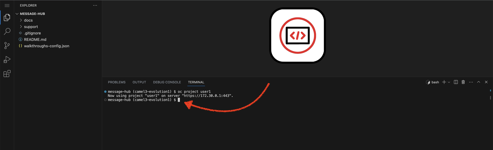

{blank}

We provide below a base skeleton to get you started:

[IMPORTANT]
====
Issue the command below to officially start your lab:

--
{copypaste}
----
start
----
--

NOTE: The command will initialise the lab with a couple of files.
====

// {empty} +

[NOTE]
====
The lab has a collection of handy scripts you'll need to use when instructed, such as:

- *start* / *restart*
- *ff* (fast-forward to the next step)
- *rw* (rewind to the previous step)
- *step* (jump to step)
- *chat* (curl-based script to interact with _Camel_)
====

{empty} +

=== Your files

After initialisation, under the `lab` directory, you'll find the following source files:

--
[.indent2]
📁 message-hub +
&nbsp;&nbsp;📁 lab +
&nbsp;&nbsp;&nbsp;&nbsp;📁 m2r +
pass:[<mark style="padding-left: 2rem; background-color: white; color: grey"><b>⚙</b></mark>] applications.properties +
pass:[<mark style="padding-left: 2rem; background-color: white; color: purple"><b><i>&nbsp;!&nbsp;&nbsp;</i></b></mark>] *m2r.camel.yaml* +
--

{blank}

Make sure the files are visible in your file explorer in the left panel of _VSCode_. +
Feel free to inspect the files in your editor. +

{empty} +

. Under your `lab/m2r` directory, find and open the following flow definition:
+
--
* `m2r.camel.yaml`
--
+
{blank}
+
PENDING to include IMAGE of Kaoto flow]
+
[NOTE]
--
About the `matrix-source` _Kamelet_:

* It's not provided out of the box by Camel. It has been specifically created and deployed for this workshop.
* It's implemented following the specification of the Matrix Sync API (new Matrix's API) to consume events from the server. To know more, read its API documentation here: https://spec.matrix.org/v1.6/client-server-api/#syncing
--
+
[NOTE]
--
About the variable `matrix`:

* The Kamelet defines `variableReceive: matrix` to allocate the incoming event (`body` is ignored).
* The route logs the incoming event using the Camel's simple expression `${variable.matrix}`
--
+
{empty} +

. Configure the application
+
--
Open in your editor your `application.properties` file where you'll find the following entries:

----
# Matrix credentials
matrix.token=YOUR_ACCESS_TOKEN
matrix.room=YOUR_ROOM_ID
----

{empty} +
--

.. To configure the `matrix.token` parameter, obtain its value from  the sequence of steps shown in the image below:
+
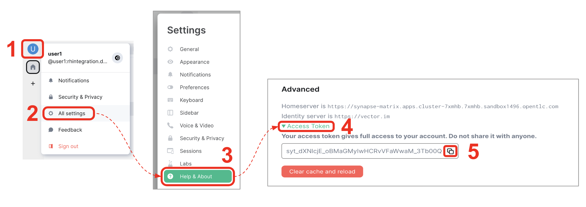
+
--
From Matrix: 

. Start from the _"User Menu"_
. Then, click _"All settings"_
. Select _"Help & About"_
. Scroll to the very bottom, and click _"Access Token"_
. Click the _Copy_ button

{blank}

Finally, paste the value you copied into the `matrix.token` parameter.
--
+
{empty} +
+
.. To configure the `matrix.room` parameter, obtain its value from the sequence of steps shown in the image below:
+
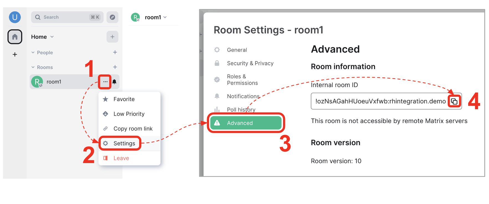
+
--
From Matrix: 

. Start from the _"Room options"_.
. Then, click _"Settings"_.
. Select _"Advanced"_.
. Click the _Copy_ button of the _"Internal room ID"_.

{blank}

Finally, paste the value you copied into the `matrix.room` parameter.
--
+
{empty} +

. Run your YAML definition with Camel JBang
+ 
Use the following command to run locally your _Camel_ route:
+
--
{copypaste}
----
camel run m2r/* --local-kamelet-dir=../support/deploy/kamelets
----
--
+
NOTE: Observe the simplicity of the command `camel run \*`. The wildcard `*` allows _Camel JBang_ to automatically scan the folder and recognise the type of each file found (code, properties, resource, etc.).
+
[WARNING]
====
If the command above failed with the following output:

----
[jbang] [ERROR] Could not download https://github.com/apache/camel/blob/HEAD/jbang-catalog.json
[jbang] Run with --verbose for more details
----

{blank}

Run the following command and try again:

--
{copypaste}
----
jbang cache clear
----
--

====
+
{blank}
+
_Camel JBang_ will build a local runnable and start it. +
In the output logs you should see _Camel_ connecting to _Matrix_, similar to the following:
+
----
... : Apache Camel 4.14.0 (m2r) started in 128ms (build:0ms init:0ms start:128ms boot:1s312ms)
... : Opening connection to Matrix...
... : Matrix HTTP Streaming started
----
+
{empty} +
+
Now, from the _Matrix_ chat room, send a message.
+
* For example:
+
--
{copypaste}
----
Hello Camel
----
--
+
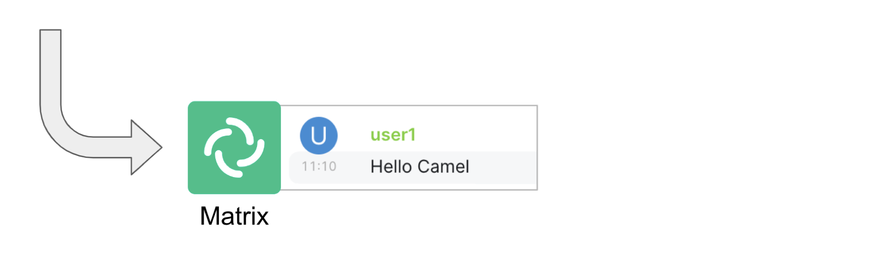
+
{blank}
+
Your terminal should show the arrival of a _Matrix_ event similar to the following JSON payload:
+
[subs="attributes+"]
----
{"fromUser":{"username":"{user-username}","displayName":"{user-username}"},"text":"Hello Camel","sent":"2023-06-19T10:10:20.000Z"}
----
+
{blank}
+
Hopefully you've been successful in capturing _Matrix_ messages with _Camel_.
+
Press kbd:[Ctrl+C], from your terminal, to stop the running _Camel_ process.
+
[TIP]
--
_Camel JBang_ also implements the following very handy commands when running multiple _Camel_ integrations:

* `camel ps` to list running _Camel_ integrations.
* `camel stop <instance_name>` to shut down a running _Camel_ integration.  
--
+
{empty} +

. Include data transformation
+
Now we need to extend the _Camel_ route definition to include data transformation to match the JSON structure the target system (_Rocket.Chat_) expects.
+
.. Include in your Camel route a Kaoto data transformation step
+
--
From Kaoto: 

. Click the `+` button in the transition
. Find and select the _Kaoto DataMapper_
. Click to open the configuration panel
. Click the `🔧Configure` button
--
+
{blank}
+
.. Attach schemas
+
--
From the DataMapper editor: 

. Define the source:
.. On `Parameters` click the `+` to add new parameter
.. Enter `matrix` and click the checkmark button kbd:[√]
.. Click first the Attach schema button, then the blue button, and pick `matrix-in.json`.
+
{blank}
+
. Define the target
.. Find the target Body and click on "Attach schema", then the blue button, and pick `rocketchat-out.json`

{blank}
--
+
{blank}
+
.. Define the data mappings
+
Copy and Paste the values below to define the given field entries:
+
... `string[@key = channel]`: 
+
--
{copypaste}
----
"room2"
----

{copypaste}{user-username}
----
"REPLACE"
----
--
+
{blank}
+
... `string[@key = text]`:
+
--
{copypaste}
----
concat('*', $matrix-x/xf:map/xf:map[@key='fromUser']/xf:string[@key='username'],'@matrix:* ', $matrix-x/xf:map/xf:string[@key='text'])
----
--
+
[IMPORTANT]
====
The string key `channel` denotes the target room in _Rocket.Chat_ where messages will be pushed. +
Make sure you it points to your designated room, for example:

* `user1` -> use `room1`
* `user2` -> use `room2`
* `userN` -> use `roomN`
====
Your JSLT content should look similar to the image below. The `channel` represents your target room in _Rocket.Chat_, in this example it targets 'room10'.
+
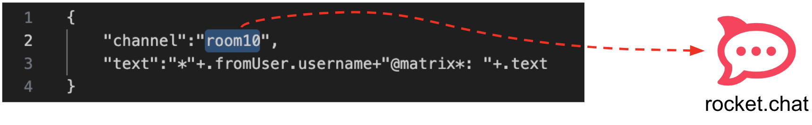
+
{blank}
+
[NOTE]
====
The field `text` includes JsonPath rules extracting values from the input Matrix event.
====
{empty} +

. Log the body
+
Update the log activity from:
+
* `${variable.matrix}` -> to `${body}`
+
NOTE: The Matrix Kamelet is configured to store events in a variable `matrix`, however, the data mapper outputs the result in the `body`.
+
{empty} +

. Run Camel JBang again ensuring you include your JSLT file. It should look as follows:
+
--
{copypaste}
----
camel run * --local-kamelet-dir=../support/deploy/kamelets
----
--
{empty} +

. From Matrix send another chat message and inspect your terminal output. +
You should see an incoming event now transformed and looking similar to this:
+
--
{snippet}user2
[subs="attributes+"]
----
{"channel":"REPLACE","text":"*{user-username}@matrix*: Hello Camel"}
----
--
+
At this stage you're ready to forward messages to _RocketChat_ using its dedicated _Kamelet_.
+
{empty} +

. [[step-rocketchat-sink]]Include the Rocket.Chat Kamelet.
+
Copy from below the step definition, and paste it at the end of your Camel route.
+
--
{copypaste}
----
{
  "type": "Route",
  "name": "to",
  "definition": {
    "uri": "kamelet",
    "description": "RocketChat",
    "parameters": {
      "templateId": "rocketchat-sink",
      "userid": "{{rocketchat.userid}}",
      "token": "{{rocketchat.token}}"
    }
  },
  "__kaoto_marker": "kaoto-node"
}
----
--
+
{empty} +

. Include your Rocket.Chat credentials in your configuration file.
+
.. Under your `matrix` parameters, copy from below the `rocketchat.*` parameters, paste them into your properties file, and configure their values with your _Rocket.Chat_ credentials, as instructed below.
+
----
# On shutdown it reduces waiting time when stoping Camel's streaming listener
camel.main.shutdownTimeout = 5

# Matrix credentials
matrix.token=(some unreadable token)
matrix.room=(some unreadable room id)
----
+
--
{copypaste}
----
# Rocket.Chat credentials
rocketchat.token=YOUR_TOKEN
rocketchat.userid=YOUR_USER_ID
----
--
+
{empty} +
+
.. To configure the _Rocket.Chat_ credentials, obtain them from the sequence of steps shown in the image below:
+
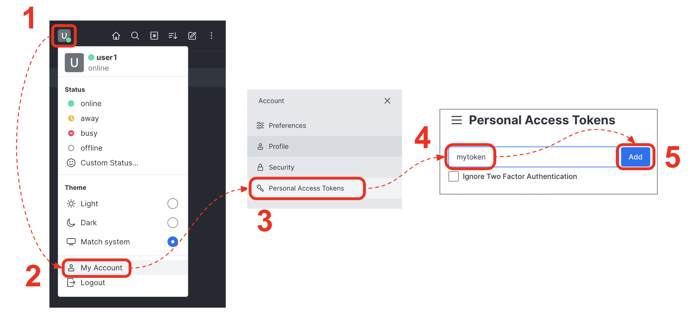
+
--
From _Rocket.Chat_: 

. Start from the _"User Menu"_.
. Then, click _"My Account"_.
. Select _"Personal Access Tokens"_.
. Type in a name for your token, for example `mytoken`.
. Click the _Add_ button
--
+
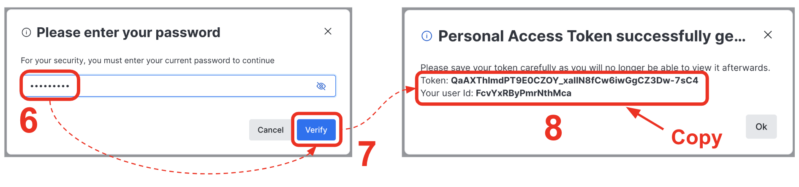
+
{blank}
+
--
[start=6]
. Enter the password `{user-password}`.
. Click _"Verify"_.
. Your token and user id will be generated.
+
Copy the values and configure your Camel parameters.
--
+
{empty} +

. Run Camel JBang from your terminal as follows:
+
--
{copypaste}
----
camel run * --local-kamelet-dir=../support/deploy/kamelets
----
--
+
{empty} +

. One more time, from _Matrix_ send one last message. If all goes well you should see the message listed in your _Rocket.Chat_ chat window
+
--
{copypaste}
----
Hello from Matrix
----
--
+
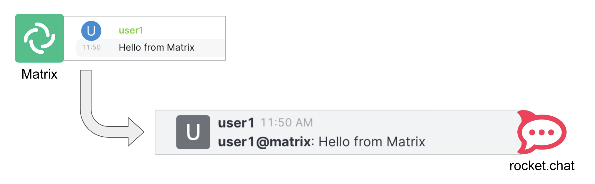
+
{empty} +
+
Hopefully you'll see a successful interaction between both chat systems, similar to the image above.
+
Press kbd:[Ctrl+C] to stop your Camel instance.
+
{empty} +
+
We can consider the local development done. We have a full data flow definition that routes messages from _Matrix_ to _Rocket.Chat_. The next step is to deploy the definition in _OpenShift_

{empty} +

[type=verification]
Did you see the message in _Matrix_ showing up in _Rocket.Chat_?

[time=5]
[id="openshift"]
== Deployment in OpenShift
{style-all}

[type=taskResource]
.Credentials
****
* *username:* `{user-username}`
* *password:* `{user-password}`
****
[type=taskResource]
.Red Hat OpenShift Dev Spaces
****
* link:{url-codeready}[Console, window="_blank"]
****
[type=taskResource]
.Red Hat OpenShift Developer Console
****
* link:{url-devconsole}[Topology View, window="_blank"]
****
[type=taskResource]
.Matrix
****
* link:{url-element}[Matrix Web Client, window="_blank"]
****
[type=taskResource]
.Rocket.Chat
****
* link:{url-rocketchat}[Rocket.Chat Web Client, window="_blank"]
****

Up until now you've only worked locally (in your dev UI and terminal). This phase has allowed you to prototype fast and produce code you feel confident with.

As per the diagram below, the _Camel_ developer can work at accelerated speed by editing sources and running locally.

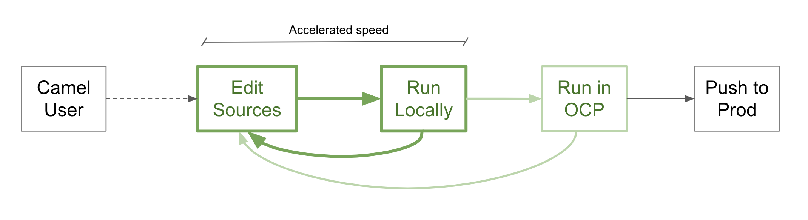

{empty} +

Now that you have validated your code locally, you can proceed to deploy and run in _OpenShift_.

The definitions that you have implemented can practically be taken 'as-is' into _OpenShift_. 

The only additional actions really to do are:
--
* Ensure we keep tokens secured with Secrets
* Ensure the Kamelet Binding can load the JSLT file as a resource. 
--

{empty} +

. To start with, make sure you have stopped you local Camel instance. +
If it is still running, press kbd:[Ctrl+C] to stop it.
+
{empty} +

. Deploy your _Matrix_ to _RocketChat_ integration
+
.. For those resuming work from a previous day, ensure the _working_ project in _OpenShift_ is selected by executing the following command:
+
--
{copypaste}
[subs=attributes]
----
oc project {namespace}
----
--
+
{blank}
+
.. Use the command below to deploy your application:
+
--
{copypaste}
----
labdeploy m2r
----
--
+
NOTE: Be patient, this action may take some time to complete (could take up to 10mn the first time).
+
{empty} +
+
You can monitor the state of the resource with the following command:
+
--
{copypaste}
----
oc get deployment/m2r
----
--
+
When the deployment is ready, the command outputs something similar to:
+
----
NAME   READY   UP-TO-DATE   AVAILABLE   AGE
m2r    1/1     1            1           10m 
----
+
{empty} +

.. Check the logs from your terminal.
+
You can use different commands to inspect the logs of your deployed `m2r` integration:
+
====
* Using the Camel CLI
+
--
{copypaste}
----
camel kubernetes logs m2r
----
--
+
* Or, using OpenShift's CLI
+
--
{copypaste}
----
oc logs deployment/m2r
----
--
====
+
{blank}
+
After a while, when the operator deploys the integration, you should see Camel connecting to Matrix and starting the streaming listener:
+
----
... : Apache Camel 4.14.0 (m2r) started in 323ms (build:0ms init:0ms start:323ms boot:2s201ms)
...
... : Opening connection to Matrix...
... : Matrix HTTP Streaming started
----
+
{empty} +

.. Check your deployment from the _Developer_ console
+
Inspect in your link:{openshift-host}/topology/ns/{namespace}[OpenShift Developer view, window="_blank"] your pod is in healthy state and running:
+
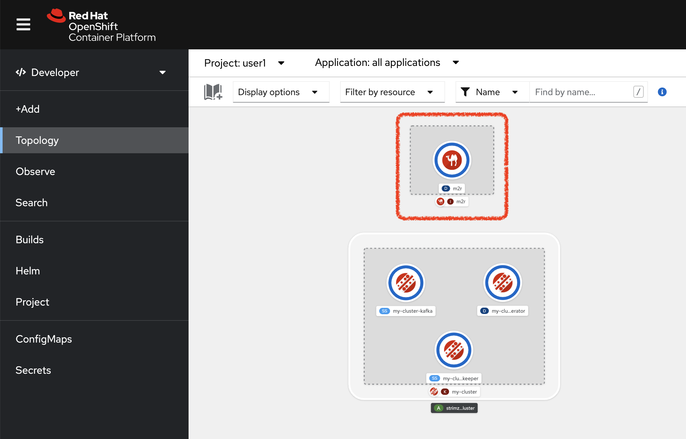
+
TIP: You can zoom in/out the canvas by using your mouse scrolling function, and move it around by clicking and dragging the background.
+
{empty} +
+
NOTE: You will observe your project also includes a pre-deployed _AMQ Streams (Kafka)_ cluster. Later in the workshop, you will use this dedicated _Kafka_ cluster to stream data in and out.
+
{empty} +

.. Check the logs.
+
You can open the logs of the _Camel_ instance by:
+
--
. Clicking in the pod's icon
. From the right pane, click `Resources`
. Click `View logs`
--
+
{blank}
+
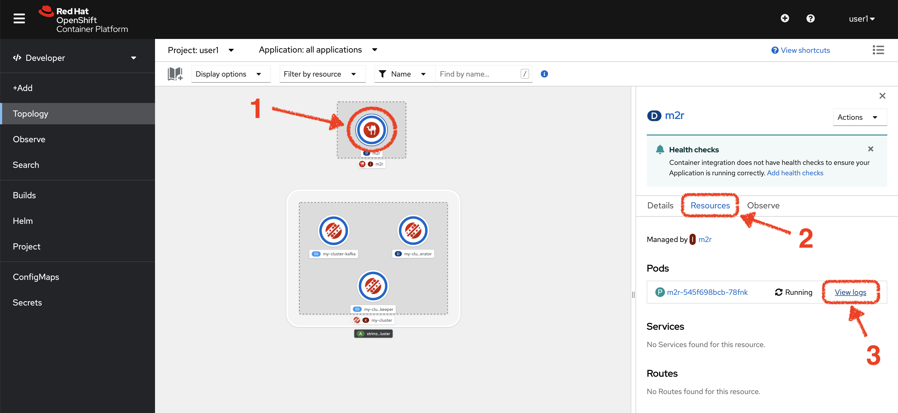
+
{blank}
+
You should see _Camel_ connecting to _Matrix_ and indicating the stream has started:
+
----
... : Apache Camel 3.14.2.redhat-00047 (camel-1) started in 825ms (build:0ms init:708ms start:117ms)
...
... : Opening connection to Matrix...
... : Matrix HTTP Streaming started
----
+
{empty} +

. Test your deployment
+
One more time, from Matrix send one last message. If all goes well you should see the message listed in your Rocket.Chat chat window
+

+
{empty} +

[type=verification]
Did you see the message going from _Matrix_ to _Rocket.Chat_?

[type=verificationSuccess]
You've successfully completed stage 1 !!

[type=verificationFail]
Inspect in the pod logs to investigate possible failure causes.
