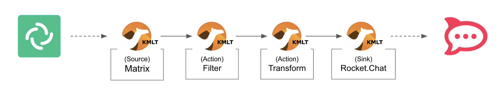
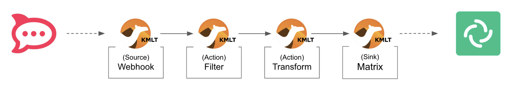

:walkthrough: Matrix to Rocket.Chat bridge ()
:user-password: openshift
:namespace: {user-username}

:url-element: https://app.element.io
:url-rocketchat: https://rocketchat-rocketchat.{openshift-app-host}
:url-codeready: http://codeready-che.{openshift-app-host}/
:url-devconsole: {openshift-host}/topology/ns/{namespace}

ifdef::env-github[]
endif::[]

[id='lab2-matrix-rocketchat-two-ways']
// = Lab 2 - Matrix ⇔ Rocket.Chat (two ways)
= Lab 2 - Enable two way interactions

// = [[kubernetes-user]] The Kubernetes user deployment flow

Enable two-way communication between Matrix and Rocket.Chat chat platforms.

{empty} + 

*Overview*

Lab 1 enabled a _Matrix_ to _Rocket.Chat_ data flow. On this second lab we want the flow to work in both directions so that users from both chat platforms can exchange messages and have a conversation.

{empty} + 

Target persona: +
--
* *Kubernetes User* +
{empty} +
--
Difficulty level: +
--
* *EASY* +
{empty} +
--
Estimated time: +
--
* *10 mn* +
{empty} +
--

{empty} +


Technical goals and milestones:

* Enable two-way communications.
* Include event filters.

{empty} +

[NOTE]
--
In the first lab you impersonated the _Camel_ developer to create and deploy _Kamelet Bindings_. Later, you will create more advanced integrations using regular Camel DSL (_Domain Specific Language_).
--

In this second lab, you will work as a _Kubernetes_ user. Instead of running locally your code, you will directly push your definitions to OpenShift. 

[NOTE]
--
As you progress with the lab, notice that working as a Kubernetes user, with Camel K, allows you to create and deploy data flows without any internal knowledge of Camel, as per the diagram below:

image::images/workflow-kube-user.png[align="center", width=100%]

You only need to define and configure sources, steps and sinks in Kamelet Binding definitions.
--

{empty} +

The picture billow illustrates two data flows interconnecting both chat systems, one for each direction of communication:

// image::images/processing-flow.png[title="Data flow",align="center",title-align=center, width=80%]
image::images/data-flow.png[align="center", width=80%]

Luckily, you've already done all the necessary onboarding setup with both chat systems, so this lab should be a lot faster to complete than the first one.

{empty} +


[time=5]
[id="m2r"]
== Matrix to Rocket.Chat

[type=taskResource]
.Credentials
****
* *username:* `{user-username}`
* *password:* `{user-password}`
****
[type=taskResource]
.Red Hat OpenShift Dev Spaces
****
* link:{url-codeready}[Console, window="_blank"]
****
[type=taskResource]
.Red Hat OpenShift Developer Console
****
* link:{url-devconsole}[Topology View, window="_blank"]
****
[type=taskResource]
.Matrix
****
* link:{url-element}[Matrix Web Client, window="_blank"]
****
[type=taskResource]
.Rocket.Chat
****
* link:{url-rocketchat}/topology/ns/{namespace}[Rocket.Chat Web Client, window="_blank"]
****

This process is identical to the one you've already created in Lab 1, except there is situation you need to prevent. +
Ask yourself the following question:

* If the App in a chat room fires an event for each new message in a conversation, what would happen when interconnecting both Apps?

{empty} +

Obviously, the interaction between both platforms would enter in a ping-pong effect between the App in Matrix and the App in Rocket.Chat.


A filtering mechanism needs to be put in place to prevent the interaction from entering in a death loop.

{empty} +

=== Process overview

The diagram below illustrates the processing flow you're about to create:



There are 4 Kamelets in use:

====
* *A source* +
Consumes events from _Matrix_.

* *Two actions* +
One filters messages to prevent death loops. +
One transforms _Matrix_ events to _Rocket.Chat_ events (in JSON format).

* *A sink* +
Produces events to _Rocket.Chat_.
====

{empty} +

[NOTE]
You can tell from the list above that this second lab suits very well the _Kubernetes_ user: all the integration process involves is defining a _Kamelet Binding_ with a sequence of _Kamelets_ in them.

{empty} +

=== Process definition

. Setup
.. Close tabs
+
image::images/crw-close-tabs.png[align="left", width=50%]
+
{blank}
+
Before you start this second lab, make sure you close in your editor all the tabs (source files) from the previous exercise.
+
{empty} +

.. Login to _OpenShift_ 
+
For those resuming work from a previous day, ensure you reconnect your `oc` client with _OpenShift_ by running the following login command:
+
[source,bash,subs="attributes+"]
----
oc login -u {user-username} -p {user-password} https://$KUBERNETES_SERVICE_HOST:$KUBERNETES_SERVICE_PORT --insecure-skip-tls-verify=true
----
+
{empty} +

.. Create the skeleton
+
... Using the sources of _Stage1_ as a base, make a copy of your previous exercise, for example:
+
[subs=]
```bash
cd /projects/MessageHub
cp -r lab1 lab2
cd lab2<br>
```
+
{empty} +

... Rename all occurrences of `stage1` to `stage2`.
+
Run the commands below in your terminal:
+
--
* **Linux**
+
[subs=]
```bash
mv stage1.properties stage2.properties
sed -i 's/stage1/stage2/g' m2r.yaml
<br> 
```
// +
// * **MacOS**
// +
// [subs=]
// ```bash
// mv stage1.properties stage2.properties
// sed -i '' 's/stage1/stage2/g' m2r.yaml
// <br> 
// ```
--
+
{blank}
+
The commands above will:
+
--
* replace the annotations in the `m2r.yaml` file from `stage1` to `stage2` 
* rename `stage1.properties` to `stage2.properties`
--
{empty} +

.. Locate your files in the project tree

{empty} +

. Include the filter
+
From the  _link:https://camel.apache.org/camel-kamelets/next/index.html[Kamelet Catalog, window="_blank"]_, there is a convenient _Kamelet_ fit for the purpose:
+
--
* `predicate-filter-action`
+
*Reference*
+
** link:https://camel.apache.org/camel-kamelets/next/predicate-filter-action.html[Filter action documentation, window="_blank"]
--
+
{empty} +
+
This _Kamelet_ action applies a _JsonPath_ expression where we can use a regular expression operator to match the blocking pattern. 
+
The challenge with _Matrix_, contrary to other chat platforms, is that there's no field (within the incoming event) indicating if the message is from a human or an app. To distinguish one from the other, we need to come up with a pattern that works for us.
+
--
Given our JSLT converts messages to the following format:

* `username@system:`  message
+
(an example would be: *jon@matrix: hello*)
--
+
{empty} +
+
It makes sense to use the same pattern to identify and block incoming events since we know they are app-generated by _Camel's_ JSLT transformation.
+
With all the above in mind, let's include a `filter-action` _Kamelet_, as an additional step, that does just what's needed.
+
Find in your editor's file tree, and open to edit:
+
--
* *_MessageHub_* -> *_lab2_* -> *`m2r.yaml`*
--
+
{empty} +
+
Copy the filter snippet below and paste it in your _Kamelet_ Binding:
+
----
apiVersion: camel.apache.org/v1alpha1
kind: KameletBinding
metadata:
  name: m2r
  annotations:
    trait.camel.apache.org/mount.configs: "secret:stage2"
    trait.camel.apache.org/mount.resources: "configmap:stage2-transform"
spec:

  source:
    ref:
      kind: Kamelet
      apiVersion: camel.apache.org/v1
      name: matrix-source
    properties:
      token: "{{matrix.token}}"
      room:  "{{matrix.room}}"

  steps:
----
+
```yaml
  # Filter action to prevent death loops
  - ref:
      kind: Kamelet
      apiVersion: camel.apache.org/v1
      name: predicate-filter-action
    properties:
      expression: $.text =~ /(?!<b>.*@.*<\/b>:).*/
```
+
----
  - ref:
      kind: Kamelet
      apiVersion: camel.apache.org/v1
      name: jslt-action
    properties:
      template: m2r.jslt

  sink:
    ref:
      kind: Kamelet
      apiVersion: camel.apache.org/v1
      name: rocketchat-sink
    properties:
      token: "{{rocketchat.token}}"
----
+
{empty} +
+
In the filter above you'll notice the expression picks the `$.text` JSON field and evaluates it against the regular expression that takes in account the _HTML_ `<b>` tags _Matrix_ uses to render rich content.
+
{empty} + 

. Push the configuration to _OpenShift_
+
Create the corresponding _ConfigMap_ and _Secret_ for _Stage2_. +
Run the following `oc` command:
+
[source, subs=]
----
oc create cm stage2-transform --from-file=m2r.jslt
oc create secret generic stage2 --from-file=stage2.properties
<br>
----
{empty} +

. Deploy the YAML definition containing your new _Kamelet Binding_
.. Run the following `oc` command to deploy the integration:
+
```bash
oc apply -f m2r.yaml
```
+
NOTE: Be patient, this action will take some time to complete as the operator needs to download all the filter's maven dependencies, build the application and create the image before the integration can be deployed.
+
IMPORTANT: The old version will keep running until _Camel K_ finishes building and deploying the new version. Make sure you wait until the new version has been rolled out.
+
{empty}
+
.. Monitor the state of the deployment with the following command:
+
```bash
oc get klb -w
```
+
{blank}
+
During the time you see _Camel K_ building and deploying the new version, the output for the command above should show something similar to:
+
----
NAME   PHASE      REPLICAS
m2r    Creating 
m2r    Ready      2
m2r    Ready      1
----
+
{blank}
+
The first entry indicates the new version is being rollet out (while the previous version still is running) and the second entry indicates the roll out has concluded.
+
{empty} +

.. Check your deployment
+
From the link:{openshift-host}/topology/ns/{namespace}[web console's topology view, window="_blank"], check the pod's deployment and logs to ensure all is in healthy state.
+
{empty} +

. Test the filter (part 1)
+
Now, from _Matrix_'s chat room, send a message, for example `go through`.
+
If all goes well your message should show up in _Rocket.Chat_'s chat room.
+
{empty} +
+

. Test the filter (part 2)
+
Now, let's fake a message pretending it is generated by _Camel_. +
Copy the following message, then paste and send from _Matrix_:
+
```
<b>fakebot@matrix</b>: fake app message
```
+
{empty} +
+
The expected behaviour from the system is to observe how the filter blocks the message and therefore to see it missing in Rocket.Chat.
+
{empty} +

// +
// Was that the case? if not, try to find out why, resolve, and try again. +
// Otherwise, if the message got indeed blocked, then the data flow is ready. Continue below with the second data flow.

[type=verification]
In test 1, did you see the message going from _Matrix_ to _Rocket.Chat_?

[type=verificationSuccess]
Very good !

[type=verificationFail]
Inspect in the pod logs to troubleshoot.


[type=verification]
In test 2, did you see the message not reach _Rocket.Chat_?

[type=verificationSuccess]
Very good !

[type=verificationFail]
Inspect in the pod logs to troubleshoot.


[time=5]
[id="r2m"]
== Rocket.Chat to Matrix

[type=taskResource]
.Credentials
****
* *username:* `{user-username}`
* *password:* `{user-password}`
****
[type=taskResource]
.Red Hat OpenShift Dev Spaces
****
* link:{url-codeready}[Console, window="_blank"]
****
[type=taskResource]
.Red Hat OpenShift Developer Console
****
* link:{url-devconsole}[Topology View, window="_blank"]
****
[type=taskResource]
.Matrix
****
* link:{url-element}[Matrix Web Client, window="_blank"]
****
[type=taskResource]
.Rocket.Chat
****
* link:{url-rocketchat}/topology/ns/{namespace}[Rocket.Chat Web Client, window="_blank"]
****

This process is equivalent to the previous one, but designed to enable the opposite data flow.

It also requires a filtering mechanism to block events from _Rocket.Chat_, originally emitted from _Matrix_-to-_Rocket.Chat_ _Camel_ transactions.

{empty} +

=== Process overview

The diagram below illustrates the processing flow:




There are 4 Kamelets in use:

====
* *A source* +
Consumes events from _Rocket.Chat_.

* *Two actions* +
One filters messages to prevent death loops. +
One transforms _Rocket.Chat_ events to _Matrix_ events (in JSON format).

* *A sink* +
Produces events to _Matrix_.
====

{empty} +

=== Process definition

. Create the YAML definition.
+
Run the following command to crate the YAML file:
+
```bash
touch r2m.yaml
```
+
{empty} +

. Define its source
+
Copy the snippet below and paste it into your new `r2m.yaml` file:
+
```yaml
apiVersion: camel.apache.org/v1alpha1
kind: KameletBinding
metadata:
  name: r2m
  annotations:
    trait.camel.apache.org/mount.configs: "secret:stage2"
    trait.camel.apache.org/mount.resources: "configmap:stage2-transform"
spec:

  source:
    ref:
      kind: Kamelet
      apiVersion: camel.apache.org/v1
      name: webhook-source


  steps:

  # Filter action to prevent death loops
  - ref:
      kind: Kamelet
      apiVersion: camel.apache.org/v1
      name: predicate-filter-action
    properties:
      expression: $.text =~ /(?!\*.*@.*\*:).*/
  
  # JSON Transformation
  - ref:
      kind: Kamelet
      apiVersion: camel.apache.org/v1
      name: jslt-action
    properties:
      template: "{{transform.path:r2m.jslt}}"


  sink:
    ref:
      kind: Kamelet
      apiVersion: camel.apache.org/v1
      name: matrix-sink
    properties:
      token: "{{matrix.token}}"
      room: "{{matrix.room}}"
```
+
{empty} +
+
[NOTE]
--
* The source Kamelet is now a _Webhook_
* The sink Kamelet is now _Matrix_
--
+
[NOTE]
--
In the filter above you'll notice the expression picks the `$.text` JSON field and evaluates it against the regular expression that takes in account the `*` symbol _Matrix_ uses to render rich content.
--
+
{empty} +

. Define the JSLT transformation.
+
.. Run the following command to crate the JSLT file:
+
```bash
touch r2m.jslt
```
+
{empty} +

.. Define its mapping definition.
+
Copy the snippet below and paste it into your new `r2m.jslt` file:
+
```
{
  "text":"<b>"+.user_name+"@rocketchat</b>: "+.text
}
```
+
{empty} +
+
[NOTE]
====
* When targeting _Rocket.Chat_, the target room is configured at the sink, not in the JSON payload. +
* The field `text` includes JsonPath rules extracting values from Rocket.Chat input events.
====
{empty} +

. Push the configuration to _OpenShift_
+
Recreate the _Secret_ and _ConfigMap_ to include both JSLTs. +
Run the following `oc` command:
+
[source, subs=]
----
oc delete secret stage2
oc create secret generic stage2 --from-file=stage2.properties

oc delete cm stage2-transform
oc create cm stage2-transform --from-file=m2r.jslt --from-file=r2m.jslt<br>
----
{empty} +

. Deploy the YAML definition containing your new Kamelet Binding
.. Run the following `oc` command to deploy the integration:
+
```bash
oc apply -f r2m.yaml

```
+
NOTE: Be patient, this action will take some time to complete as the operator needs to download all the filter's maven dependencies, build the application and create the image before the integration can be deployed.

.. Wait for readyness
+
You can monitor the state of the new flow with the following command:
+
```bash
oc get klb -w
```
+
{blank}
+
During the time you see _Camel K_ building and deploying the integration, the output for the command above should show something similar to:
+
----
NAME   PHASE      REPLICAS
m2r    Ready      1
r2m    Creating   
r2m    Ready      0
r2m    Ready      1
r2m    Ready      1
----
+
{blank}
+
The last entry indicates the pod is ready.
+
Check the pod's deployment and logs to ensure all is in healthy state.
+
image::images/ocp-dev-pod-healthy-s2g.png[align="left", width=80%]
+
{empty} +

. Test the integration from Rocket.Chat.
+
Go to you Rocket.Chat's chat room and send a message, for example "Hello from Rocket.Chat".
+
If all goes well your message should show up in Matrix.
+
image::images/stage2-msg-slack-gitter.png[align="left", width=80%]
+
[NOTE]
--
You will notice two inmediate differences:

* When pushing messages from _Camel_, _Matrix_ shows them as a user, not as an App. _Rocket.Chat_ on the other hand, does not allow Apps to impersonate users.
* _Rocket.Chat_ does not provide the real user name, instead it provides its ID.
--
+
[NOTE]
--
An interesting exercise would be to replace _Rocket.Chat_'s user ID by the real user name. We leave this task for a future more advanced scenario.
--
+
{empty} +

. Ensure the filter works.
+
We now have both flows in place:
+
--
* Matrix to Rocket.Chat
* Rocket.Chat to Matrix
--
+
{empty} +
+
As a final step, to test the filter and validate it's working well, let's ensure that _Matrix_-to-_Rocket.Chat_ messages do not circle back.
+
From your _Matrix_ chat room, send a message. +
The expected outcome should be as follows:

* You see the message in _Rocket.Chat_
* You don't see a new message in _Matrix_


+
{empty} +


[type=verification]
Did you see your message from _Rocket.Chat_ successfully reach _Matrix_ (and not come back)?

[type=verificationSuccess]
You have now completed Stage 2 !!

[type=verificationFail]
Inspect in the pod logs to troubleshoot.


// You have now completed Stage 2 !!