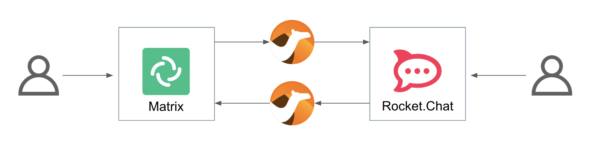
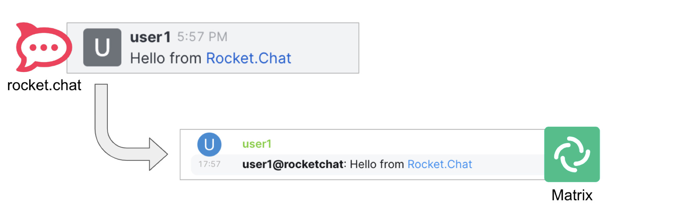

:walkthrough: Gitter to Slack bridge ()

ifdef::env-github[]
endif::[]

[id='lab2-gitter-slack-two-ways']
// = Lab 2 - Gitter ⇔ Slack (two ways)
= Lab 2 - Enable two way interactions

// = [[kubernetes-user]] The Kubernetes user deployment flow

Enable two-way communication between Gitter and Slack chat platforms.

{empty} + 

*Overview*

Lab 1 enabled a _Gitter_ to _Slack_ data flow. On this second lab we want the flow to work in both directions so that users from both chat platforms can exchange messages and have a conversation.

{empty} + 

Target persona: +
--
* *Kubernetes User* +
{empty} +
--
Difficulty level: +
--
* *EASY* +
{empty} +
--
Estimated time: +
--
* *10 mn* +
{empty} +
--

{empty} +


Technical goals and milestones:

* Enable two-way communications.
* Include event filters.

{empty} +

[NOTE]
--
Given the first lab covered in detail the workflows for both personas (Kubernets/Camel user), consider yourself equipped with the knowledge and tools to choose your preferred development methodology going forward.

From now on, we simplify the instructions with code snippets directly deployable in _OpenShift_. Feel free to modify the snippets accordingly if you'd like to test them locally (as a Camel expert). 
--

{empty} +

The picture billow illustrates two data flows interconnecting both chat systems, one for each direction of communication:

// image::images/processing-flow.png[title="Data flow",align="center",title-align=center, width=80%]


Luckily, you've already done all the necessary onboarding setup with both chat systems, so this lab should be a lot faster to complete than the first one.

{empty} +


[time=5]
[id="g2s"]
== Gitter to Slack

This process is identical to the one you've already created in Lab 1, except there is situation you need to prevent. +
Ask yourself the following question:

* If the App in a chat room fires an event for each new message in a conversation, what would happen when interconnecting both Apps?

{empty} +

Obviously, the interaction between both platforms would enter in a ping-pong effect between the App in Gitter and the App in Slack.

image::images/death-loop.png[align="center", width=60%]

A filtering mechanism needs to be put in place to prevent the interaction from entering in a death loop.

{empty} +

=== Process overview

The diagram below illustrates the processing flow you're about to create:

image::images/processing-flow-g2s.png[align="center", width=80%]

There are 4 Kamelets in use:

====
* *A source* +
Consumes events from _Gitter_.

* *Two actions* +
One filters messages to prevent death loops. +
One transforms _Gitter_ events to _Slack_ events (in JSON format).

* *A sink* +
Produces events to _Slack_.
====

{empty} +

[NOTE]
You can tell from the list above that this second lab suits very well the _Kubernetes_ user: all the integration process involves is defining a _Kamelet Binding_ with a sequence of _Kamelets_ in them.

{empty} +

=== Process definition

. Create the skeleton
+
.. Using the sources of _Stage1_ as a base, make a copy of your previous exercise, for example:
+
```bash
cd /projects/MessageHub
cp -r lab1 lab2
cd lab2
: 
```
+
{empty} +

.. rename all occurrences of `stage1` to `stage2`.
+
This action should include:
+
--
* replacing the annotations in the `g2s.yaml` file from `stage1` to `stage2` 
* renaming `stage1.properties` to `stage2.properties`
--
+
{empty} +
+
or simply run the commands below in your terminal:
+
* **Linux**
+
```bash
mv stage1.properties stage2.properties
sed -i 's/stage1/stage2/g' g2s.yaml 
: 
```
+
* **MacOS**
+
```bash
mv stage1.properties stage2.properties
sed -i '' 's/stage1/stage2/g' g2s.yaml 
: 
```
+
{empty} +

. Include the filter
+
There is a convenient _Kamelet_ in the catalog fit for this purpose:
+
--
* `predicate-filter-action`
+
*Reference*
+
** https://camel.apache.org/camel-kamelets/0.8.x/predicate-filter-action.html
--
+
{empty} +
+
This _Kamelet_ action applies a _JsonPath_ expression where we can use a regular expression operator to match the blocking pattern. 
+
The challenge with _Gitter_, contrary to other chat platforms, is that there's no field (within the incoming event) indicating if the message is from a human or an app. To distinguish one from the other, we need to come up with a pattern that works for us.
+
--
Given our JSLT converts messages to the following format:

* `username@system:`  message
--
+
{empty} +
+
It makes sense to use the same pattern to identify and block incoming events since we know they are app-generated by Camel's JSLT transformation.
+
With all the above in mind, let's include a `filter-action` Kamelet, as an additional step, that does just what's needed.
+
Copy the filter snippet below and paste it in your Kamelet Binding:
+
----
apiVersion: camel.apache.org/v1alpha1
kind: KameletBinding
metadata:
  name: g2s
  annotations:
    trait.camel.apache.org/mount.configs: "secret:stage2"
    trait.camel.apache.org/mount.resources: "configmap:stage2-transform"
spec:

  source:
    ref:
      kind: Kamelet
      apiVersion: camel.apache.org/v1
      name: gitter-source
    properties:
      token: "{{gitter.token}}"
      room:  "{{gitter.room}}"

  steps:
----
+
```yaml
  # Filter action to prevent death loops
  - ref:
      kind: Kamelet
      apiVersion: camel.apache.org/v1
      name: predicate-filter-action
    properties:
      expression: $.text =~ /(?!\*\*.*@.*\*\*:).*/
```
+
----
  - ref:
      kind: Kamelet
      apiVersion: camel.apache.org/v1
      name: jslt-action
    properties:
      template: g2s.jslt

  sink:
    ref:
      kind: Kamelet
      apiVersion: camel.apache.org/v1
      name: slack-sink
    properties:
      token: "{{slack.token}}"
----
+
{empty} +
+
In the filter above you'll notice the expression is picking the `text` JSON field and matching it with the regular expression that takes in account the _Markdown_ syntax that _Gitter_ uses.
+
{empty} + 

. Push the configuration to _OpenShift_
+
Create the corresponding _ConfigMap_ and _Secret_ for _Stage2_. +
Run the following `oc` command:
+
```bash
oc create cm stage2-transform --from-file=g2s.jslt
oc create secret generic stage2 --from-file=stage2.properties
:
```
{empty} +

. Deploy the YAML definition containing your new _Kamelet Binding_
.. Run the following `oc` command to deploy the integration:
+
```bash
oc apply -f g2s.yaml
```
+
NOTE: Be patient, this action will take some time to complete as the operator needs to download all the filter's maven dependencies, build the application and create the image before the integration can be deployed.

.. Check your deployment
+
Check the pod's deployment and logs to ensure all is in healthy state.
+
{empty} +

. Test the filter (part 1)
+
Now, from _Gitter_'s chat room, send a message, for example `go through`.
+
If all goes well your message should show up in _Slack_'s chat room.
+
{empty} +
+

. Test the filter (part 2)
+
Now, let's fake a message pretending it is generated by _Camel_. +
Copy the following message, then paste and send from _Gitter_:
+
```
**fakebot@gitter**: fake app message
```
+
{empty} +
+
The expected behaviour from the system is to observe the filter to block the message and therefore not be seen in Slack.
+
{empty} +

// +
// Was that the case? if not, try to find out why, resolve, and try again. +
// Otherwise, if the message got indeed blocked, then the data flow is ready. Continue below with the second data flow.

[type=verification]
In test 1, did you see the message going from _Gitter_ to _Slack_?

[type=verificationSuccess]
Very good !

[type=verificationFail]
Inspect in the pod logs to troubleshoot.


[type=verification]
In test 2, did you see the message not reach _Slack_?

[type=verificationSuccess]
Very good !

[type=verificationFail]
Inspect in the pod logs to troubleshoot.


[time=5]
[id="s2g"]
== Slack to Gitter

This process is equivalent to the previous one, but designed to enable the opposite data flow.

It also requires a filtering mechanism to block events from _Slack_, originally emitted from _Gitter_-to-_Slack_ _Camel_ transactions.

{empty} +

=== Process overview

The diagram below illustrates the processing flow:

image::images/processing-flow-s2g.png[align="center", width=80%]


There are 4 Kamelets in use:

====
* *A source* +
Consumes events from _Slack_.

* *Two actions* +
One filters messages to prevent death loops. +
One transforms _Slack_ events to _Gitter_ events (in JSON format).

* *A sink* +
Produces events to _Gitter_.
====

{empty} +

=== Process definition

. Create the YAML definition.
+
Run the following command to crate the YAML file:
+
```bash
touch s2g.yaml
```
+
{empty} +

. Define its source
+
Copy the snippet below and paste it into your new `s2g.yaml` file:
+
```yaml
apiVersion: camel.apache.org/v1alpha1
kind: KameletBinding
metadata:
  name: s2g
  annotations:
    trait.camel.apache.org/mount.configs: "secret:stage2"
    trait.camel.apache.org/mount.resources: "configmap:stage2-transform"
spec:

  source:
    ref:
      kind: Kamelet
      apiVersion: camel.apache.org/v1
      name: slack-source
    properties:
      token:   "{{slack.token}}"
      channel: "{{slack.channel.name}}"
      delay: 2000


  steps:

  # Filter action to prevent death loops
  - ref:
      kind: Kamelet
      apiVersion: camel.apache.org/v1
      name: predicate-filter-action
    properties:
      expression: "!$.botId || $.botId == null"
  
  # JSON Transformation
  - ref:
      kind: Kamelet
      apiVersion: camel.apache.org/v1
      name: jslt-action
    properties:
      template: "{{transform.path:s2g.jslt}}"


  sink:
    ref:
      kind: Kamelet
      apiVersion: camel.apache.org/v1
      name: gitter-sink
    properties:
      token: "{{gitter.token}}"
      room: "{{gitter.room}}"
```
+
{empty} +
+
[NOTE]
--
* The source Kamelet is now _Slack_
* The sink Kamelet is now _Gitter_
--
+
[NOTE]
--
The filter is simpler, because _Slack_ includes a `botId` field when messages are app-generated.

* Its expression allows messages to go through when not including `botId` (or equal to null).
--
+
{empty} +

. Include an extra _Slack_ parameter to your properties file.
+
Copy from below the parameter definition `slack.channel.name`, paste it into your properties file, and set its value to the _Slack_ room you're using.
+
----
# Allows HTTP streaming from Gitter
camel.main.streamCachingEnabled=false

# Gitter credentials
gitter.token=2d482bdf092e0e2299832b1f38d9560243083894
gitter.room=6317569e6da03739849c519a

# Slack credentials
slack.token=YOUR_TOKEN
----
+
```properties
slack.channel.name=YOUR_SLACK_ROOM
```
+
{empty} +

. Define the JSLT transformation.
+
.. Run the following command to crate the JSLT file:
+
```bash
touch s2g.jslt
```
+
{empty} +

.. Define its mapping definition.
+
Copy the snippet below and paste it into your new `s2g.jslt` file:
+
```
{
    "text":"**"+.user+"@slack**: "+.text
}
```
+
{empty} +
+
[NOTE]
====
* When targeting _Slack_, the target room is configured at the sink, not in the JSON payload. +
* The field `text` includes JsonPath rules extracting values from Slack input events.
====
{empty} +

. Push the configuration to _OpenShift_
+
Recreate the _Secret_ and _ConfigMap_ to include both JSLTs. +
Run the following `oc` command:
+
```bash
oc delete secret stage2
oc create secret generic stage2 --from-file=stage2.properties

oc delete cm stage2-transform
oc create cm stage2-transform --from-file=g2s.jslt --from-file=s2g.jslt
:
```
{empty} +

. Deploy the YAML definition containing your new Kamelet Binding
.. Run the following `oc` command to deploy the integration:
+
```bash
oc apply -f s2g.yaml

```
+
NOTE: Be patient, this action will take some time to complete as the operator needs to download all the filter's maven dependencies, build the application and create the image before the integration can be deployed.

.. Wait for readyness
+
Check the pod's deployment and logs to ensure all is in healthy state.
+

+
{empty} +

. Test the integration from Slack.
+
Go to you Slack's chat room and send a message, for example "Hello from Slack".
+
If all goes well your message should show up in Gitter.
+

+
[NOTE]
--
You will notice two inmediate differences:

* When pushing messages from _Camel_, _Gitter_ shows them as a user, not as an App. _Slack_ on the other hand, does not allow Apps to impersonate users.
* _Slack_ does not provide the real user name, instead it provides its ID.
--
+
[NOTE]
--
An interesting exercise would be to replace _Slack_'s user ID by the real user name. We leave this task for a future more advanced scenario.
--
+
{empty} +

. Ensure the filter works.
+
We now have both flows in place:
+
--
* Gitter to Slack
* Slack to Gitter
--
+
{empty} +
+
As a final step, to test the filter and validate it's working well, let's ensure that _Gitter_-to-_Slack_ messages do not circle back.
+
From your _Gitter_ chat room, send a message. +
The expected outcome should be as follows:

* You see the message in _Slack_
* You don't see a new message in _Gitter_


+
{empty} +


[type=verification]
Did you see your message from _Slack_ successfully reach _Gitter_ (and not come back)?

[type=verificationSuccess]
You have now completed Stage 2 !!

[type=verificationFail]
Inspect in the pod logs to troubleshoot.


// You have now completed Stage 2 !!