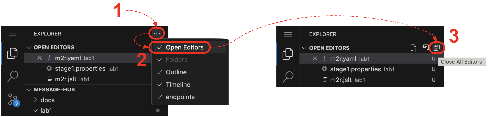
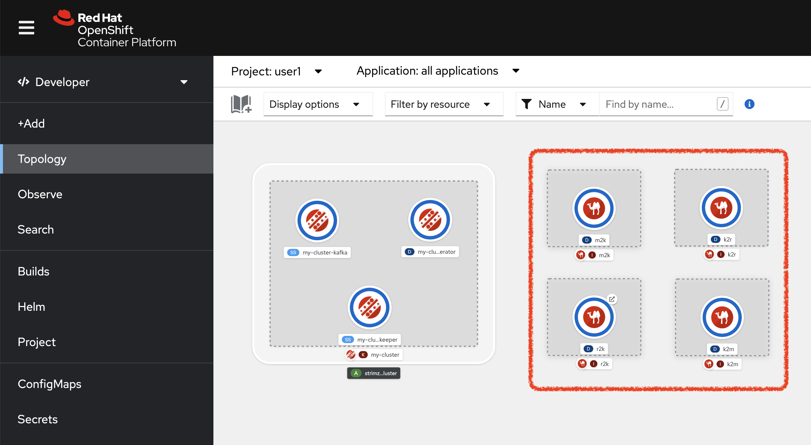

:walkthrough: Matrix to Rocket.Chat bridge ()
:user-password: openshift
:namespace: {user-username}

:url-element: https://app.element.io
:url-rocketchat: https://rocketchat-rocketchat.{openshift-app-host}
:url-codeready: http://devspaces.{openshift-app-host}/
:url-devconsole: {openshift-host}/topology/ns/{namespace}

ifdef::env-github[]
endif::[]

[id='lab3-matrix-kafka-rocketchat']
// = Lab 3 - Matrix ⇔ Kafka ⇔ Rocket.Chat (via streams)
= Lab 3 - Decoupled Re-Architecture

// = [[kubernetes-user]] The Kubernetes user deployment flow

Open the architecture by decoupling the chat systems using streaming capabilities with AMQ Streams.


Prerequisites: +
--
* Ensure you have previously completed the following tiles:
+


{empty} +
--

*Overview*

Lab 1 and 2 enabled _Matrix_/_Rocket.Chat_ conversations. However their connectivity was tightly coupled with dedicated data translations between both platforms. On this third lab we want to break them away to open up the architecture in order to welcome additional systems and services.


{empty} +

Target persona: +
--
* *Kubernetes User* +
{empty} +
--
Difficulty level: +
--
* *EASY* +
{empty} +
--
Estimated time: +
--
* *20 mn* +
{empty} +
--

{empty} +

Technical goals and milestones:

* Evolve and mature the architecture.
* Adopt a standard interface
* Switch bindings to plug platform resources.

{empty} +

The picture billow illustrates an asynchronous decoupled architecture, via a streaming platform (_Kafka_). This approach increases the number of data flows from two to four.

TIP: At first it seems unnecessary to double the number of data flows, but the benefits outweighs complexity, we gain an easily extensible architecture. In later labs you'll see new additions to the architecture.

{empty} +

// image::images/processing-flow.png[title="Data flow",align="center",title-align=center, width=80%]
image::images/data-flow.png[align="center", width=90%]

{empty} +

In terms of implementation effort for this lab, your main task is to split each of your current data flows (from Lab-2) in two different parts:

- The _Matrix_ to _Rocket.Chat_ process into:
. _Matrix_ to _Kafka_
. _Kafka_ to _Rocket.Chat_
+
{empty} +
- The _Rocket.Chat_ to _Matrix_ process into:
. _Rocket.Chat_ to _Kafka_
. _Kafka_ to _Matrix_

{empty} +

One fundamental architecture consideration is that if we want an easy to plugin platform where other communication systems or services need to plugin with ease, we should adopt a standard data model. It would establish a common interface for systems willing to integrate with the platform.

This implies that instead of applying platform specific data transformations (eg. _Matrix_ data model to _Rocket.Chat_ data model), we apply the following data transformations:

- System specific to standard data model (e.g. _Matrix_/_Rocket.Chat_ to _Kafka_)
- Standard data model to system specific (e.g. _Kafka_ to _Matrix_/_Rocket.Chat_)

{empty} +

The illustration below describes data exchanges via _Kafka_:

image::images/standard-data-model.png[align="center", width=90%]

{empty} +


[time=2]
[id="setup"]
== Setup the Lab working folder

[type=taskResource]
.Credentials
****
* *username:* `{user-username}`
* *password:* `{user-password}`
****
[type=taskResource]
.Red Hat OpenShift Dev Spaces
****
* link:{url-codeready}[Console, window="_blank"]
****

For those resuming work from a previous day, ensure the _working_ project in _OpenShift_ is selected by executing the following command:

[source,bash,subs="attributes+"]
----
oc project {namespace}
----

{empty} +

First of all, ensure you undeploy Lab2's _Kamelet_ bindings, otherwise they will enter in conflict with the ones we're about to create:
[subs=]
```bash
oc delete klb m2r
oc delete klb r2m
<br>
```
{empty} +


Now, we go back where we left it to continue growing our solution. +
We use Lab-2 as the base for this next stage.

The following set of instructions prepare the set of files you will be working with: 


. Close tabs
+

+
{blank}
+
Before you start this second lab, make sure you close in your editor all the tabs (source files) from the previous exercise.
+
1) Click on the file explorer's `...` button +
2) Ensure your `Open Editors` is ticked [√] +
3) Click the `Close all Editors` button.
+
{empty} +

. Prepare Lab 3 folder
+
* **Linux**
+
[subs=]
```bash
cd /projects/MessageHub
cp -r lab2 lab3
cd lab3
mv stage2.properties stage3.properties
grep -rl stage2 . | xargs sed -i 's/stage2/stage3/g'<br>
```
+
// * **MacOS**
// +
// [subs=]
// ```bash
// cd /projects/MessageHub
// cp -r lab2 lab3
// cd lab3
// mv stage2.properties stage3.properties
// grep -rl stage2 . | xargs sed -i '' 's/stage2/stage3/g'<br>
// ```
// +
{empty} +

. Split each YAML file in two:
+
(The split allows to place Kafka in between)
+
[subs=]
```bash
mv m2r.yaml m2k.yaml
cp m2k.yaml k2r.yaml
mv r2m.yaml r2k.yaml
cp r2k.yaml k2m.yaml
mkdir flows
mv *.yaml flows/<br>
```
+
{empty} +

. Rename the bindings:
+
* **Linux**
+
[subs=]
```bash
sed -i 's/m2r/m2k/g' flows/m2k.yaml
sed -i 's/m2r/k2r/g' flows/k2r.yaml
sed -i 's/r2m/r2k/g' flows/r2k.yaml
sed -i 's/r2m/k2m/g' flows/k2m.yaml<br>
```
+
// * **MacOS**
// +
// [subs=]
// ```bash
// sed -i '' 's/m2r/m2k/g' flows/m2k.yaml
// sed -i '' 's/m2r/k2r/g' flows/k2r.yaml
// sed -i '' 's/r2m/r2k/g' flows/r2k.yaml
// sed -i '' 's/r2m/k2m/g' flows/k2m.yaml<br>
// ```
// +
{empty} +

. Prepare JSLTs:
+
[subs=]
```bash
rm *.jslt
mkdir maps
touch maps/m2k.jslt
touch maps/k2r.jslt
touch maps/r2k.jslt
touch maps/k2m.jslt<br>
```
{empty} +

. Check your lab folder
+
After executing the commands above, have a look in your editor's tree view to confirm it looks healthy. It should be similar to:
+
image::images/lab-setup.png[align="left", width=20%]
+
{empty} +

[type=verification]
Do you see the same folder structure and files?

[type=verificationSuccess]
You're ready to continue.

[type=verificationFail]
Make sure the syntax of the commands are compatible with with your environment and try again.


{empty} +


[time=5]
[id="matrix-rocketchat-to-kafka"]
== Matrix/Rocket.Chat to Kafka

[type=taskResource]
.Credentials
****
* *username:* `{user-username}`
* *password:* `{user-password}`
****
[type=taskResource]
.Red Hat OpenShift Dev Spaces
****
* link:{url-codeready}[Console, window="_blank"]
****
[type=taskResource]
.Red Hat OpenShift Developer Console
****
* link:{url-devconsole}[Topology View, window="_blank"]
****
[type=taskResource]
.Matrix
****
* link:{url-element}[Matrix Web Client, window="_blank"]
****
[type=taskResource]
.Rocket.Chat
****
* link:{url-rocketchat}[Rocket.Chat Web Client, window="_blank"]
****

The two data flows we have created in previous labs are almost identical in terms of processing steps, those are:

. Receive events
. Filter events
. Transform events
. Push events

{empty} +

For the processes from _Matrix_/_Rocket.Chat_ to _Kafka_, the steps remain the same, we just need to switch to the standard data model (step 3) and target _Kafka_ instead (step 4).

{empty} +

=== Process overview

The diagram below applies to the data flows (2 of them) from _Matrix_/_Rocket.Chat_ respectively to _Kafka_:

image::images/processing-flow-chat2kafka.png[align="center", width=90%]

{empty} +

There are 4 Kamelets in use:

====
* *1 source* +
Consumes events from _Matrix/Rocket.Chat_.

* *2 actions* +
One filters messages to prevent death loops. +
One transforms _Matrix/Rocket.Chat_ events to the standard data model.

* *1 sink* +
Produces events to _Kafka_.
====

{empty} +

[NOTE]
As in lab 1 & 2, this one also fits the _Kubernetes_ user. We compose the definitions using Kamelets to enable the data flows between the different platforms.

{empty} +

=== Matrix to Kafka

. Replace the sink to target _Kafka_
+
Open and edit your `m2k.yaml` file.
+
The original definition remains intact except for the sink to be replaced by a _Kafka_ destination. +
Copy the sink snippet down below and paste it in your _Kamelet Binding_:
+
----
apiVersion: camel.apache.org/v1alpha1
kind: KameletBinding
metadata:
  name: m2k
  annotations:
    trait.camel.apache.org/mount.configs: "secret:stage3"
    trait.camel.apache.org/mount.resources: "configmap:stage3-transform"
spec:

  source:
    ref:
      kind: Kamelet
      apiVersion: camel.apache.org/v1
      name: matrix-source
    properties:
      token: "{{matrix.token}}"
      room:  "{{matrix.room}}"

  steps:
    
  # Filter action to prevent death loops
  - ref:
      kind: Kamelet
      apiVersion: camel.apache.org/v1
      name: predicate-filter-action
    properties:
      expression: $.text =~ /(?!\*\*.*@.*\*\*:).*/

  - ref:
      kind: Kamelet
      apiVersion: camel.apache.org/v1
      name: jslt-action
    properties:
      template: m2k.jslt

----
+
```yaml
  sink:
    ref:
      kind: KafkaTopic
      apiVersion: kafka.strimzi.io/v1beta1
      name: roomx
```
+
{empty} +
+
[IMPORTANT]
====
Keep the name `roomx` for your _KafkaTopic_, do not change its value, it simplifies the copy/paste actions all along the lab exercises.
====
+
[TIP]
====
* The sink definition in a _Kamelet Binding_ can either be a _Kamelet_ sink from the catalog, or a platform resource (_Kafka_ or _KNative_).
* _Kafka_ definitions only require the name of the topic, in the above definition `roomx`. The _Camel K_ operator automatically wires the connectivity to the _Kafka_ platform available in the environment.
====
{empty} +

. Define the JSLT transformation to the new standard data model.
+
Copy the snippet below and paste it into your new `m2k.jslt` file:
+
```
{
	"timestamp": string(round(parse-time(.sent, "yyyy-MM-dd'T'HH:mm:ss.SSSX"))),
	"source":"matrix", 
	"user": .fromUser.displayName, 
	"text": .text
}
```
+
[NOTE]
====
* We include various fields to provide context.
* We parse the timestamp to a numeric value.
====
{empty} +

And that's all it takes for this first data flow between _Matrix_ and _Kafka_.

{empty} +


=== Rocket.Chat to Kafka

Very similar changes apply for the _Rocket.Chat_ -> _Kafka_ flow.

. Replace the sink to target _Kafka_
+
Open and edit your `r2k.yaml` file.
+
The original definition remains intact except for the sink to be replaced by a _Kafka_ destination. +
Copy the sink snippet down below and paste it in your _Kamelet Binding_:
+
----
apiVersion: camel.apache.org/v1alpha1
kind: KameletBinding
metadata:
  name: r2k
  annotations:
    trait.camel.apache.org/mount.configs: "secret:stage3"
    trait.camel.apache.org/mount.resources: "configmap:stage3-transform"
spec:

  source:
    ref:
      kind: Kamelet
      apiVersion: camel.apache.org/v1
      name: webhook-source


  steps:

  # Filter action to prevent death loops
  - ref:
      kind: Kamelet
      apiVersion: camel.apache.org/v1
      name: predicate-filter-action
    properties:
      expression: $.text =~ /(?!\*.*@.*\*:).*/


  # JSON Transformation
  - ref:
      kind: Kamelet
      apiVersion: camel.apache.org/v1
      name: jslt-action
    properties:
      template: "{{transform.path:r2k.jslt}}"
----
+
```yaml
  sink:
    ref:
      kind: KafkaTopic
      apiVersion: kafka.strimzi.io/v1beta1
      name: roomx
```
+
{blank}
+
[IMPORTANT]
====
Keep the name `roomx` for your _KafkaTopic_, do not change its value, it simplifies the copy/paste actions all along the lab exercises.
====
+
{empty} +

. Define the JSLT transformation to the new standard data model.
+
Copy the snippet below and paste it into your new `r2k.jslt` file:
+
```
{
	"timestamp": string(round(parse-time(.timestamp, "yyyy-MM-dd'T'HH:mm:ss.SSSX"))),
	"source":"rocketchat", 
	"user": .user_name, 
	"text": .text
}
```
+
[NOTE]
====
* We define the same common fields complying with our standard data model.
* We also parse the timestamp to a numeric value.
====
{empty} +

Very straightforward, nothing else to be done here. 

{empty} +


[time=5]
[id="kafka-to-matrix-rocketchat"]
== Kafka to Matrix/Rocket.Chat

[type=taskResource]
.Credentials
****
* *username:* `{user-username}`
* *password:* `{user-password}`
****
[type=taskResource]
.Red Hat OpenShift Dev Spaces
****
* link:{url-codeready}[Console, window="_blank"]
****
[type=taskResource]
.Red Hat OpenShift Developer Console
****
* link:{url-devconsole}[Topology View, window="_blank"]
****
[type=taskResource]
.Matrix
****
* link:{url-element}[Matrix Web Client, window="_blank"]
****
[type=taskResource]
.Rocket.Chat
****
* link:{url-rocketchat}[Rocket.Chat Web Client, window="_blank"]
****

The processing steps still remain essentially the same:

. Receive events
. Filter events
. Transform events
. Push events

{empty} +

The main differences are that we are consuming events from _Kafka_ (step 1) and that we have to translate events (step 3) from the standard data model to the target specific model (e.g. _Matrix_, _Rocket.Chat_, other)

{empty} +

=== Process overview

The diagram below applies to the data flows (2 of them) from _Kafka_ to Matrix/Rocket.Chat respectively:


{empty} +

There are 4 Kamelets in use:

====
* *1 source* +
Consumes events from _Kafka_.

* *2 actions* +
One filters messages to prevent death loops. +
One transforms events from the standard data model to _Matrix/Rocket.Chat_.

* *1 sink* +
Produces events to _Matrix/Rocket.Chat_.
====

{empty} +


=== Kafka to Matrix

. Modify the Kamelet Binding
+
Open and edit your `k2m.yaml` file.
+
Two modifications are required:
+
--
* The source is now _Kafka_
* The filter should blocks self-events
--
+
{empty} +
+
Copy the corresponding snippets and replace in your _Kamelet Binding_:
+
----
apiVersion: camel.apache.org/v1alpha1
kind: KameletBinding
metadata:
  name: k2m
  annotations:
    trait.camel.apache.org/mount.configs: "secret:stage3"
    trait.camel.apache.org/mount.resources: "configmap:stage3-transform"
spec:
----
+
```yaml
  source:
    ref:
      kind: KafkaTopic
      apiVersion: kafka.strimzi.io/v1beta1
      name: roomx
```
+
----
  steps:

  # Filter action to prevent death loops
  - ref:
      kind: Kamelet
      apiVersion: camel.apache.org/v1
      name: predicate-filter-action
    properties:
----
+
```yaml
      expression: $.source != "matrix"
```
+
----
  # JSON Transformation
  - ref:
      kind: Kamelet
      apiVersion: camel.apache.org/v1
      name: jslt-action
    properties:
      template: "{{transform.path:k2m.jslt}}"


  sink:
    ref:
      kind: Kamelet
      apiVersion: camel.apache.org/v1
      name: matrix-sink
    properties:
      token: "{{matrix.token}}"
      room: "{{matrix.room}}"
----
+
{empty} +
+
[NOTE]
====
The filter definition is specifically blocking events coming from _Matrix_ itself. As now _Kafka_ sits in the middle, we are simultaneously producing and consuming _Kafka_ events from/to _Matrix_, which can cause event loops. 
====
+
[TIP]
====
The source definition in a _Kamelet Binding_ can either be a _Kamelet_ source from the catalog, or a platform resource (_Kafka_ or _KNative_). The operator auto-wires the connectivity to _Kafka_ for us.
====
{empty} +

. Define the JSLT transformation (Standard -> Matrix).
+
Copy the snippet below and paste it into your new `k2m.jslt` file:
+
```
{
    "text":"<b>"+.user+"@"+.source+"</b>: "+.text
}
```
+
[NOTE]
====
We're mapping values from the Standard data model
====
{empty} +

Again, very simple updates, nothing else required for the _Kafka_ -> _Matrix_ process.

{empty} +


=== Kafka to Rocket.Chat

Very similar changes apply for the _Kafka_ -> _Rocket.Chat_ flow.


. Modify the Kamelet Binding
+
Open and edit your `k2r.yaml` file.
+
Two modifications are required:
+
--
* The source is now _Kafka_
* The filter should blocks self-events
--
+
{empty} +
+
Copy the corresponding snippets and replace in your _Kamelet Binding_:
+
----
apiVersion: camel.apache.org/v1alpha1
kind: KameletBinding
metadata:
  name: k2r
  annotations:
    trait.camel.apache.org/mount.configs: "secret:stage3"
    trait.camel.apache.org/mount.resources: "configmap:stage3-transform"
spec:
----
+
```yaml
  source:
    ref:
      kind: KafkaTopic
      apiVersion: kafka.strimzi.io/v1beta1
      name: roomx
```
+
----
  steps:
    
  # Filter action to prevent death loops
  - ref:
      kind: Kamelet
      apiVersion: camel.apache.org/v1
      name: predicate-filter-action
    properties:
----
+
```yaml
      expression: $.source != "rocketchat"
```
+
----
  - ref:
      kind: Kamelet
      apiVersion: camel.apache.org/v1
      name: jslt-action
    properties:
      template: k2r.jslt

  sink:
    ref:
      kind: Kamelet
      apiVersion: camel.apache.org/v1
      name: rocketchat-sink
    properties:
      token: "{{rocketchat.token}}"
----
+
{empty} +
+
[NOTE]
====
The filter definition is specifically blocking events coming from _Rocket.Chat_ itself. As now _Kafka_ sits in the middle, we are simultaneously producing and consuming _Kafka_ events from/to _Rocket.Chat_, which can cause event loops. 
====
+
{empty} +

. Define the JSLT transformation (Standard -> _Rocket.Chat_).
+
Copy the snippet below and paste it into your new `k2r.jslt` file:
+
```
{
    "channel":"YOUR_ROOM",
    "text":"*"+.user+"@"+.source+"*: "+.text
}
```
+
[IMPORTANT]
====
The field `channel` denotes the target room in _Rocket.Chat_ where messages will be pushed. +
Make sure you replace `YOUR_ROOM` with your designated room, for example:

* `user1` -> use `room1`
* `user2` -> use `room2`
* `userN` -> use `roomN`
====
+
[NOTE]
====
The field `text` includes JsonPath rules extracting values from the input Standard data model.
====
{empty} +

And you're done with the _Kafka_ -> _Rocket.Chat_ changes.


{empty} +


[time=8]
[id="deploy-test"]
== Deploy and test

[type=taskResource]
.Credentials
****
* *username:* `{user-username}`
* *password:* `{user-password}`
****
[type=taskResource]
.Red Hat OpenShift Dev Spaces
****
* link:{url-codeready}[Console, window="_blank"]
****
[type=taskResource]
.Red Hat OpenShift Developer Console
****
* link:{url-devconsole}[Topology View, window="_blank"]
****
[type=taskResource]
.Matrix
****
* link:{url-element}[Matrix Web Client, window="_blank"]
****
[type=taskResource]
.Rocket.Chat
****
* link:{url-rocketchat}[Rocket.Chat Web Client, window="_blank"]
****

We've covered a lot of ground. It would be normal to make mistakes. Hopefully the helper guide kept those to a minimum and, once deployed, you can see your integrations working in healthy state and delivering the expected outcome.

. Select your _OpenShift_ project
+
For those resuming work from a previous day, ensure the _working_ project in _OpenShift_ is selected by executing the following command:
+
[source,bash,subs="attributes+"]
----
oc project {namespace}
----
+
{empty} +

. Push the configuration to _OpenShift_
+
Recreate the _Secret_ and _ConfigMap_ to include both JSLTs. +
Run the following `oc` command:
+
[source, subs=]
----
oc create secret generic stage3 --from-file=stage3.properties
oc create cm stage3-transform --from-file=maps
<br>
----
{empty} +

. Create the _Kafka_ topic
+ 
Run the following command:
+
[source, subs=]
----
mkdir kafka
touch kafka/room_x.yaml
<br>
----
+
{empty} +
+
Edit your `room_x.yaml` file under the `kafka` directory. Add the following definition
+
```yaml
kind: KafkaTopic
apiVersion: kafka.strimzi.io/v1beta2
metadata:
  name: roomx
  labels:
    strimzi.io/cluster: my-cluster
```
+
[IMPORTANT]
====
Keep the name `roomx` for your _KafkaTopic_, do not change its value, it simplifies the copy/paste actions all along the lab exercises.
====
+
[NOTE]
====
The YAML source above defines a new _Kafka_ topic with name `roomx`. This is the topic all _Camel_ producers and consumers will use.
====
+
{empty} +
+
Push the definition to _OpenShift_ with the following command:
+
```bash
oc apply -f kafka/room_x.yaml
```
{empty} +

. Deploy the YAML definition containing your new _Kamelet Binding_
.. Run the following `oc` command to deploy the integration:
+
[source, subs=]
----
oc apply -f flows/m2k.yaml
oc apply -f flows/k2r.yaml
oc apply -f flows/r2k.yaml
oc apply -f flows/k2m.yaml<br>
----
+
NOTE: Be patient, this action will take some time to complete as the operator needs to download all related dependencies, build the applications and create the images before the integrations can be deployed.

.. Wait for readyness
+
Check the deployment of all pods and their logs to ensure all is in healthy state.
+
You can run the following command to check their state:
+
```bash
oc get klb
```
+
{empty} +
+
When the pods are ready, the command should return:
+
----
NAME   PHASE   REPLICAS
m2k    Ready   1
k2m    Ready   1
k2r    Ready   1
r2k    Ready   1
----
+
{empty} +
+
Looking from your console's topology view, you should see something similar to:
+

+
{empty} +

. Send messages to test the system.
+
.. Go to you _Matrix_'s room and send a message, for example `Hello from Matrix`.

.. Then go to you _Rocket.Chat_'s room and send a message, for example `Hello from Rocket.Chat`.
+
If all goes well you should see something similar to the picture below:
+
image::images/stage3-msg-chat-test.png[align="left", width=90%]
+
{empty} +

+
{empty} +

[type=verification]
Did you see the message going from _Matrix_ to _Rocket.Chat_?

[type=verificationSuccess]
Very good !

[type=verificationFail]
Inspect in the pod logs to troubleshoot.


[type=verification]
Did you see the message going from _Rocket.Chat_ to _Matrix_?

[type=verificationSuccess]
Very good !

[type=verificationFail]
Inspect in the pod logs to troubleshoot.


// Bravo! You've completed Stage 3 !!
