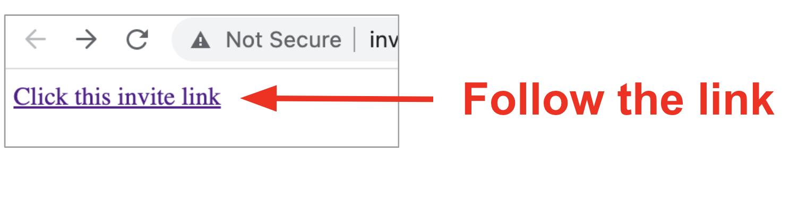
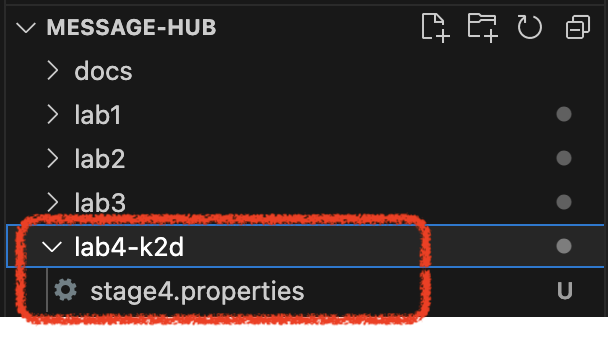
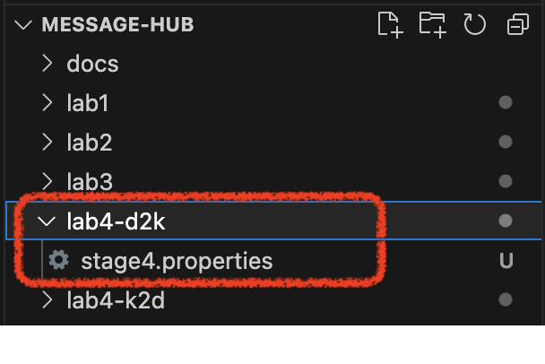

:walkthrough: Discord Integration
:checkedbox: pass:normal[{startsb}&#10004;{endsb}]
:user-password: openshift
:namespace: {user-username}
:invite-url: http://invite-webapp.{openshift-app-host}

ifdef::env-github[]
endif::[]

[id='lab4-discord-integration']
// = Lab 4 - Discord Integration
= Lab 4 - Integrate a new platform

Use Camel K to integrate additional chat systems to the platform. 
// toc::[]

Prerequisites: +
--
* Ensure you have previously completed the following tiles:
+


{empty} +
--

// == Overview
Up until now we have evolved a solution to interconnect _Matrix_ and _Rocket.Chat_, and crucially, with the addition of AMQ Streams, now the platform allows for new systems to easily integrate. In this new Lab we're going to add a new chat option: _Discord_.

_Discord_ is a well known chat platform, very popular among gamers, but increasingly embraced by enterprises to connect internal teams but also for external interactions with customers as a way to maintain close contact.

The difficulty of this new stage is that the catalog does not have _Kamelets_ for _Discord_. We need to create our own connectors.

{empty} +


Target persona: +
--
* *Camel Developer* +
{empty} +
--
Difficulty level: +
--
* *MEDIUM* +
{empty} +
--
Estimated time: +
--
* *20 mn* +
{empty} +
--

{empty} +

Technical goals and milestones:

* Prototype custom _Kamelets_ to extend catalogue.
* Integrate new platforms with new _Kamelets_.
* Use of _Camel DSL_ for more advanced use cases.

{empty} +


The picture billow illustrates all chat systems communicating via _Kafka_, including the to-be-integrated _Discord_ system, and optionally (for those willing to go the extra mile) _Telegram_.

image::images/stage-overview-discord.png[align="center", width=80%]

{empty} +

In terms of implementation effort for this lab, the main tasks to complete are the following:

- Create a _Discord_ sink _Kamelet_
- Craete a _Kafka_ -> _Discord_ flow using the new _Kamelet_
- Create a _Discord_ -> _Kafka_ flow using _Camel K_ (DSL)

{empty} +

and optionally:

- Create a _Telegram_ -> _Kafka_ flow
- Create a _Kafka_ -> _Teletram_ flow

{empty} +


// == Access Discord\'s chat platform


[time=5]
[id="discord-chat"]
== Discord platform onboarding

TIP: If you're unfamiliar with _Discord_, it is a well known chat platform, very popular among gamers, but increasingly embraced by enterprises to connect internal teams but also for external interactions with customers as a way to maintain close contact.


{empty} +

=== Join the lab's Discord server.

To accelerate the onboarding process in _Discord_, we've created a shared server for students to freely join and use to complete this enablement workshop. 

TIP: You don't need an account in _Discord_ to join the server. Just follow the instructions below to join with what _Discord_ calls an _"Unclaimed Account"_, a sort of temporary account you can claim as yours afterwards if you want.

TIP: If you prefer using an existing _Discord_ account of yours, please feel free to sign in with it instead of using an _"Unclaimed Account"_.

{empty} +

To join the lab's Discord server using a temporary account (Unclaimed account), follow the instructions below:

. Click on the link below to obtain your invitation to _Discord_ (opens a new tab).
+
--
- link:{invite-url}/invite/discord[Generate _Discord_ invite,window="_blank"]
--
+
{empty} +

. Then, follow the link generated (click on it) to join your _Discord_ server.
+


. In the new tab, follow the sequence of steps described below:

.. In the invitation screen, you will be prompted to enter a `USERNAME`:
+

+
--
. Type in a username, for example `{user-username}`. +
You can also choose any other username of your liking.
. Tick the agreement box.
. Click the _Continue_ button.
--
+
{empty} +

.. A _'Capcha'_ verification process will pop up to validate you are human:
+

+
--
. Tick the box _"I'm a human"_.
. Select the tiles accordingly.
. Click the _Verify_ button.
--
+
{empty} +

.. An age verification process will pop up. +
The window will prompt you to enter your birthday. There's no need to enter a real one, just ensure the birthday matches an individual of 18+ years old.
+

+
--
. Select a month, day and year. +
For example:
- `January`, `1`, `2000`
+
{blank}
+
. Then click _Done_.
--
+
{empty} +

.. A final popup window will prompt you to claim the account. Simply ignore it by closing the popup
+

+
--
. Click the cross in the upper right corner.
. You should then see on screen the _CamelWorkshop_ server.
--

{empty} +

CAUTION: The server is open to the public, please be mindful of your actions, don't abuse the space.

{empty} +

[TIP]
--
You could create your own _Discord_ server, and be able to complete the workshop with the same below instructions.

From _Discord_, to create your own server:

. Click the `+` button (add a server).
. select `Create My Own`.
. Then select `For me and my friends` (private server). 

{blank}

You will need to create your own _App_ (Bot) to send/fetch messages from the rooms in the server. You can find instructions on how to create your _App_ following the link below:

====
- link:https://github.com/RedHat-Middleware-Workshops/workshop-camel3/blob/v2.0/docs/labs/stage4/walkthrough.adoc#creating-your-own-app-for-discord/invite/discord[Create your own Discord App,window="_blank"]
====
--
{empty} +


=== Join a Discord room (channel).

. Your dedicated _Discord_ room
+ 
A number of rooms have been made available for this workshop. 
+
To work on a room number that nobody uses and avoid noisy conversations, please choose a room matching your username. +
For example, if your username is:
+
--
* `user1` -> use `room1`
* `user2` -> use `room2`
* `userN` -> use `roomN`
--
+
{empty} +
+
Alternatively, you can also create your own room (channel), use the prefix `room_`, for example:

* `room_x`

{empty} +

=== Connecting Camel to Discord

To connect from _Camel_ to the chat platform, an App needs to be registered in _Discord_. Apps in _Discord_ are automatically member of all channels in the server.

* An App has been made available for all students to share.
+
[TIP]
--
To configure _Camel_ you will need the _Discord_ App credentials. Later, you will find the credentials following the lab instructions.
--

{empty} +

[type=verification]
Were you able to join the _Discord_ room successfully?

{empty} +


[time=10]
[id="kamelet-create"]
== Part 1 - Create the Sink Kamelet

TIP: _Kamelets_ are [underline big]_**Camel**_ route snipp[underline big]**ets**. +
A Kamelet encapsulates a normal _Camel_ route.

The _Kamelet_ to create involves defining a Camel route that targets _Discord_ as the endpoint system.

To integrate with _Discord_ we need to understand well its API, but don't worry, we got you covered. For reference, here's _Discord_'s documentation on how to post messages:

* link:https://discord.com/developers/docs/resources/channel#create-message[window="_blank"]

{empty} +

=== Process overview

The diagram below illustrates the processing flow (Camel route) you're about to create:

image::images/processing-flow-sink.png[align="center", width=90%]


There are 4 key processing steps necessary:

====
* *Clean Headers* +
  The incoming _Camel_ exchange might have headers that can potentially enter in conflict with the HTTP call to _Discord_.

* *Set Content-Type* +
	Include an HTTP header to specify the type of payload we send (JSON)

* *Set Authorization* +
	Include an HTTP header with the security token

* *HTTP invokation* +
  Trigger the HTTP call using the _Camel_ HTTP component
====

{empty} +

Obviously, developing this process is the task of an experienced _Camel_ developer. When the _Kamelet_ is fully implemented, it gets deployed along the rest of _Kamelets_ in the catalogue, which allows non-_Camel_ users (the _Kubernetes_ user) to consume it inside _Kamelet Bindings_.

{empty} +

=== Process definition

The best approach to make rapid progress developing this _Kamelet_, is to use _Camel JBang_ in your local environment.

image::images/camel-jbang.png[align="left", width=40%]

{empty} +

==== Prototype the Camel route

The first step is to create a little prototype that will validate our _Camel_ route implementation.

. Close tabs
+
image::images/crw-close-tabs.png[align="left", width=50%]
+
{blank}
+
Before you start this new lab, make sure you close in your editor all the tabs (source files) from previous exercises.
+
{empty} +

. Setup your lab folder
.. Create your working folder:
+
[subs=]
```bash
cd /projects/MessageHub
mkdir lab4-k2d
cd lab4-k2d<br>
```
+
{empty} +
+
.. Create a configuration file
+
```bash
touch stage4.properties
```
+
... Find your new folder in the project tree
+

+
{blank}
+
Ensure you're working on folder `lab4-k2d`
+
{empty} +
+
... Include in the new properties file your _Discord_ details:
+
```properties
# Discord credentials
token=YOUR_TOKEN
channel=YOUR_ROOM_ID
```
+
--

{empty} +

Ensure you configure with your _Discord_ values, and save changes.

- `token`
+
Obtain the _Discord_ token with 1 of these 3 options, and replace `YOUR_TOKEN`:
+
=====
** *Option 1*: Try the link below:
+
WARNING: The link may fail if the cluster did not enable token resolution. +
If it fails, choose [*Option 2*] or [*Option 3*].
+
*** link:{invite-url}/token/discord[Obtain _Discord_ token,window="_blank"]
+
{empty} +

** *Option 2*: Ask your instructor/administrator for the token to use to connect to Discord.
+
[TIP]
====
The workshop slides should contain the token values valid for today's session:


====
** *Option 3*: if you created your own _Discord_ App, use your App's `Bot User OAuth Token`
=====

{empty} +


* `channel` +
You can find the channel id in the address bar of your _Discord_ browser tab. The pattern is:
+
** \http://discord.com/channels/SERVER_ID/CHANNEL_ID
+
image::images/discord-room-id.png[align="left", width=80%]
--
+
{empty} +

. Create a skeleton using _Camel JBang_ in YAML format:
+
For example:
+
```bash
camel init test-discord.yaml
```
+
{empty} +

. Open and Edit the `test-discord.yaml` file
+
Replace the parameter:
+
--
* `period: "1000"`
--
+
{empty} +
+
Use instead the parameter `repeatCount` (copy/replace from the snippet below):
+
----
# camel-k: language=yaml

# Write your routes here, for example:
- from:
    uri: "timer:yaml"
    parameters:
----
+
```yaml
      repeatCount: "1"
```
+
----
    steps:
      - setBody:
          simple: "Hello Camel from ${routeId}"
      - log: "${body}"
----
+
{empty} +

. Run your test route with:
+
```bash
camel run * --dev
```
+
TIP: the flag `dev` indicates to _Camel JBang_ to hot reload new definitions whenever file changes are detected allowing fast prototyping.
+
The output in your terminal should show, only once, the following:
+
----
... : Hello Camel from route1
----
{empty} +

. Simulate a _Discord_ payload
+
Let's modify the code to simulate the JSON payload _Discord_ expects. Replace the body with the following:
+
----
    steps:
      - setBody:
----
+
```yaml
          constant: '{"content": "Hello from Camel"}'
```
+
----
      - log: "${body}"
----
+
{empty} +
+
Save changes. +
-> _Camel JBang_ will react: it will load the new definition on the fly and run it.
+
You should see the following in the log output:
+
----
... {"content": "Hello from Camel"}
----
+ 
{empty} +
+
[TIP]
+
--
- **Troubleshooting with _Camel JBang_**
+
Let's pretend for a moment you did something wrong in your code to understand how _Camel JBang_ helps the developer to quickly fix problems before deploying code in _Kubernetes_.
+
In your previous line of code, let's say you forgot to close the quote at the end of the `constant` expression, like so:
+
```yaml
          constant: '{"content": "Hello from Camel"}
```
+
{blank}
+
When saving changes (automatic by default in _DevSpaces_), _Camel JBang_ quickly loads the new faulty definition and throws an error. Of course, errors are always ugly and have long stack traces, but if you inspect the output carefully you'll find something similar to:
+
----
Caused by: while scanning a quoted scalar
 in file:test-discord.yaml, line 10, column 21:
              constant: '{"content": "Hello from Camel"}
----
+
{blank}
+
Pretend you fix the bug by rolling back your changes to restore normality. _Camel JBang_ will immediately reload the code and execute bug free.
+
Fast code iterations with _Camel JBang_ allows developers to accelerate the project development in a more friendly and productive manner.
--
+
{empty} +

. Post to _Discord_
+
Modify the code to call _Discord_'s API to post a message. +
Include the following snipped in your YAML file:
+
----
# camel-k: language=yaml

# Write your routes here, for example:
- from:
    uri: "timer:yaml"
    parameters:
      repeatCount: "1"
    steps:
      - setBody:
          constant: '{"content": "Hello from Camel"}'
      - log: "${body}"
----
+
```yaml
      - remove-headers:
          pattern: "*"
      - set-header:
          name: Content-Type
          simple: application/json
      - set-header:
          name: Authorization
          simple: Bot {{token}}
      - to:
          uri: "https://discordapp.com/api/channels/{{channel}}/messages"
```
+
{empty} +
+
Save changes. +
-> _Camel JBang_ will react: it will load the new definition on the fly and run it.
+
If all goes well, _Discord_ will receive the message and display it in the room, as shown below:
+
image::images/discord-room-hello.png[align="left", width=40%]
+
{empty} +

=== End of prototyping

[type=verification]
Did you see the message showing in _Discord_?

[type=verificationSuccess]
The first goal has been accomplished. 

[type=verificationFail]
Verify the snippet copy/paste actions were well followed.

{empty} +

Press `ctrl`+`c` to stop _Camel JBang_.

[TIP]
--
_Camel JBang_ also implements the following very handy commands when running multiple _Camel_ integrations:

* `camel ps` to list running _Camel_ integrations.
* `camel stop <instance_name>` to shut down a running _Camel_ integration.  
--

{empty} +

==== Encapsulate as a Sink

Now that our prototype is fully functional, let's encapsulate the code as a _Kamelet_ sink.

. Create skeleton
+
Use the following command to create a _Kamelet_ skeleton:
+
```bash
camel init discord-sink.kamelet.yaml
```
+
{empty} +
+
Open the file in your editor.
+
{empty} +

. Define your Kamelet
+
.. Define metadata and parameters
+
```yaml
spec:
  definition:
    title: "Discord Sink"
    description: |-
      Send messages to Discord.
    required:
      - token
      - channel
    type: object
    properties:
      token:
        title: Security Token
        description: The bot security token
        type: string
      channel:
        title: Channel Identifier
        description: The channel id
        type: string
  types:
    out:
      mediaType: application/json
  dependencies:
  - "camel:kamelet"
  template:
    from:
      uri: "kamelet:source"
      steps:
```
+
{empty} +
+
.. Include your prototype code
+
```yaml
      - remove-headers:
          pattern: "*"
      - set-header:
          name: Content-Type
          simple: application/json
      - set-header:
          name: Authorization
          simple: Bot {{token}}
      - to:
          uri: "https://discordapp.com/api/channels/{{channel}}/messages"
```
+ 
{empty} +
+
Save changes.
+ 
{empty} +

. Test your _Kamelet_
+
.. Modify your prototype `test-discord.yaml`
+
Replace the HTTP logic with your _Kamelet_:  
+
----
# camel-k: language=yaml

# Write your routes here, for example:
- from:
    uri: "timer:yaml"
    parameters:
      repeatCount: "1"
    steps:
      - setBody:
          constant: '{"content": "Hello from Camel"}'
      - log: "${body}"
----
+
```yaml
      - to:
          uri: "kamelet:discord-sink"
          parameters:
            token:   "{{discord.token}}"
            channel: "{{discord.channel}}"
```
+
{empty} +
+
Save changes.
+
{empty} +
.. Update configuration
+
We include the [`discord`.xxxxx] prefix on parameters to avoid confusion with other chat systems.
+
* **Linux**
+
[subs=]
```bash
sed -i 's/token/discord.token/g' stage4.properties
sed -i 's/channel/discord.channel/g' stage4.properties
<br>
```
+
// * **MacOS**
// +
// [subs=]
// ```bash
// sed -i '' 's/token/discord.token/g' stage4.properties
// sed -i '' 's/channel/discord.channel/g' stage4.properties
// <br>
// ```
// +
{empty} +

.. Run it
+
```bash
camel run *
```
+
{empty} +
+
Again, if all goes well, _Discord_ will receive the message and display it in the room, as shown below:
+
image::images/discord-room-hello.png[align="left", width=40%]
+
{empty} +
+


=== End of encapsulation

[type=verification]
Did you see the message showing in _Discord_?

[type=verificationSuccess]
The second goal has been accomplished. 

[type=verificationFail]
Verify the snippet copy/paste actions were well followed.

{empty} +

Press `ctrl`+`c` to stop _Camel JBang_.

{empty} +


[time=5]
[id="kamelet-binding-create"]
== Part 2 - Kafka ⇒ Discord

We have now the building block we were missing, we can now bind our _Discord_ _Kamelet_ to _Kafka_ to push chat conversations to _Discord_.

=== Process overview

You should by now be very familiar with the necessary processing steps. The diagram below illustrates the _Kafka_ to _Discord_ data flow:


There are 4 Kamelets in use:

====
* *A source* +
Consumes events from _Kafka_.

* *Two actions* +
One filters messages to prevent death loops. +
One transforms events from the standard data model to _Discord_.

* *A sink* +
Produces events to _Discord_.
====

{empty} +


=== Process definition

. Close tabs
+
image::images/crw-close-tabs.png[align="left", width=50%]
+
{blank}
+
Before you start this new lab, make sure you close in your editor all the tabs (source files) from previous exercises.
+
{empty} +

. Setup the _Kamelet_ binding
+
Given the process is almost identical to the _Kafka_ to _Matrix_/_Rocket.Chat_ ones, we can use one of those as a base for our definition.
+
Run the following commands in your terminal:
+
* **Linux**
+
[subs=]
```bash
cp ../lab3/flows/k2r.yaml k2d.yaml
sed -i 's/k2r/k2d/g'       k2d.yaml
sed -i 's/stage3/stage4/g' k2d.yaml
sed -i 's/rocketchat/discord/g' k2d.yaml
sed -i 's/userid/channel/g' k2d.yaml
touch k2d.jslt<br>
```
+
// * **MacOS**
// +
// [subs=]
// ```bash
// cp ../lab3/flows/k2r.yaml k2d.yaml
// sed -i '' 's/k2r/k2d/g'       k2d.yaml
// sed -i '' 's/rocketchat/discord/g' k2d.yaml
// sed -i '' 's/stage3/stage4/g' k2d.yaml
// touch k2d.jslt<br>
// ```
// +
{empty} +
+
[NOTE]
====
The commands above modified the `k2d.yaml` binding with the following changes:

* Its name is `k2d` (_Kafka_ to _Discord_)
* The filter blocks `discord` source events
* Applies the `k2d.jslt` transformation (to be defined)
* Uses the new _Discord sink Kamelet_
** defines the `channel` property for _Discord_
====
+
{empty} +

. Define the JSLT transformation (Standard -> _Discord_).
+
Copy the snippet below and paste it into your new `k2d.jslt` file:
+
```
{
	"content":"**"+.user+"@"+.source+"**: "+.text
}
```
+
{empty} +
+
[NOTE]
====
We're mapping values from the Standard data model JSON structure
====
{empty} +

And that's it, ready to be deployed.

{empty} +

=== Deploy and test

. Login to _OpenShift_ 
+
For those resuming work from a previous day, ensure you reconnect your `oc` client with _OpenShift_ by running the following login command:
+
[source,bash,subs="attributes+"]
----
oc login -u {user-username} -p {user-password} https://$KUBERNETES_SERVICE_HOST:$KUBERNETES_SERVICE_PORT --insecure-skip-tls-verify=true
----
+
{empty} +

. Deploy the _Kamelet_
+
To allow _Kubernetes_ users to consume (use in a binding) the _Discord_ _Kamelet_, we need to push the its definition to _OpenShift_ to become part of the Kamelet catalog.
+
Push it using the following command:
+
```bash
oc apply -f discord-sink.kamelet.yaml
```
+
{empty} +


. Push the configuration to _OpenShift_
+
For your _Kamelet_ binding to operate, its configuration needs to be available in _OpenShift_.
+
Create the _Secret_ and the _ConfigMap_ that includes the JSLT. +
Run the following `oc` command:
+
[subs=]
```bash
oc create secret generic stage4 --from-file=stage4.properties
oc create cm stage4-transform --from-file=k2d.jslt
<br>
```
{empty} +

. Deploy the YAML definition containing your new _Kamelet Binding_
.. Run the following `oc` command to deploy the integration:
+
```bash
oc apply -f k2d.yaml
```
+
NOTE: Be patient, this action will take some time to complete as the operator needs to download all related dependencies, build the applications and create the image before the integration can be deployed.

.. Wait for readyness
+
Check the deployment of the pod and logs to ensure all is in healthy state.
+
You can run the following command to check their state:
+
```bash
oc get klb k2d
```
+
{empty} +
+
When the pods are ready, the command should return:
+
----
NAME   PHASE   REPLICAS
k2d    Ready   1
----
+
{empty} +

. Send messages to test the system.
+
.. Go to your _Matrix_'s room and send a message, for example `Hello from Matrix`.

.. Then go to your _Rocket.Chat_'s room and send a message, for example `Hello from Rocket.Chat`.
+
If all goes well you should see something similar to the picture below:
+
image::images/stage4-msg-k2d-test.png[align="left", width=90%]
+
{empty} +

+
{empty} +

[type=verification]
Did you see the message going from _Matrix_ to _Discord_?

[type=verificationSuccess]
Very good !

[type=verificationFail]
Inspect in the pod logs to troubleshoot.


[type=verification]
Did you see the message going from _Rocket.Chat_ to _Discord_?

[type=verificationSuccess]
Very good !

[type=verificationFail]
Inspect in the pod logs to troubleshoot.


[time=5]
[id="kamelet-binding-create"]
== Part 3 - Discord ⇒ Kafka

In previous exercises we kept using _Kamelets_ to define processing flows. This task however requires more developer control.

_Camel K_ provides the following development options:

====
* *Kamelets* +
These are encapsulated _Camel_ routes that can be used in _Kamalet_ bindings and also directly with the _Camel_'s DSL (_Domain Specific Language_).

* *Kamelet bindings* +
No code definitions where Kamelets are bound together or to a platform resource (_Kafka/Knative_). _Camel K_ deploys them as a running integration instance as per their definition.

* *Camel DSL* +
The _Camel_ language to define integration processes (routes). Using the DSL's EIPs (_Enterprise Integration Patterns_), the _Camel_ components (connectors) and _DataFormats_ (translators) the developer defines integrations with a very high level of control.
====

{empty} +

_Discord_ implements the use of websockets to push notifications from the chat platform to the application. Websockets is a 2-way communication mechanism on top of HTTP. _Camel's_ DSL provides the necessary level of control to implement a _Discord_ listener.

{empty} +

=== Process overview

Although the data flow will be implemented with _Camel's_ DSL instead of _Kamelets_, the processing steps are still essentially the same. The diagram below illustrates the _Discord_ -> _Kafka_ data flow:

image::images/processing-flow-discord2kafka.png[align="center", width=90%]

There are 4 steps involved:

====
* *A websocket listener* +
Consumes events from _Discord_.

* *Two actions* +
One filters messages to prevent death loops. +
One transforms events from _Discord_ to the standard data model.

* *A Kafka producer* +
Produces events to _Kafka_.
====

{empty} +

Due to the nature of _Discord's_ communication channel, the developer is also responsible to manage the lifecycle of the websocket connection following _Discord's_ specification.

NOTE: For reference, here's _Discord's Gateway API_ specification covering the details on how websocket exchanges need to happen: link:https://discord.com/developers/docs/topics/gateway[window="_blank"]


{empty} +

The following diagram illustrates the required exchanges that need to happen to maintain the connection alive.

image::images/discord-websocket-management.png[align="center", width=40%]

{empty} +

The _Camel_ developer needs to open a websocket connection and ensure the following tasks are covered:

. Identify the application.
. Send regular heartbeats.
. Listen for incoming events. 

{empty} +


=== Process definition

. Close tabs
+
image::images/crw-close-tabs.png[align="left", width=50%]
+
{blank}
+
Before you start this new lab, make sure you close in your editor all the tabs (source files) from previous exercises.
+
{empty} +

. Setup your lab folder
+
Execute the following commands to create your working folder and configuration:
+
[subs=]
```bash
cd /projects/MessageHub
mkdir lab4-d2k
cd lab4-d2k
cp ../lab4-k2d/stage4.properties .<br>
```
+
{empty} +
+
[NOTE]
====
We've copied the same configuration file from the previous exercise since it contains the same _Discord_ credentials identifying your bot.
====
+
{empty} +

. Find your new folder in the project tree
+

+
{blank}
+
Ensure you're working on folder `lab4-d2k`
+
{empty} +

. Create your _Camel_ definition file
+
Execute the following _Camel JBang_ command:
+
```bash
camel init d2k.xml
```
+
{empty} +
+
Open the file to edit.
+
{empty} +

. Include a (_Discord_) identification process
+
Replace in your `d2k.xml` the main _Camel_ route, by the following one:
+
----
<?xml version="1.0" encoding="UTF-8"?>
<!-- camel-k: language=xml -->

<routes xmlns:xsi="http://www.w3.org/2001/XMLSchema-instance"
        xmlns="http://camel.apache.org/schema/spring"
        xsi:schemaLocation="
            http://camel.apache.org/schema/spring
            https://camel.apache.org/schema/spring/camel-spring.xsd">
----
+
```xml
    <route id="identification">
        <from uri="direct:identify"/>
        <setBody>
            <simple>{
                "op": 2,
                "d": {
                  "token": "{{discord.token}}",
                  "intents": 513,
                  "properties": {
                    "os": "linux",
                    "browser": "my_library",
                    "device": "my_library"
                  }
                }
              }
            </simple>
        </setBody>
        <to uri="ahc-wss://gateway.discord.gg/?v=9&amp;encoding=json&amp;clientConfig=#myconfig"/>
    </route>
```
+
----
</routes>
----
+
[NOTE] 
--
* The `from` element defines the `direct` _Camel_ component permitting other _Camel_ routes to trigger identification events.

* The JSON body follows _Discord's_ API specification for identification payloads.

* The parameter `{{discord.token}}` identifies the bot connecting to _Discord_.

* The producer (`to` element) invokes _Discord's_ websocket, and uses a custom client configurer `myconfig` (java resource) to customise the websocket connection. 
--
+
{empty} +

. Include a pulsating heartbeat process
+
Inlcude in your `d2k.xml` the following _Camel_ route:
+
```xml
    <route id="heartbeat">
        <from uri="timer:heartbeat?delay=10000&amp;period={{time:30000}}"/>
        <setBody>
            <simple>{"op": 1,"d": 251}</simple>
        </setBody>
        <to uri="ahc-wss://gateway.discord.gg/?v=9&amp;encoding=json&amp;clientConfig=#myconfig"/>
    </route>
```
+
[NOTE] 
--
* The `from` element defines the `timer` _Camel_ component to triggers an event every 30 seconds.

* The JSON body follows _Discord's_ API specification for heartbeat payloads.

* The producer (`to` element) invokes _Discord's_ websocket, and uses a custom client configurer `myconfig` (java resource) to customise the websocket connection. 
--
+
{empty} +

. Include an event listener
+
Inlcude in your `d2k.xml` the following _Camel_ route:
+
```xml
    <route id="listener">
        <from uri="ahc-wss://gateway.discord.gg/?v=9&amp;encoding=json&amp;clientConfig=#myconfig"/>
        <log message="from DISCORD: ${body}"/>
        <choice>
            <when>
                <jsonpath>$[?(@.op == 11)]</jsonpath>
                <log message="Heartbeat ACK received."/>
            </when>
            <when>
                <jsonpath>$[?(@.op == 7)]</jsonpath>
                <log message="Reconnect requested. Server will disconnect."/>
            </when>
            <when>
                <jsonpath>$[?(@.op == 10)]</jsonpath>
                <log message="Hello received. Sending identification..."/>
                <to uri="direct:identify"/>
            </when>
            <when>
                <jsonpath>$[?(@.t == "MESSAGE_CREATE" &amp;&amp; @.d.author.username != "camelbot")]</jsonpath>
                <to uri="jslt:d2k.jslt"/>
                <to uri="direct:kafka-push"/>
            </when>
        </choice>
    </route>
```
+
[NOTE] 
--
* The `from` consumer connects to _Discord's_ websocket to attend incoming events, and uses a custom client configurer `myconfig` (java resource) to customise the websocket connection. 

* A `choice` EIP matches types of incoming events according to their `op` (operation identifier).

* Events with `op == 10` require responding to _Discord_ with an identification event (triggers internal call to `direct:identify`).

* Events of type `MESSAGE_CREATE` identify _Discord_ chat messages to be routed to Kafka. The expression includes a condition (filter) to block BOT messages.
** *ATTENTION:* Make sure the field `.d.author.username` is evaluated against the bot name you're using. The code defines `camelbot` by default.
** Chat messages are transformed with a JSLT mapping.
--
+
{blank}
+
[WARNING]
--
In the filter expression for events of type `MESSAGE_CREATE`, make sure the field `.d.author.username` is evaluated against the bot name you're using. The code defines `camelbot` by default.

Not Using the correct bot name will cause feedback loops.
--
+
{empty} +


. Include an _Kafka_ publisher
+
Inlcude in your `d2k.xml` the following _Camel_ route:
+
```xml
    <route id="kafka-publisher">
        <from uri="direct:kafka-push"/>
        <log message="message to push: ${body}"/>
        <choice>
            <when>
                <simple>"{{camel.jbang.classpathFiles:not-jbang}}" != "not-jbang"</simple>
                <log message="JBang instance, bypassing kafka push"/>
            </when>
            <otherwise>
                <log message="Camel K instance, pushing to kafka"/>
                <toD uri="kafka:roomx?brokers=my-cluster-kafka-bootstrap:9092"/>
            </otherwise>
        </choice>
    </route>
```
+
[NOTE] 
--
* The `from` element defines a `direct` _Camel_ component permitting other _Camel_ routes invoking this route to publish events to _Kafka_.

* A `choice` EIP defines two different behaviours:
** Executions with _Camel JBang_, for local testing (bypassing pushes to _Kafka_).
** Live executions pushing events to the _Kafka_ cluster.
--
+
{empty} +

. Define the JSLT transformation (_Discord_ -> Standard).
+
.. Create the JSLT file
+
Execute the following command:
+
```bash
touch d2k.jslt
```
+
{empty} +
+
.. Copy the snippet below and paste it into your new `d2k.jslt` file:
+
```
{
	"timestamp": string(round(now())),
	"source":"discord", 
	"user": .d.author.username, 
	"text": .d.content
}
```
+
[NOTE]
====
* We're mapping values from _Discord's_ JSON structure.
* We're generating a timestamp (_Discord_ doesn't provide one).
====
+
{empty} +


. Define the custom websocket configurer
+
The default behaviour of _Camel's_ websocket component does not include the `Origin` HTTP header set to the value _Discord_ requires.
+
Camel is highly customisable. In this particular case, to address the problem we can create a custom _Java_ class that includes the needed HTTP header.
+
.. Create the Java class
+
Execute the following command:
+
```bash
touch wsConfig.java
```
+
{empty} +
+
.. Inlcude in your `wsConfig.java` file the following code:
+
```java
// camel-k: language=java

import org.apache.camel.BindToRegistry;
import org.apache.camel.builder.RouteBuilder;
import org.asynchttpclient.AsyncHttpClientConfig;
import org.asynchttpclient.DefaultAsyncHttpClientConfig;
import org.asynchttpclient.filter.RequestFilter;
import org.asynchttpclient.filter.FilterContext;
import org.asynchttpclient.filter.FilterException;

public class wsConfig extends RouteBuilder {

    //dummy
    @Override
    public void configure() throws Exception {}

    @BindToRegistry
    public static AsyncHttpClientConfig myconfig(){

        DefaultAsyncHttpClientConfig.Builder configBuilder = new DefaultAsyncHttpClientConfig.Builder();
        configBuilder.addRequestFilter(new RequestFilter() {
            public FilterContext filter(FilterContext ctx) throws FilterException {

                    ctx.getRequest().getHeaders().add("Origin", "https://gateway.discord.gg");

                    return ctx;
                }
        });

        return configBuilder.build();
    }
}
```
+
[NOTE] 
--
* The class needs to extend `RouteBuilder` as _Camel K_ only accepts route builder definitions. In our case we define an empty `configure` method because our routes are defined in a separate XML file.

* A filter method defines an instruction that adds the `Origin` header.
--
+
[NOTE] 
--
After some time, the IDE will highlight on screen many errors in red, as per the picture below:


{blank}

Ignore the errors. +
_Camel JBang_ and _Camel K_ will resolve dependencies automatically by analysing the code. The IDE is not able to find the packages because our _Camel_ sources are not packaged in a conventional _Maven_ project. 
--
+
{empty} +
+
Save changes.
+
{empty} +


. Test locally your _Discord_ listener
+
.. Start your local instance with _Camel JBang_:
+
```bash
camel run * --dep=org.apache.camel:camel-ahc-ws:3.18.2
```
+
[NOTE] 
--
As a temporary workaround, the _Camel_ websocket dependency `camel-ahc-ws` needs to be manually indicated. This component needs to be replaced in the future by a newer websocket component.
--
+
{empty} +
+
.. Go to your _Discord's_ room and send a message. +
For example, type `test Camel listener`.
+
image::images/stage4-msg-d2k-test-local.png[align="left", width=30%]
+
{empty} +
+
If all goes well you should see in your terminal an output similar to:
+
----
... : message to push: {"timestamp":"1663927933","source":"discord","user":"bmesegue","text":"test Camel listener"}
... : JBang instance, bypassing kafka push
----

{empty} +

[type=verification]
Did you see the _Discord_ message showing up in your terminal with the standard JSON format?

[type=verificationSuccess]
Very good !

[type=verificationFail]
Inspect in the pod logs to troubleshoot.


{empty} +

Press `ctrl`+`c` to stop _Camel JBang_.

{empty} +

=== Deploy in OpenShift

You have successfully tested your integration locally. It is time to deploy it in _OpenShift_.

. Login to _OpenShift_ 
+
For those resuming work from a previous day, ensure you reconnect your `oc` client with _OpenShift_ by running the following login command:
+
[source,bash,subs="attributes+"]
----
oc login -u {user-username} -p {user-password} https://$KUBERNETES_SERVICE_HOST:$KUBERNETES_SERVICE_PORT --insecure-skip-tls-verify=true
----
+
{empty} +

. Deploy the integration
+
The _Camel K_ client (`kamel`) allows us to push the definition to _OpenShift_. The _Camel K_ operator will do the rest, as it does for _Kamelet_ bindings.
+
.. Run the following `kamel` command to deploy the integration:
+
[subs=]
```bash
kamel run --name d2k \
d2k.xml \
wsConfig.java \
-p file:stage4.properties \
--resource file:d2k.jslt \
-d camel-jslt \
-d camel-ahc-ws<br>
```
+
NOTE: Be patient, this action will take some time to complete as the operator needs to download all related dependencies, build the applications and create the image before the integration can be deployed.
+
[NOTE] 
--
As a temporary workaround, the _Camel_ websocket dependency `camel-ahc-ws` needs to be manually indicated. This component needs to be replaced in the future by a newer websocket component.
--
+
{empty} +

.. Wait for readyness
+
Check the deployment of the pod and logs to ensure all is in healthy state.
+
You can run the following command to check their state:
+
```bash
kamel get d2k
```
+
{empty} +
+
When the pod is ready, the command should return:
+
----
NAME   PHASE     KIT
d2k    Running   demo-camelk/kit-ccmpckejt0blsp80sp10
----
+
{empty} +
+
You can run inspect the pod logs by running:
+
```bash
kamel logs d2k
```
+
{empty} +


. Test the integration
+
.. Go to your _Discord's_ room and send a message. +
For example, type `Hello from Discord`.
+
If all goes well you should see the message displayed both in Rocket.Chat and Matrix, as the picture shown below:
+
image::images/stage4-msg-d2k-test-ocp.png[align="left", width=90%]
+
{empty} +

[type=verification]
Did you see the message displayed in _Rocket.Chat_?

[type=verificationSuccess]
Very good !

[type=verificationFail]
Inspect in the pod logs to troubleshoot.


[type=verification]
Did you see the message displayed in _Matrix_?

[type=verificationSuccess]
Very good !

[type=verificationFail]
Inspect in the pod logs to troubleshoot.
