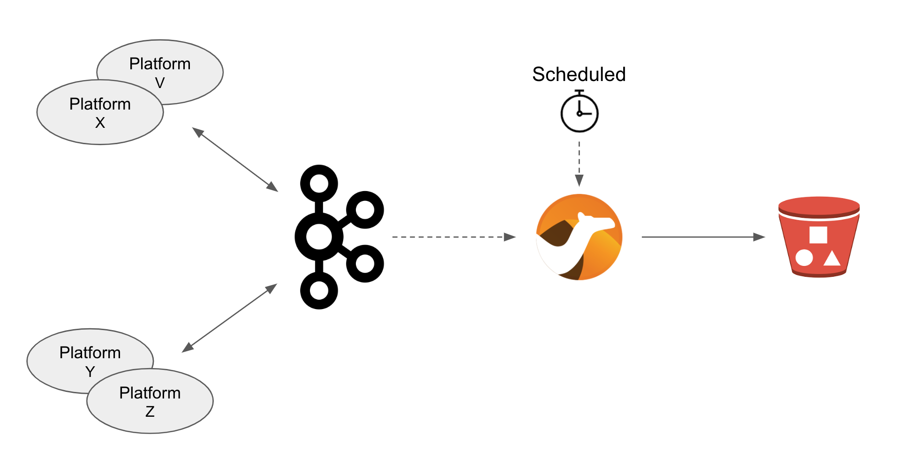
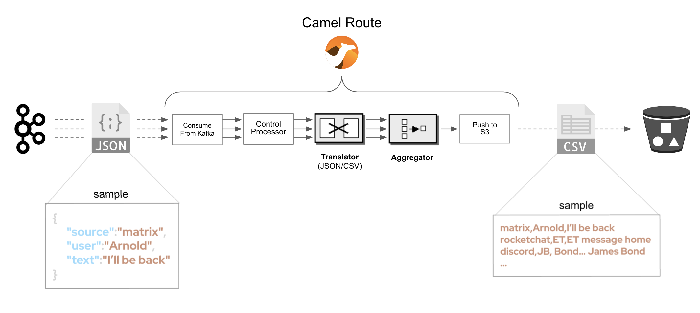
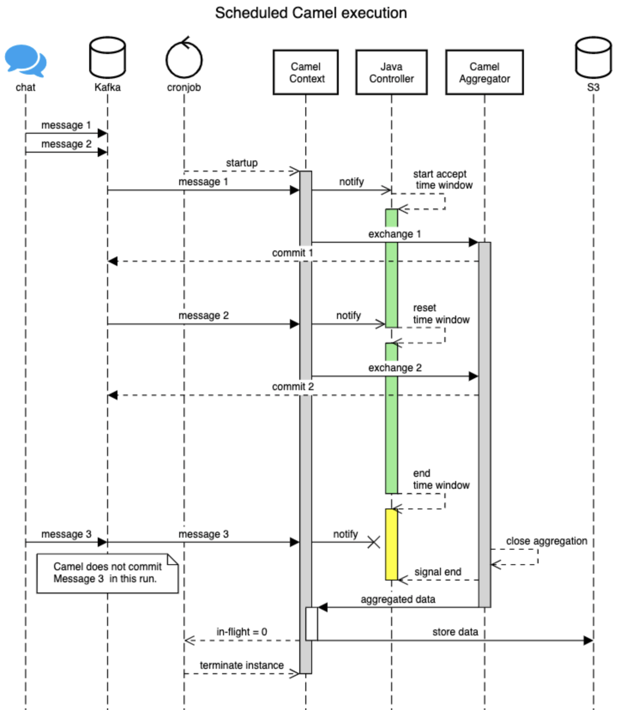
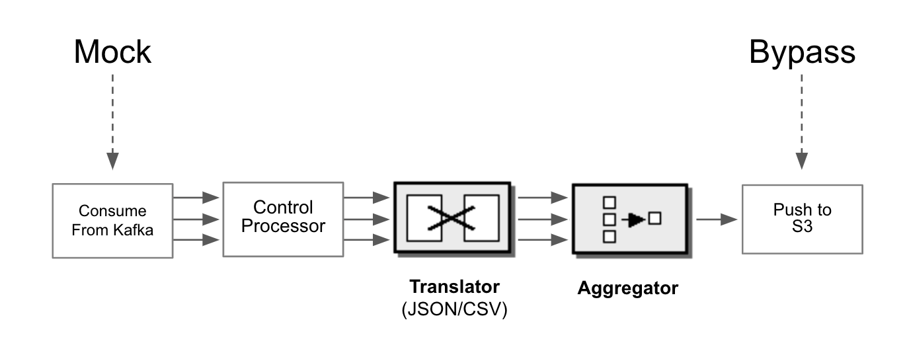
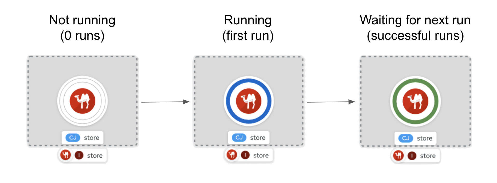
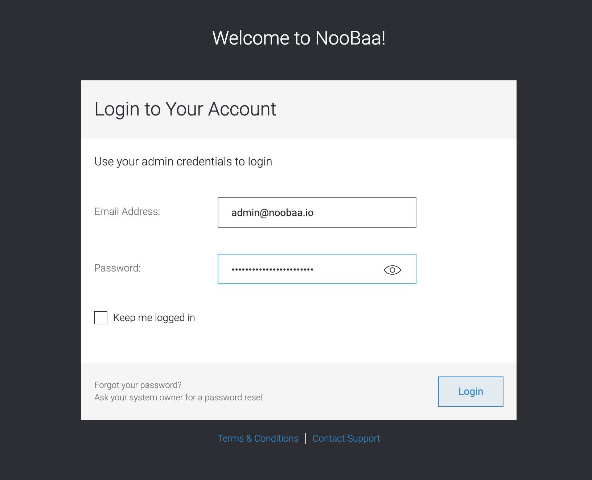
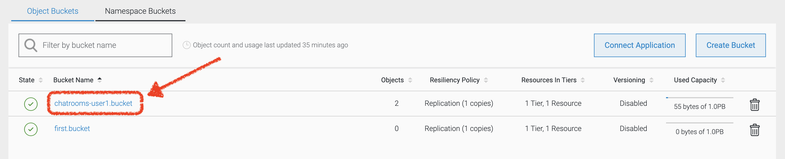
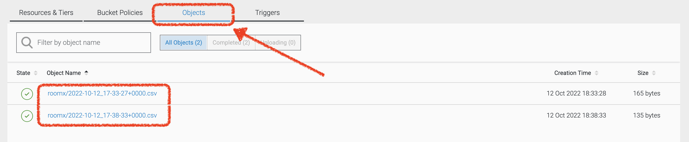

:walkthrough: Storage

ifdef::env-github[]
endif::[]

[id='lab5-storage']
// = Lab 5 - Storage
= Lab 5 - Add Storage to the Architecture

Use OpenShift Data Foundation to provide storage capabilities and services to the MessageHub platform.

All the lab stages you have completed so far have focussed on interconnecting independent instant messaging platforms. This lab however simulates the need to respond to government regulations (or policies alike) to meet legal and business data archival requirements.

Adding _Kafka_ in the architecture was a strategical decision. Any type of message broker would have been qualified, except we chose _Kafka_ because of its ability to replay data streams.

In the context explained, the plan is to process data streams from room conversations and transfer them to a storage layer dedicated to meet the data retention requirements.



In the diagram above we see a number of instant messaging platforms interacting together via _Kafka_. The depicted _Camel_ process represents the new integration to develop responsible to replay streams and push conversations to the storage system.

The clock in the diagram illustrates an on/off mechanism described as follows: the _OpenShift_ platform starts up the new _Camel_ process at scheduled intervals, for example once a day, to process and archive daily conversations. Once the job done, the platform shutdowns the _Camel_ process until the next scheduled run.

{empty} +

Target persona: +
--
* *Camel Developer* +
{empty} +
--
Difficulty level: +
--
* *MEDIUM/ADVANCED* +
{empty} +
--
Estimated time: +
--
* *20 mn* +
{empty} +
--


[time=5]
[id="daily-storage"]
== Understand the end-to-end process


The process to implement is not a trivial one, it requires to perform a series of well coordinated actions. To start with, the scheduler mechanism is based on _Kubernetes_ cronjobs, which _Camel K_ leverages and that we can take advantage of.

_Camel K_ includes the concept of _'Traits'_. These are capabilities that can be enabled/disabled or configured to customise the behaviour of the final integration. The `Cron` trait allows us to program scheduled runs of the integration, _OpenShift_ will automatically fire off an instance that will start processing _Kafka_ events. When the end of the data stream is reached, the process shuts down.

{empty} +

=== Process overview

The diagram below describes the _Camel_ process to be implemented. This integration involves multiple EIPs (_Enterprise Integration Patterns_) and therefore belongs to the _Camel_ developer who will use the _Camel DSL_ to define it.



There are 5 main steps involved:

====
* *A Kafka consumer* +
Consumes events from _Kafka_.

* *A custom controller* +
Java process responsible to coordinate the aggregator with the cronjob to accurately control the start/end of the data stream processing. +

* *A data transformer* +
Formats JSON messages into CSV entries in preparation for the aggregation action. +

* *An aggregator* +
Merges all the incoming messages into a single body that contains all the CSV entries of a daily digest of a chat room. +

* *An S3 producer* +
Uploads the daily digest into an S3 bucket.
====

{empty} +


=== The custom controller

One tricky scenario we must handle with care is how to prevent the cronjob from killing the _Camel_ instance too early. Let's explain it in more detail.

The cronjob knows when to kill a running instance once _Camel_ reports the number of _Exchanges_ in-flight (still executing) is nil.

NOTE: An `_Exchange_` is the Java object _Camel_ creates encapsulating the incoming message (and its context). It traverses the _Camel_ route (processing steps) from start to finish, at which point the exchange is disposed.


While an in-flight exchange walks the _Camel_ route from start to finish, the _Aggregator EIP_ creates and keeps a copy that is merged with other preceding and following exchanges. When all exchanges reach the end of transit, the _Camel_ instance informs the cronjob no live (in-flight) exchanges are in execution, however, the aggregator EIP may still be waiting for more exchanges to digest. What this all means is that the cronjob might kill the _Camel_ instance before the aggregation had time to be completed.

The controller, implemented as a Java class and integrated with _Camel_, will help to prevent the cronjob from shutting down _Camel_ too early. 

{empty} +

==== End of stream

Another consideration to have in mind is how to determine the end (in the current run) of the data stream. As far as the _Kafka_ consumer is concerned, it will keep creating _Camel_ exchanges as long as _Kafka_ messages are available, the listener is always active. As developers, we need to decide where the cut off point will be.

The adopted strategy in this lab (surely other strategies are possible) is to define a windowed time interval, inside which messages are accepted, and consider late arrivals as discarded. Meanwhile, our aggregator can operate in a similar time window and, when reaching its time limit, close the collection and push the aggregated data to storage.

{empty} +

==== Sequence diagram

To best understand all that was described above, look at the sequence diagram below depicting all the interactions between the different entities involved. 

{empty} +



{empty} +

[NOTE] 
--
Pay special attention to the following diagram highlights:

* For every incoming event, _Camel_ notifies the controller.
* The time window (in green) for accepting messages (to aggregate) starts when the controller gets its first notification.
* Subsequent notifications (new messages) reset the time window.
* All aggregated messages are committed to _Kafka_.
* When the time window closes (in yellow), late arrivals (like Message 3) are ignored.
* Non committed (in this run) events are reprocessed on subsequent cronjob runs.
* The controller ensures the `in-flight=0` is only reported when the aggregator completes and the data is pushed to storage. 
--

{empty} +

=== End of section

[type=verification]
Did you understand the role of the controller running with Camel?

[type=verificationSuccess]
Get ready to implement the Camel process !

[type=verificationFail]
Review the notes above and study the sequence diagram again.


[time=1]
[id="initialise"]
== Initialise the lab exercise


The first step is to create a little prototype that will validate our _Camel_ route implementation.

. Setup your lab folder
.. Create your working folder:
+
```bash
cd /projects/MessageHub
mkdir lab5
cd lab5
cp ../support/stage5/HelperStage5.java .
:
```
+
{empty} +
+
.. Create a configuration file
+
```bash
touch stage5.properties
```
+
{empty} +
+
Include in your configuration the following properties:
+
```properties
# Test JSON payload to simulate Kafka events
producer.mock.body= {"user":"${exchangeProperty.CamelTimerName}","text":"message ${exchangeProperty.CamelTimerCounter}"}

# Time the aggregator will wait for messages before the data storage process is triggered
message.aggregator.timeout = 10000

# Cut-off time the controller uses to allow messages to be aggregated.
# Messages arriving after cut-off time will be aggregated in the next cron run
# Attention: cut-off time should be less than aggregator timeout
messege.controller.cutoff.time = 5000

# AMQ Strams connectivity
camel.uri.kafka.parameters=\
brokers=my-cluster-kafka-bootstrap:9092\
&clientId=lab\
&groupId=lab\
&autoCommitEnable=false\
&allowManualCommit=true

# S3 connectivity
camel.uri.s3.parameters=\
accessKey=YOUR_ACCESS_KEY\
&secretKey=RAW(YOUR_SECRET_KEY)\
&region=us-east-1\
&uriEndpointOverride=http://s3.openshift-storage.svc:80\
&overrideEndpoint=true\
&useDefaultCredentialsProvider=false\
&autoCreateBucket=true
```
+
NOTE: The above properties will be explained as we make progress with the implementation in chapters to follow.
{empty} +

[time=2]
[id="inspect-controller"]
== Inspect the Controller implementation

This lab provides the Java class `HelperStage5.java` containing the _Controller_ logic and the _Aggregation_ strategy. For now let's focus on the _Controller_ functionality.

In your Java file you will find the following code that implements the _Controller_ logic. +
Inspect carefully the code below to familiarise yourself with the _Controller_:

----
        //Controller implementation
        return new Controller(){

            // Helper variables
            boolean expiredTimeWindow = false;
            CountDownLatch latch      = null;
            long lastMessageTime      = 0;


            public synchronized void newMessage(CamelContext context) {

                //initialise when first message comes in
                if(latch == null){
                    lastMessageTime = System.currentTimeMillis();
                    latch = new CountDownLatch(1);
                    context.createProducerTemplate().asyncSendBody("direct:wait-until-aggregation-done", null);
                }

                //calculate time split between last 2 messages
                long now = System.currentTimeMillis();
                long elapsed = now - lastMessageTime;

                //if message not in the time window, we stop processing messages.
                if(elapsed > cutoffTime){
                    expiredTimeWindow = true;
                }

                //reset time
                lastMessageTime = now;
            }

            public void waitUntilAggregationDone() throws Exception {
                if(latch != null){
                    latch.await();
                }
            }

            public void aggregationDone() throws Exception{
                latch.countDown();
            }

            public boolean isTimeWindowExpired() {
                return expiredTimeWindow;
            }

        };
----

{empty} +

In the code above you'll find:

* Helper variables used in the code:
** `expiredTimeWindow`: a flag indicating no more events are accepted.
** `latch`: the retain/release mechanism to keep the process alive.
** `lastMessageTime`: to monitor the time the last event arrived. +
{empty} +

* A method `newMessage` for _Camel_ to invoke on new event arrivals.
+
This method is responsible to create and maintain the time window.
+
[NOTE]
--
Upon first event arrival, this method will: +

* Set arrival time
* Initialise the latch
* Trigger the `wait-until-aggregation-done` Camel route. +
This action maintains an _Exchange_ always alive (in-flight) to prevent the cronjob from terminating _Camel_ too early. 
--

* A method `waitUntilAggregationDone` that waits for the latch to be released. +
This method is invoked from the `wait-until-aggregation-done` _Camel_ route. +
{empty} +

* A method `aggregationDone` to announce the run has completed. +
The aggregator logic invokes this method to signal completion. +
{empty} +

* A method `isTimeWindowExpired` to return the status of the variable. +
The method is invoked from the _Camel_ route to evaluate if an incoming event falls in or outside the time window. +
{empty} +


[time=2]
[id="inspect-aggregation-strategy"]
== Inspect the Aggregation strategy

The _Camel Aggregation EIP_ manages for you the coordination with the _Camel_ framework when aggregating data, and provides some common strategies out-of-the-box. However, data can be aggregated in many ways. Depending on your use case, you'll use one approach or another.

To customise the _Aggregation EIP_, _Camel_ allows you to define your own _Aggregation_ strategy in Java. In our case, we require some special handling, and therefore we need our own custom aggregation strategy.

TIP: If you want to know more about the inner workings of this EIP, take a look at Camel's https://camel.apache.org/components/3.18.x/eips/aggregate-eip.html[_Aggregate EIP_] documentation.

In the same Java class `HelperStage5.java` you will find the _Aggregation_ strategy used by the _EIP_ in the _Camel_ route.

Inspect carefully the code below to familiarise yourself with it:
----
    @BindToRegistry
    public static AggregationStrategy msgStrategy(){

        return new AggregationStrategy() {

            public Exchange aggregate(Exchange oldExchange, Exchange newExchange) {

                // Manual Kafka commit
                // Messages not commited will be retried on subsequent Cronjob runs
                newExchange
                    .getIn()
                    .getHeader(KafkaConstants.MANUAL_COMMIT, KafkaManualCommit.class)
                    .commitSync();

                if (oldExchange == null) {
                    return newExchange;
                }

                String oldBody = oldExchange.getIn().getBody(String.class);
                String newBody = newExchange.getIn().getBody(String.class);
                
                oldExchange.getIn().setBody(oldBody + newBody);
                return oldExchange;
            }

        };
    }
----

[NOTE] 
--
In your source file you may find the manual Kafka commit commented out to perform local testing without a _Kafka_ instance. +
When deploying in OpenShift it will be uncommented.
--

{empty} +

In the code you'll find the following highlights:

* A Kafka commit is executed first to guarantee this incoming event will not be re-processed on subsequent cronjob runs.

* When the first message comes in, an `oldExchange` (from preceding iterations) does not exist, so the method returns without any extra processing.

* On normal aggregations (old and new exchanges provided), the method appends the new data to the already aggregated data from preceding iterations (handed in the `oldExchange`).


[time=5]
[id="create-camel-routes"]
== Prototype the Camel routes

Let's recap how the _Camel_ process workflow should shape up:


There are 5 main steps involved:

====
* *A Kafka consumer* +
Consumes events from _Kafka_.

* *A custom controller* +
Java process responsible to coordinate the aggregator with the cronjob to accurately control the start/end of the data stream processing. +

* *A data transformer* +
Formats JSON messages into CSV entries in preparation for the aggregation action. +

* *An aggregator* +
Merges all the incoming messages into a single body that contains all the CSV entries of a daily digest of a chat room. +

* *An S3 producer* +
Uploads the daily digest into an S3 bucket.
====

{empty} +

NOTE: Do not hesitate to navigate back to previous chapters to have a second look to the detailed sequence diagram describing the interactions.

{empty} +

=== Accelerated Development

Although the code required is little, the end-to-end process is not a trivial one, it has various parts at play that need to be well coordinated. To accelerate the development phase, a good developer would want to prototype and test locally, iterating over the code until its implementation is fully validated.

Another very useful technique to simplify the development cycle, is to bypass (or mock) the endpoints the process integrates with: in this case _Kafka_ as the source of events, and _S3_ as the storage layer.



You will first build your integration bypassing the endpoints, and when you're confident the process does what is intended to do, then you'll replace the mocks with real endpoints, and deploy in _OpenShift_.

{empty} +

=== Process definition


. Create your _Camel_ definition file
+
Execute the following _Camel JBang_ command:
+
```bash
camel init store.xml
```
+
{empty} +
+
Open the file to edit.
+
{empty} +

. Include a mock _Kafka_ producer
+
Replace in your `store.xml` the existing _Camel_ route, by the following one:
+
----
<?xml version="1.0" encoding="UTF-8"?>
<!-- camel-k: language=xml -->

<routes xmlns:xsi="http://www.w3.org/2001/XMLSchema-instance"
        xmlns="http://camel.apache.org/schema/spring"
        xsi:schemaLocation="
            http://camel.apache.org/schema/spring
            https://camel.apache.org/schema/spring/camel-spring.xsd">
----
+
```xml
    <!-- Temporary route. To be removed when integrating with Kafka -->
    <route id="timer-mock-1">
        <from uri="timer:mock-1?repeatCount=5&amp;period=1000"/>
        <setBody>
            <simple>{{producer.mock.body}}</simple>
        </setBody>
        <to uri="direct:main-processor"/>
    </route>
```
+
----
</routes>
----
+
{empty} +
+
[NOTE] 
--
In the Camel route above:

* A timer generates 5 exchanges (`repeatCount=5`), one every second (`period=1000`)

* A JSON body is set to simulate an incoming chat message.

* Exchanges are sent to the main event processor (main _Camel_ route).
--
+
{empty} +


. Include the main _Camel_ route 
+
Append in your `store.xml` the main _Camel_ route. +
Copy the snippet below and paste it below the previously defined mock route.
+
```xml
    <route id="main-processor">
        <from uri="direct:main-processor"/>

        <!-- The controller helps keeping the instance alive while the aggregation is undergoing -->
        <bean ref="controller" method="newMessage"/>

        <when>
            <simple>${bean:controller?method=isTimeWindowExpired}</simple>
            <log message="time window closed, ignoring event: ${body}"/>
            <stop/>
        </when>

        <log message="got new message: ${body}"/>

        <unmarshal>
            <json/>
        </unmarshal>

        <marshal>
            <csv/>
        </marshal>

        <aggregate aggregationStrategy="msgStrategy" completionTimeout="{{message.aggregator.timeout}}">
            <correlationExpression>
              <constant>true</constant>
            </correlationExpression>
            <bean ref="controller" method="aggregationDone"/>
            <to uri="direct:store-data"/>
        </aggregate>

    </route>
```
+
[NOTE] 
--
In the Camel route above:

* The controller gets notified for every message that comes in.

* A `<when>` clause is evaluated to determine if the event is accepted.

* The incoming JSON body is converted to CSV using out-of-the-box transformers (known as _Camel DataFormats_).

* An aggregator, configured with the Java custom strategy `msgStrategy`:
** Signals the controller the aggregation has concluded.
** Directs the result to another route in charge of storing the data.
--
+
{empty} +


. Include the 'keep-alive' _Camel_ route 
+
The following route is triggered by the _Controller_ to ensure the _Camel_ instance is kept alive, preventing the cronjob from terminating it too early.
+
Append in your `store.xml` the following _Camel_ route. +
Copy the snippet below and paste it below the previously defined route.
+
```xml
    <route>
        <from uri="direct:wait-until-aggregation-done"/>
        <log message="waiting for aggregation to finish..."/>
        <bean ref="controller" method="waitUntilAggregationDone"/>
        <log message="Aggregation has completed."/>
    </route>
```
+
[NOTE] 
--
In the Camel route above:

* The controller is invoked to force the _Exchange_ traversing this route to wait for the latch to be released.
--
+
NOTE: Keeping at least one exchange alive ensures the condition `in-flight = 0` is always `false`, thus preventing the instance from being terminated.
+
{empty} +


. Include the _Camel_ route that stores the data. 
+
NOTE: Remember, for simplicity, the route will bypass the action of pushing data to the storage layer. Later the real connector for S3 will be put in place.
+
The following route is triggered by the _Aggregator_ when the aggregation is closed.
+
Append in your `store.xml` the following _Camel_ route. +
Copy the snippet below and paste it below the previously defined route.
+
```xml
    <route id="store-data">
      <from uri="direct:store-data"/>
      <log message="ready to store aggregated data:\n${body}"/>

      <!-- placeholder for the S3 integration logic -->

      <log message="storage done."/>
    </route>
```
+
[NOTE] 
--
In the Camel route above:

* A placeholder indicates where the S3 integration logic will be placed in a later phase.
--
+
NOTE: When the latch is released, by the aggregator, the retained _Exchange_ from the 'keep-alive' route completes and gets disposed. +
The condition `in-flight = 0` is however still `false` because a new _Exchange_ is in-flight to push the data to storage.
+
{empty} +
+
Make sure you save all the changes done (automatic by default in _OpenShift Dev Spaces_).
+
{empty} +


. Test locally your integration process.
+
.. Start your local instance with _Camel JBang_:
+
```bash
camel run *
```
+
{empty} +
+
You should see in your terminal an output similar to:
+
----
... 09:02:40.283 ...: Apache Camel 3.18.0 (CamelJBang) started in 1s35ms (build:153ms init:502ms start:380ms JVM-uptime:4s)
... 09:02:41.315 ...: got new message: {"user":"mock-1","text":"message 1"}
... 09:02:41.316 ...: waiting for aggregation to finish...
... 09:02:42.285 ...: got new message: {"user":"mock-1","text":"message 2"}
... 09:02:43.286 ...: got new message: {"user":"mock-1","text":"message 3"}
... 09:02:44.288 ...: got new message: {"user":"mock-1","text":"message 4"}
... 09:02:45.290 ...: got new message: {"user":"mock-1","text":"message 5"}
... 09:02:56.252 ...: Aggregation has completed.
... 09:02:56.252 ...: ready to store aggregated data:
mock-1,message 1
mock-1,message 2
mock-1,message 3
mock-1,message 4
mock-1,message 5

...  09:02:56.252 ...: storage done.
----
+
[NOTE] 
--
In the logs above:

* The 5 simulated messages from user `mock-1` are accepted.
* The aggregation finishes 10 seconds (approx.) after last message was accepted.
* The aggregated data is in CSV format.
* The data gets stored (simulated).  
--
+
If your execution behaved as above, you are progressing well, but you would still want to validate how the system reacts on late event arrivals. 

{empty} +

. Test your system with late arrivals.
+
In this test, your expectation would be to see the acceptance of early events, and when the time window expires, to see late arrivals excluded.

.. Include a second mock _Kafka_ producer
+
Add in your `store.xml` the following _Camel_ route. +
Copy the snippet below and paste it below the other mock producer.
+
```xml
    <!-- Temporary route. To be removed when integrating with Kafka -->
    <route id="timer-mock-2">
        <from uri="timer:mock-2?repeatCount=5&amp;period=1000&amp;delay=13000"/>
        <setBody>
            <simple>{{producer.mock.body}}</simple>
        </setBody>
        <to uri="direct:main-processor"/>
    </route>
```
+
[NOTE] 
--
The route above is equivalent to the first one, except the timer `mock-2` uses the parameter `delay` (13s) to simulate late events arriving when the time window has expired (gap > 5s).
--
+
{empty} +

.. Stop and restart your local instance with _Camel JBang_:
+
```bash
camel run *
```
+
{empty} +
+
You should see in your terminal an output similar to:
+
----
... 09:08:23.818 ...: Apache Camel 3.18.0 (CamelJBang) started in 1s31ms (build:155ms init:523ms start:353ms JVM-uptime:4s)
... 09:08:24.851 ...: got new message: {"user":"mock-1","text":"message 1"}
... 09:08:24.852 ...: waiting for aggregation to finish...
... 09:08:25.818 ...: got new message: {"user":"mock-1","text":"message 2"}
... 09:08:26.820 ...: got new message: {"user":"mock-1","text":"message 3"}
... 09:08:27.822 ...: got new message: {"user":"mock-1","text":"message 4"}
... 09:08:28.822 ...: got new message: {"user":"mock-1","text":"message 5"}
... 09:08:36.816 ...: time window closed, ignoring event: {"user":"mock-2","text":"message 1"}
... 09:08:37.816 ...: time window closed, ignoring event: {"user":"mock-2","text":"message 2"}
... 09:08:38.818 ...: time window closed, ignoring event: {"user":"mock-2","text":"message 3"}
... 09:08:39.794 ...: Aggregation has completed.
... 09:08:39.794 ...: ready to store aggregated data:
mock-1,message 1
mock-1,message 2
mock-1,message 3
mock-1,message 4
mock-1,message 5

... 09:08:39.794 ...: storage done.
... 09:08:39.820 ...: time window closed, ignoring event: {"user":"mock-2","text":"message 4"}
... 09:08:40.821 ...: time window closed, ignoring event: {"user":"mock-2","text":"message 5"}
----
+
[NOTE] 
--
In the logs above:

* The 5 simulated messages from user `mock-1` are accepted.
* The gap (12s approx.) between the last `mock-1` event and first `mock-2` event is greater than the configured controller time window `5000ms`.
* The 5 simulated messages from user `mock-2` are ignored.
* The aggregated data only includes `mock-1` messages.
--
+
You can consider your code to be validated if your execution behaved as above.


[time=2]
[id="deploy-openshift"]
== Deploy in OpenShift

During the prototyping phase we used _Timer_ components to mock _Kafka_ events, and we bypassed the action of pushing the data to the Storage layer.

Let's put in place the real components and deploy in OpenShift.

[NOTE] 
--
As _Camel JBang_ is an upstream tool (not Red Hat supported), it runs on a slight upper version of _Camel_.

Now we intend to run the code with _Red Hat Camel K_ which is a version behind. Generally the syntax is the same, but from time to time you might bump into the occasional difference.
--

{empty} +

. Include explicit Camel K declarations
+
This release of _Camel K_ is still missing to resolve adequately some dependencies, so we include explicit flags to remediate the problem using what's know as _modeline hooks_.
+
Open your `store.xml` file and modify (top of file) the _modeline_ configuration as follows:
+
* from:
+
----
<!-- camel-k: language=xml -->
----
+
{blank}
+
* to:
+
```
<!-- camel-k: language=xml dependency=camel-kafka dependency=camel-jackson dependency=camel-csv  -->
```
+
NOTE: The modeline above resolves dependencies for JSON to CSV data transformation.
+
{empty} +


. Define a _Kafka_ consumer
+
Delete the `timer-mock-1` and `timer-mock-2` _Camel_ routes and replace with the one defined below:
+
```xml
    <route id="kafka-consumer">
        <from uri="kafka:roomx?{{camel.uri.kafka.parameters}}"/>
        <to uri="direct:main-processor"/>
    </route>
```
+
{empty} +
+
It's a very simple Camel route that consumes Kafka events and directs them to the main processor.
+
[NOTE] 
--
The component is configured to consume _Kafka_ messages from the topic `roomx`.
--
+
[NOTE] 
--
The property `camel.uri.kafka.parameters` contains two important settings to configure manual commit:

* `autoCommitEnable = false`: disables automatic commit.
* `allowManualCommit = true`: allows manual commit.
--
+
{empty} +

. Update minor _Camel_ syntax keyword
+
Another minor adjustment is needed because of a syntax difference between _Camel_ versions. +
Modify the following line in your `store.xml` file:
+
from:
+
----
        <aggregate aggregationStrategy="msgStrategy" completionTimeout="{{message.aggregator.timeout}}">
----
+
to:
+
```
        <aggregate strategyRef="msgStrategy" completionTimeout="{{message.aggregator.timeout}}">

```
+
{empty} +


. Include code to push the data to an S3 bucket 
+
Copy the snippet below, and paste into your `store-data` Camel route:
+

[source, xml, subs="verbatim,attributes"]
----
      <setHeader name="CamelAwsS3Key">
        <simple>roomx/${date:now:yyyy-MM-dd_HH-mm-ssZ}.csv</simple>
      </setHeader>

      <setHeader name="CamelAwsS3ContentType">
        <simple>text/csv</simple>
      </setHeader>

      <to uri="aws2-s3:chatrooms-{user-username}.bucket?{{camel.uri.s3.parameters}}"/>
----
+
[NOTE] 
--
* We define the S3 object name (or key) appending a timestamp.
* We indicate the payload type `text/csv`.
* The default pattern used above to name the _S3_ bucket is as follows:
+
** `chatrooms-{username}.bucket`
+
{blank}
+
where `username` is your username in _OpenShift_.
--
+
{empty} +

. Uncomment Kafka's manual commit
+
If you remember, in order to test locally with _Camel JBang_, the code had some pieces commented out to bypass the manual commit to Kafka.
+
Open your `HelperStage5.java` file and make sure the following lines are uncommented:
+
----
import org.apache.camel.component.kafka.KafkaConstants;
import org.apache.camel.component.kafka.KafkaManualCommit;
----
+
{blank}
+
and
+
----
                // Manual Kafka commit
                // Messages not committed will be retried and subsequent Cron runs
                newExchange
                     .getIn()
                     .getHeader(KafkaConstants.MANUAL_COMMIT, KafkaManualCommit.class)
                     .commitSync();
----
+
{empty} +


. Configure the integration
+
Right at the start we created a properties file with some default values. Let's complete its configuration and fine tune some of the settings.
+
Open your `stage5.properties` and edit the following settings:

.. Configure longer timeouts
+
To test out the _Controller's_ time window we initially used low values. In a real environment we would probably want to back up conversations once a day (every 24h). We will however just increase the timeout values a bit to see the cronjob launching and terminating pods at a rate that is comfortable for you to observe.
+
Use the following settings instead:
+
```
# Time the aggregator will wait for messages before the data storage process is triggered
message.aggregator.timeout = 20000

# Cut-off time the controller uses to allow messages to be aggregated.
# Messages arriving after cut-off time will be aggregated in the next cron run
# Attention: cut-off time should be less than aggregator timeout
messege.controller.cutoff.time = 15000
```
+
{empty} +

.. Configure your S3 credentials
+
Ask the workshop's administrator for the following parameters:
+
--
* S3's Access Key
* S3's Secret Key
--
+
{blank}
+
Use the values above to update `accessKey` and `secretKey` from the configuration below:
+
----
accessKey=YOUR_ACCESS_KEY\
&secretKey=RAW(YOUR_SECRET_KEY)\
----
+
NOTE: Make sure your secret key is defined inside the `RAW()` statement.
+
{empty} +

. Run it
+
Execute the CLI command using the `camelk` client to deploy and run your integration:
+
```bash
kamel run --name store \
store.xml \
HelperStage5.java \
--property file:stage5.properties \
--trait cron.enabled=true \
--trait cron.schedule="0/1 * * * ?"
```
+
NOTE: Be patient, this action will take some time to complete as the operator needs to download all the maven dependencies, build the application and create the image before the integration can be deployed.
+
NOTE: You will notice the use of the `cron` trait in the command. The trait instructs Camel K to deploy the integration as a _Cronjob_. It's configured to run every minute.
+
{blank}
+
Run the following command:
+
```bash
oc get cronjob -w
```
+
{blank}
+
You'll see that _Camel K_ has materialized a cron job (it might take one minute to appear.). At first you should see something similar to:
+
----
NAME    SCHEDULE      SUSPEND   ACTIVE   LAST SCHEDULE   AGE
store   0/1 * * * ?   False     0        <none>          3s
----
+
And as time passes you'll see new entries (new executions).
+
When looking at the _Developer Console_ you will see the _Camel K_ instance transitioning through various colors (phases) indicating the state of the _Cronjob_.
+

+
After the first run (blue color), it will terminate and wait for the next run (green color). This cycle (start/stop) will continue at schedule intervals as per the cronjob configuration.
+
{empty} +

. Visualise the uploads in the Console UI
+
When _Camel_ completes a run you should be able to see in the UI console the S3 object in its bucket.
+
Open the storage UI from the link below:
+
--
* https://noobaa-mgmt-openshift-storage.{openshift-app-host}/fe?skip-oauth
--
+
{blank}
+
Enter the admin credentials (ask for them to your workshop administrator). +
Click `Login`.
+

+
{blank}
+
Then from the left vertical menu, select `Buckets`:
+

+
{blank}
+
Select your bucket (as defined in your _Camel_ process):
+

+
{blank}
+
From the bucket view, select `Objects`, as per the picture below:
+

+
{blank}
+
You should then see (enclosed in red) the list of objects _Camel_ has uploaded, as many as runs where Kafka events where available.
+
NOTE: When no new Kafka messages are available, no aggregation occurs and therefore no upload to S3 takes place.